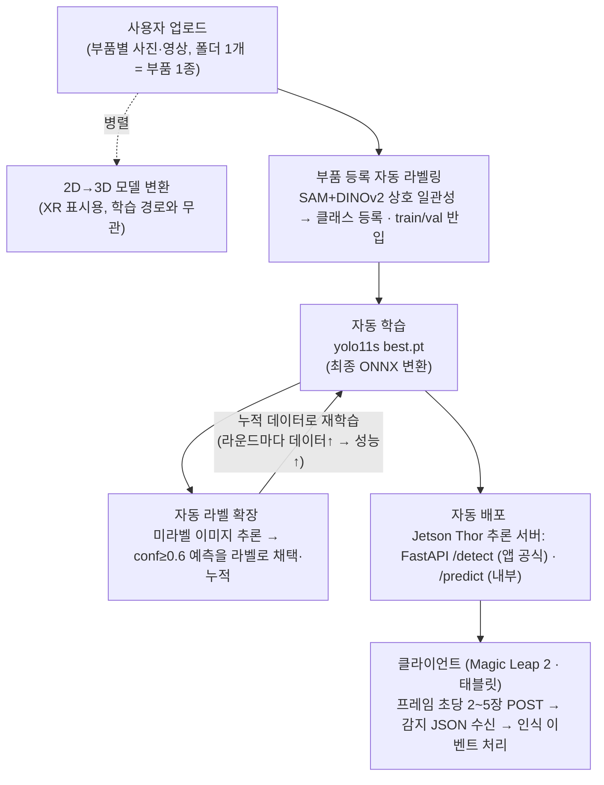
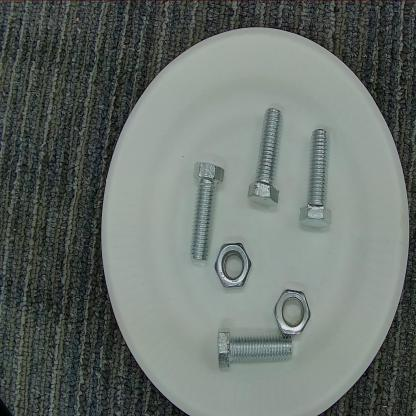
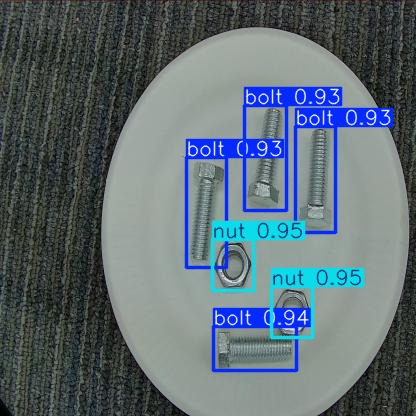

# XR 오토러닝 (XR Auto-Learning) - 헬기 부품 비마커 인식 파이프라인

## 1. 프로젝트 개요

헬기 정비 부품을 비마커(QR/바코드 없이) 인식하는 YOLO 객체탐지 모델을 **사람 개입 없이(zero-manual) 자동으로 학습·배포하는 MLOps 파이프라인**이다. 사용자가 업로드한 부품 사진에서 라벨을 자동 생성하고, 학습 → 자동 라벨 확장 → ONNX/API 배포까지 하나의 루프로 돌린다.

### 데이터 생성 방식
**수작업 라벨링 없이 사용자 업로드 사진으로 학습 데이터 산출**

1. 등록: 사용자가 부품별 사진(영상 프레임 포함)을 업로드 목록에 쌓음 (폴더 1개 = 부품 1종)
2. 자동 라벨링: 상호 일관성 매칭으로 각 사진에서 부품 위치를 자동 탐지해 라벨 생성 (4.3 참고)
3. 반입: 클래스 자동 등록 + YOLO 학습 데이터로 변환. 배치 처리라 재학습은 배치당 1회
4. 병렬: 같은 업로드 사진으로 2D→3D 모델 변환을 병렬 수행 (XR 화면 표시용, 학습 경로와 무관)

설계 변경 이력(무엇이 어떻게 바뀌었는지)은 8장에 계속 기록한다.

### 핵심 기능

- **부품 등록 자동 라벨링**: 업로드 사진에서 SAM+DINOv2 상호 일관성 매칭으로 라벨 자동 생성
- **자동 라벨 확장(self-training)**: 학습된 모델이 신규 이미지에 conf ≥ 0.6 라벨을 생성해 데이터셋을 자동 증분·재학습
- **학습·변환 자동화**: yolo11s 학습 → best.pt 추출 → ONNX export를 단일 스크립트로
- **추론 서빙**: FastAPI 추론 서버. 교육생 앱 공식 규격 `/detect`(인터페이스 요청서 2탄 준수, 8장) + 내부 검증용 `/predict`

<br>

## 2. 시스템 아키텍처 및 파이프라인

사용자 업로드 사진 기반 YOLO 자동 라벨링·학습 파이프라인. 부품 등록부터 학습·배포까지 사람 손을 타지 않고 단일 루프로 자동화하는 것이 설계 목표다.

**데이터 흐름**



- 사람 개입은 사진 업로드뿐, 라벨링·학습·배포는 전부 스크립트가 수행 (단계별 실행 명령은 6장, 루프 효과 실측은 5.3)
- **역할 분담**: 부품 등록·오토러닝(라벨 생성~재학습)은 전부 PC/서버 측에서 수행한다. XR 기기(Magic Leap 2·태블릿)는 학습에 관여하지 않고, 배포된 모델의 탐지 결과만 소비한다
- **배포 구조 = 원격 추론(서버 사이드)**: 클라이언트(Magic Leap 2·태블릿)는 카메라 프레임을 보내고 JSON 결과만 받아 그린다. 전처리(레터박스)·추론·후처리(NMS·좌표 복원)·GPU 활용은 전부 Thor 서버의 ultralytics 런타임이 담당하므로 기기 쪽 구현 부담과 기종 의존성이 없다

**컴포넌트 연동**

| 계층 | 구성 |
|------|------|
| 모델 | **yolo11s** (Ultralytics). 부품 34클래스 재벤치(8모델 v8·11·26 × n/s/m)에서 mAP50 1위로 선정 (5.5) |
| 등록 라벨링 | SAM(ViT-H) 후보 분할 + DINOv2 상호 일관성 매칭 (`0_register_part.py`). 업로드 = 부품 1종 전제라 클래스 분류가 불필요 |
| 추론 서버 | **NVIDIA Jetson Thor** (ARM64 + Blackwell GPU, JetPack 스택). FastAPI + Uvicorn: 교육생 앱 공식 `/detect`(인터페이스 요청서 2탄 규격, 8장) + 내부 검증용 `/predict` + `/health`. 기동 시 모델 로드+워밍업, 추론은 스레드풀 실행(요청 비차단) + 추론 구간 직렬화 Lock(동시 기기 대비). Swagger 자동 문서 `/docs` |
| 클라이언트 | Magic Leap 2 · 태블릿: 카메라 프레임 초당 2~5장 POST → 감지 JSON 수신 → "인식됨" 이벤트 판단은 앱 몫 (온디바이스 추론 없음. 앱 측 송수신 구현 완료 통보 2026-07-30) |
| 배포 포맷 | PyTorch `.pt`(서빙 기본) / ONNX / TensorRT 엔진(Thor 가속, 변환 예정) |
| 공용 모듈 | `pseudo_utils`(박스 선택 단일 구현: 운영·실험 공용) / `dataset_utils`(클래스 등록 가드) |
| 모델 릴리스 | 학습마다 `models/releases/v<타임스탬프>/`에 best.pt·onnx·지표·**학습로그 전문** 자동 보관(최근 10개). **배포 게이트**: 직전 채택본보다 mAP50 하락 시 서빙 모델 미교체. 롤백은 `6_model_registry.py` |
| 설정 | `scripts/config.py` 단일 소스(경로·임계값·하이퍼파라미터) |

**폴더 구조**

```
xr_autolearning/
├─ data.yaml                     # 클래스 정의(names)·데이터 경로
├─ requirements.txt
├─ scripts/                      # 파이프라인 코드 (폴더 = 역할, 실행 순서는 6장)
│  ├─ config.py                  # 경로·클래스·임계값·하이퍼파라미터 공통 설정 (유일한 최상위)
│  ├─ gpu_utils.py               # GPU 메모리 회수 공용 (labeling/training 양쪽 사용)
│  ├─ data_import/               # 데이터 반입·변환
│  │  ├─ coco_to_yolo.py         #   Roboflow COCO → YOLO 포맷 변환 (샘플 데이터용)
│  │  ├─ import_render.py        #   라벨 딸린 외부 데이터 반입 (클래스 등록·라벨 검증·배치)
│  │  ├─ import_roboflow.py      #   Roboflow YOLOv8 export 정리
│  │  ├─ dataset_utils.py        #   데이터셋 등록 공용 (names 정규화·data.yaml 등록 가드)
│  │  └─ data_viewer.ipynb       #   COCO 어노테이션 점검 노트북
│  ├─ labeling/                  # ① 라벨 자동 생성
│  │  ├─ register_part.py        #   부품 등록: 업로드 사진/영상 → 자동 라벨 → 반입 (운영 진입점)
│  │  ├─ auto_labeling.py        #   self-training 자동 라벨링 (conf 필터, --tta, --conf-per-class)
│  │  └─ pseudo_utils.py         #   박스 선택 단일 구현 (추론·TTA·conf 필터)
│  ├─ training/                  # ② YOLO 학습·배포
│  │  ├─ train_pipeline.py       #   train/val 분할 → 학습 → 게이트 → ONNX export → 릴리스
│  │  ├─ finetune_real.py        #   실사 소량 파인튜닝 (2단계: 동결 → 저lr 해제, 전/후 게이트)
│  │  ├─ model_registry.py       #   릴리스 조회/롤백 (이전 버전 복원)
│  │  └─ release_utils.py        #   릴리스 기록 공용 (trained_at·history.jsonl)
│  ├─ serving/
│  │  └─ api_server.py           # FastAPI 추론 서버 (/detect = 교육생 앱 공식 규격, /predict = 내부 검증용)
│  ├─ experiments/               # 실증·벤치마크 (운영과 분리된 실험 전용)
│  │  ├─ experiment_autolearn.py #   오토러닝 효과 실증 (정답 숨기고 자동 채점)
│  │  ├─ benchmark.py            #   모델 x 입력크기 매트릭스 벤치마크 (배포 모델 선정 근거)
│  │  └─ exp_epochs.py           #   후속 검증 (300ep·레시피·시드 반복)
│  └─ verify/                    # 육안 검증
│     ├─ dashboard_api.py        #   대시보드 API 서버 (React 프론트 서빙 + 즉석 비교 추론)
│     ├─ dashboard_core.py       #   대시보드·리포트 공용 데이터 계층
│     └─ build_report.py         #   검증 리포트(단일 HTML) 생성 -> docs/report.html
├─ dashboard/                    # 검증 대시보드 프론트 (React + Vite, 빌드 산출물 dist/ 는 미커밋)
├─ data/                         # 모든 데이터의 단일 루트 (전체 git 제외, 이름 규칙: 소문자 영문)
│  ├─ training_pool/             #   운영 학습 풀: 등록한 부품의 사진·라벨이 여기 누적 (images/ labels/ unlabeled_images/)
│  ├─ uploads/                   #   부품 등록 입력함 - 처음엔 없음, 등록할 부품이 생기면 만들어 사용
│  │                             #   (uploads/<부품명>/ 에 사진·영상을 넣고 등록 명령 실행, 6.1 참고)
│  ├─ robo_coco/                 #   Roboflow 공개 기계부품 데이터 원본 (COCO 포맷, 실험용)
│  ├─ robo_yolo/                 #   위 원본의 YOLO 변환본 (실험 기준 데이터, 대시보드 즉석 비교가 사용)
│  ├─ gearbox_register_trial*/   #   기어박스 영상으로 부품 등록 기능을 검증한 산출물
│  │                             #   (trial1 = 프레임 33장·재현율 31% / trial2 = 193장·재현율 88%)
│  └─ videos/                    #   실사 검증 영상 원본 (gearbox1·2.mp4)
├─ docs/                         # 문서 자산 (코드 아님: 이미지·리포트)
│  ├─ method_previews/           #   오토라벨링 방법별 증거 이미지 (대시보드·리포트가 표시, git 추적)
│  ├─ report.html                #   '내보내기' 산출물 (verify/build_report.py 가 생성)
│  └─ sample_*.jpg               #   README 예시 이미지
├─ models/                       # base_model.pt(초기 생성기) / new_model.pt·onnx(서빙 현재본)
│  └─ releases/                  # 버전별 보관: v<타임스탬프>/{best.pt, best.onnx, metrics.json, train.log}
├─ results/benchmark/                # 벤치마크 결과 (benchmark.json / benchmark.md)
└─ exp_results/                  # 실험 리포트 (report_*.json, zeroshot/ = 콜드스타트 채점 결과)
```

<br>

## 3. 기술 스택

**Data & AI**

- 언어: Python 3.10+
- 탐지 프레임워크: Ultralytics 8.4.93, 모델 yolo11s (부품 34클래스 벤치마크 선정, 5.5)
- 딥러닝: PyTorch 2.x (RTX 5090은 CUDA 12.8 빌드, 그 외 GPU는 CUDA 버전에 맞춰 설치)
- 등록 라벨링: segment-anything(SAM ViT-H) + DINOv2(torch.hub, 임베딩 매칭)
- 변환·서빙 런타임: ONNX, onnxruntime, onnxslim
- 데이터 처리: NumPy, Pillow, PyYAML

**Infra & Backend**

- API: FastAPI, Uvicorn, python-multipart
- 배포(운영) 서버: NVIDIA Jetson Thor (ARM64 + Blackwell, JetPack 기반 torch/ultralytics 스택, TensorRT 가속 예정. 도입 전으로 스택 구성은 7장 과제)
- 학습·실험 환경: NVIDIA RTX 5090 1장 (단일 GPU, CUDA 12.8)
- 형상 관리: Git (GitHub: `ev1025/auto_annotation_learning`)
- 데이터셋/모델 가중치는 `.gitignore`로 제외(용량·재생성 가능), 소스·결과 리포트(json)만 추적

<br>

## 4. 데이터 전처리 및 모델링

### 4.1 데이터 소스

**샘플 데이터 (현재 사용 중, 파이프라인 검증용)**

| 항목 | 내용 |
|------|------|
| 데이터셋 | Mechanical Parts Dataset 2022 (Roboflow 공개 데이터) |
| 규모 | 2,250장 / 4클래스(bearing·bolt·gear·nut) / 박스 10,599개 |
| 포맷 | Roboflow COCO (`_annotations.coco.json` + 이미지) → `0_coco_to_yolo.py`로 변환 |
| 용도 | 학습·자동라벨·평가 루프의 유효성 검증 (5장 실험 결과가 전부 이 데이터 기준) |

**실제 데이터 (운영용): 사용자 등록 사진**

| 항목 | 내용 |
|------|------|
| 출처 | 사용자가 부품 등록 시 업로드하는 사진·영상 프레임 (폴더 1개 = 부품 1종, 여러 부품을 목록에 쌓아 배치 처리) |
| 라벨 생성 | `0_register_part.py` 상호 일관성 매칭으로 자동 생성 (수작업 0, 방식은 4.3) |
| 클래스 정의 | 업로드 폴더명 = 부품명(클래스). 반입 시 data.yaml 에 자동 등록(기존과 충돌하면 중단하는 가드) |
| 시재품 준비 | 기본 장비를 우리가 같은 절차로 사전 등록해 모델을 구워 넣은 상태로 출고 |
| 수량 기준 | 부품당 사진 30장+ 권장 (실증 최소선: 클래스당 50~85장에서 오토러닝 루프 작동, 5.3). 영상 등록이면 프레임 추출로 충당 |

입력이 샘플이든 사용자 등록분이든 이후 파이프라인은 동일. 검증 대상은 "라벨셋 → 학습 → 자동라벨 확장 → 성능 향상" 루프다.

### 4.2 전처리 (COCO → YOLO)

| 처리 | 내용 |
|------|------|
| 좌표 변환 | COCO 픽셀 bbox → YOLO 정규화 중심좌표 (경계 밖은 0~1 클램프) |
| 더미 클래스 제거 | Roboflow가 넣는 상위 카테고리(id 0) 제외, 실제 클래스만 0..k-1 재매핑 |
| 정합성 검증 | 이미지-라벨 파일명 1:1 매칭, 필드 5개 미만 라인 스킵 |
| train/val 분할 | 최초 실행 시 고정 seed 분할(val 20%). 이후 신규 유입분(자동 라벨)은 **train에만 추가**하고 val은 고정 (라운드 간 비교 일관성 + 자동 라벨의 평가 오염 방지) |
| 경로 함정 회피 | 상대 `path` 오해석("Dataset not found") 방지용 절대경로 `data.generated.yaml` 자동 생성 |

변환 예시 (실제 데이터 1개 박스, 이미지 크기 416×416):

```
----------------------------------------------------------------------------
[변환 전] COCO 방식 = "박스의 왼쪽 위 모서리 + 크기"를 픽셀로 기록
----------------------------------------------------------------------------
  클래스: gear
  "bbox": [116.9, 73.3, 77.9, 82.0]     → 왼쪽 위 (116.9, 73.3)에서 시작하는
                                          가로 77.9 × 세로 82.0 픽셀짜리 박스

----------------------------------------------------------------------------
[변환 계산] "박스의 중심점 + 크기"로 바꾸고, 이미지 크기로 나눠 0~1 비율로
----------------------------------------------------------------------------
  중심 x = (116.9 + 77.9/2) ÷ 416 = 0.375
  중심 y = ( 73.3 + 82.0/2) ÷ 416 = 0.275
  너비   =  77.9 ÷ 416            = 0.187
  높이   =  82.0 ÷ 416            = 0.197

----------------------------------------------------------------------------
[변환 후] YOLO 방식 = .txt 한 줄
----------------------------------------------------------------------------
  2 0.375 0.275 0.187 0.197
  = "클래스 2(gear), 중심 (0.375, 0.275), 크기 0.187 × 0.197"
```

변환이 끝나면 이미지 1장마다 이런 .txt 가 하나씩 생긴다 (한 줄 = 박스 1개):

```
train/labels/239_jpg.rf.9urQ....txt   ← 같은 이름의 .jpg 와 짝
  1 0.426154 0.414663 0.082115 0.242788     ← bolt
  1 0.629219 0.403846 0.083630 0.250000     ← bolt
  3 0.743389 0.324519 0.081202 0.120192     ← nut
  ...(총 7줄 = 이 사진엔 bolt 3개, nut 4개)
```

### 4.3 자동 라벨링 안전장치 (모델 작동 근거)

**등록 단계 (콜드스타트, `0_register_part.py`)** - 모델이 없을 때 라벨을 만드는 방법과 안전장치:

| 장치 | 동작 | 이유 |
|------|------|------|
| 상호 일관성 매칭 | SAM 이 분할한 물체 후보 중 "같은 폴더의 **다른 모든 사진에도 등장하는 물체**"를 DINOv2 임베딩 유사도로 식별 | 업로드 사진엔 그 부품이 매 장 등장하고 배경 물체는 바뀜. 텍스트 프롬프트 제로샷(정밀도 0.24 실측, exp_results/zeroshot)과 달리 클래스 혼동이 원천 배제됨 |
| 일관성 임계값(τ) 0.55 이상 | 미달 후보는 라벨 포기(해당 사진 제외) | 고순도 우선. DINOv2 임계값 0.85 고정밀 추출은 정밀도 0.927 실측 |
| 다중 채택 + 포함 억제 | 임계값 이상 후보 전부 라벨(NMS 중복 제거), 큰 박스에 70%+ 포함되는 작은 박스 제거 | 한 사진에 같은 부품 여러 개 대응(빠뜨리면 배경으로 오학습) + SAM 부분-전체 이중 분할 교정 |
| 최소 채택 수(5장) | 미만이면 그 부품 등록 보류, 재촬영 안내 | 저품질 등록이 학습을 오염시키는 것 차단 |

**운영 루프 (self-training, `1_auto_labeling.py`)** - 학습된 모델이 라벨을 확장할 때의 안전장치:

| 장치 | 동작 | 이유 |
|------|------|------|
| conf ≥ 0.6 | 임계값 이상 예측만 라벨 채택 | 정밀도 우선, 오라벨 유입 억제 |
| TTA 일관성 필터 (`--tta`) | 원본·반전·축소 3뷰 모두 재현(IoU≥0.8)되는 예측만 채택 (이미지 8장 단위 배치 추론) | "자신 있게 틀리는" 예측 차단 (실측 FP −44%, 5.4 참고) |
| 클래스별 임계값 (`--conf-per-class`) | 클래스마다 임계값 개별 설정 | 쉬운 클래스만 라벨 양산되는 클래스 소외 완화 |
| 콜드 리스타트 | 매 라운드 사전학습 가중치(`config.PRETRAINED`)에서 새로 학습 | 오라벨이 가중치에 고착(confirmation bias)되는 것 방지 |
| 가드레일 | 라운드1 mAP < 라운드0이면 폐기 권고 기록 | 오류 증폭 자동 감지·롤백 |
| 박스 선택 단일 구현 | 위 필터 전부를 `pseudo_utils.predict_boxes` 한 곳에 구현, 운영(1번)·실험(4번)이 공용 | 실험으로 검증한 규칙과 실제 배포 규칙이 몰래 어긋나는 것(드리프트) 차단 |

자동 라벨링 후 생성되는 리포트(report.json). 라벨 전수 검사 대신 이 수치로 채택 여부를 판단한다:

```json
"pseudo": {
  "labeled_images": 578,        // 라벨 생성된 이미지 수 (입력 647장 중)
  "boxes": 2955,                // 생성 박스 총 개수
  "precision": 0.9381,          // 정답과 일치 비율 (실험 환경 한정)
  "recall": 0.7406,             // 실제 객체 중 잡아낸 비율
  "per_class_boxes": {"nut": 1667, "bolt": 1288},  // 한쪽 0에 쏠리면 이상 신호
  "mean_conf": 0.9218,          // 지속 하락 시 중단 신호
  "tta_dropped_boxes": 352      // TTA 필터가 걸러낸 박스 수
},
"guardrail": {"accepted": true} // false = 이번 라운드 라벨 폐기
```

핵심: 채택 여부는 `guardrail`, 이상 징후는 `per_class_boxes`·`mean_conf` 로 본다.

### 4.4 하이퍼파라미터 및 검증 전략

| 항목 | 값 |
|------|-----|
| 모델 | yolo11s (사전학습 `yolo11s.pt`에서 전이학습. 5.2~5.4 실험 수치는 선정 이전 YOLOv8n 기준 측정) |
| 입력 크기 | 640 |
| epochs | 60 (실험), 기본 100 (운영 스크립트) |
| batch | 32 (단일 GPU), 대용량 조건은 24 |
| optimizer | auto (Ultralytics 자동 선택) |
| best 선택 | `model.trainer.best` (val 기준 best.pt) |

- 검증 분할: 고정 난수 seed 단일 홀드아웃. 실험은 초기 라벨셋 / 미라벨셋(라벨 숨김) / 평가셋(측정 전용) 3분할, 평가셋은 어떤 학습에도 미사용 (코드·리포트 표기: seed / pool / test)
- k-fold 교차검증 미적용 (7장 한계점 참고)

<br>

## 5. 성능 평가

평가는 두 가지 질문에 답하기 위해 수행했다.

1. **최종 모델의 탐지 성능은 어느 수준인가?** → 5.2
2. **오토러닝(자동 라벨 재학습)이 성능을 실제로 올렸는가?** → 5.3 (이 프로젝트의 핵심 검증)

### 5.1 지표 정의

| 지표 | 의미 | 어디에 쓰나 |
|------|------|-------------|
| mAP50 | 예측 박스가 정답과 50% 이상 겹치면 정답으로 인정하고 계산한 평균 정밀도 (0~1, 높을수록 좋음) | 모델 성능의 대표 지표 |
| mAP50-95 | 겹침 기준을 50~95%까지 높여가며 평균 | 박스 위치까지 엄격히 본 지표 |
| 자동라벨 정밀도(P) | 자동 생성 라벨 중 정답과 일치한 비율 | 자동 라벨을 믿어도 되는지 |
| 자동라벨 재현율(R) | 실제 객체 중 자동 라벨이 잡아낸 비율 | 자동 라벨이 얼마나 빠뜨리는지 |

- 모든 mAP는 **평가셋**(어떤 학습에도 안 쓴 데이터)에서 측정
- 자동라벨 P/R은 미라벨셋의 숨겨둔 정답과 IoU ≥ 0.5 매칭으로 산출
- 분할·셔플은 고정 난수 seed로 재현 가능

### 5.2 최종 모델 성능

오토러닝 완료 후(라운드1) 모델의 **평가셋**(정답 라벨, 학습 미사용) 성능:

| 조건 | mAP50 | mAP50-95 |
|------|-------|----------|
| 2클래스 (bolt·nut) | 0.859 | 0.674 |
| 3클래스 (+gear) | 0.835 | 0.677 |
| **4클래스 전체** | **0.863** | **0.680** |

참고: 운영 루프 E2E 구동(전체 라벨 부트스트랩 100 epochs → 자동 라벨 220장 누적 → 재학습 100 epochs) 결과, 고정 val(405장, 자동 라벨 미포함) 기준 mAP50 0.873 / mAP50-95 0.708 (정밀도 0.917 / 재현율 0.804). 이 구동에서 재학습 시 train이 1,620 → 1,840장으로 늘어 자동 라벨이 실제 누적됨을 확인.

클래스별 mAP50-95 (4클래스 실험 모델):

| bolt | nut | gear | bearing |
|------|-----|------|---------|
| 0.710 | 0.751 | 0.570 | 0.690 |

- gear가 상대적으로 낮음(형태 다양성·유사 클래스 혼동) → 데이터 보강 대상
- Confusion Matrix, PR curve 등 상세 플롯은 학습 시 `runs/<name>/`에 자동 생성

**실제 추론 예시** (평가셋 이미지 1장, 오토러닝 완료 2클래스 모델)

| 입력 (이미지 + 라벨) | 출력 (모델 추론 결과) |
|---|---|
|  |  |

입력 라벨 (bolt 4개 + nut 2개):

```
1 0.560721 0.637019 0.086058 0.125000   ← nut
1 0.703726 0.752404 0.093221 0.120192   ← nut
0 0.635228 0.378606 0.095649 0.252404   ← bolt
0 0.757825 0.432692 0.090793 0.254808   ← bolt
0 0.497055 0.507212 0.088486 0.254808   ← bolt
0 0.612392 0.840144 0.199014 0.112981   ← bolt
```

- 출력: 6개 객체 전부 탐지, 신뢰도 0.93~0.95 (bolt 4, nut 2, 미탐·오탐 0)

### 5.3 오토러닝 효과 검증 (전후 비교 실험)

**목적**: "라벨 없는 이미지에 모델이 스스로 붙인 라벨로 재학습하면, 라벨링 비용 0으로 성능이 오르는가"를 증명한다. 같은 평가셋에서 **재학습 전(라운드0)과 후(라운드1)를 비교**해 차이(Δ)가 곧 오토러닝의 효과다.

| 실험 | 라벨o / 라벨x / 평가셋 (장) | mAP50 (R0→R1) | ΔmAP50 | mAP50-95 (R0→R1) | 자동라벨 P/R |
|------|---------------------------|----------------|--------|-------------------|--------------|
| 2클래스, 초기 라벨 15% | 149 / 647 / 199 | 0.835 → 0.859 | **+2.3%p** | 0.645 → 0.674 | 0.902 / 0.805 |
| 2클래스, 초기 라벨 10% | 99 / 697 / 199 | 0.819 → 0.839 | **+2.0%p** | 0.623 → 0.663 | 0.885 / 0.765 |
| 3클래스 | 236 / 1,025 / 315 | 0.825 → 0.835 | **+1.0%p** | 0.649 → 0.677 | 0.901 / 0.715 |
| 4클래스 전체 | 337 / 1,463 / 450 | 0.827 → 0.863 | **+3.6%p** | 0.649 → 0.680 | 0.871 / 0.726 |

- 라벨o = 라벨 주고 시작하는 초기 학습분 / 라벨x = 라벨 숨기고 자동 라벨을 붙이는 대상 / 평가셋 = 측정 전용
- 라벨o가 라벨x보다 훨씬 적은 이유: "라벨은 비싸서 적고, 미라벨은 공짜로 많다"는 실전 조건을 재현한 것. 초기 라벨이 많으면 미라벨 데이터의 기여를 측정할 수 없다

**결과 해석**:

- 4개 조건 전부 라운드1 > 라운드0 → 클래스 수·초기 라벨 비율과 무관하게 오토러닝 효과가 일관 재현됨
- 초기 라벨 15%→10%(149→99장)로 줄여도 개선폭 유지(+2.0%p) → 초기 라벨 부담을 낮춰도 유효
- 자동 라벨 정밀도 0.87~0.90 → 사람 개입 없이 학습에 쓸 만한 품질

**반증(라벨 품질이 깨지면)**: 자동 라벨과 이미지 매칭이 깨진 채 학습된 사례에서 mAP50 **−19.7%p** 폭락(전 객체를 배경으로 오학습). 좋은 라벨은 +2~4%p 올리지만 나쁜 라벨은 −20%p로 무너뜨림 → 라벨-이미지 정합성이 오토러닝 성패의 핵심 변수.

### 5.4 TTA 일관성 필터 효과 (2클래스, 초기 라벨 15% 동일 분할)

**목적**: 안전장치인 TTA 일관성 필터(4.3)가 오라벨을 실제로 걸러내는지, 켰을 때 무엇을 얻고 잃는지 측정한다.

| | 기본 conf 필터 | + TTA 일관성 필터 | 변화 |
|---|---|---|---|
| pseudo 정밀도 | 0.902 | **0.938** | **+3.6%p** |
| 오라벨(FP) 수 | 327개 | **183개** | **−44%** |
| pseudo 재현율 | 0.805 | 0.741 | −6.4%p |
| 채택 박스 수 | 3,339 | 2,955 (352개 필터 제거) | −11% |
| ΔmAP50 (R0→R1) | +2.3%p | +0.1%p | |
| ΔmAP50-95 (R0→R1) | +2.9%p | +2.1%p | |

- TTA 필터는 약속대로 동작: **오라벨을 절반 가까이 제거**(FP −44%)하고 정밀도를 0.94로 올림. 대가는 재현율 −6.4%p.
- 단, 동일 도메인(공개 데이터) 조건에서는 기본 필터도 정밀도 0.90으로 이미 충분해 최종 mAP50 이득은 없었음.
- 결론: **동일 도메인에서는 기본 conf 필터로 충분(TTA 기본 OFF 유지). 촬영 환경이 크게 달라 도메인 갭이 생기는 구간(신규 현장 등)에서 `--tta`를 켜는 것을 권장**(오라벨 유입 차단이 정밀도 손실보다 중요해지는 상황).
- 참고: 두 실행의 라운드0 기준점이 다름(0.835 vs 0.820, 학습 확률성·GPU 구성 차이). pseudo 정밀도/FP 비교가 필터 자체의 효과를 보는 지표.

### 5.5 배포 모델 선정 벤치마크 (yolo11s 확정 근거)

부품 34클래스(85:15 분할, imgsz 640, epochs 100, RTX 5090)로 8모델(v8·11·26 계열 n/s/m)을 동일 조건 비교. mAP 는 자동 라벨 기준이라 절대 성능이 아니라 **모델 간 상대 비교용**(GT 아님). 전체 산출물은 `results/bench/20260805_173149/`(summary.txt·infer.txt), 실행 방법은 6.5.

**정확도 (mAP50 내림차순)**

| 모델 | mAP50 | mAP50-95 | P | R | params(M) | size(MB) | 학습(min) |
|------|-------|----------|-----|-----|-----------|----------|-----------|
| **yolo11s** | **0.9931** | 0.9737 | 0.987 | 0.988 | 9.43 | 19.2 | 30.7 |
| yolov8m | 0.9898 | 0.9750 | 0.983 | 0.993 | 25.86 | 52.1 | 41.9 |
| yolov8n | 0.9896 | 0.9694 | 0.985 | 0.986 | 3.01 | 6.2 | 24.9 |
| yolo26s | 0.9891 | 0.9738 | 0.976 | 0.991 | 9.48 | 20.3 | 41.5 |
| yolo11n | 0.9881 | 0.9679 | 0.986 | 0.981 | 2.59 | 5.5 | 29.3 |
| yolov8s | 0.9880 | 0.9740 | 0.980 | 0.988 | 11.14 | 22.5 | 27.4 |
| yolo26m | 0.9880 | 0.9725 | 0.978 | 0.983 | 20.38 | 44.1 | 64.2 |
| yolo26n | 0.9870 | 0.9675 | 0.968 | 0.967 | 2.38 | 5.4 | 39.6 |

**추론 속도** (imgsz 640, RTX 5090 · `infer.json`. 단건 지연 / 연속 FPS)

| 모델 | PyTorch-GPU | PyTorch-CPU | ONNX-CPU |
|------|-------------|-------------|----------|
| yolo11s | 11.7ms / 83.8fps | 42.3ms / 23.8fps | 52.1ms / 20.1fps |
| yolo11n | 11.5ms / 86.1fps | 31.4ms / 32.6fps | 41.0ms / 24.6fps |
| yolov8n | 11.4ms / 87.7fps | 28.7ms / 36.4fps | 36.3ms / 27.7fps |

**선정: yolo11s @ 640**

- **mAP50 1위(0.9931)**, mAP50-95(0.9737)도 최상위권과 사실상 동급(1위 yolov8m 0.975와 0.001차)
- 기존 후보 yolo26s 대비 **전 항목 우위**: 정확도(0.9931 vs 0.9891), 크기(19.2 vs 20.3MB), 학습시간(30.7 vs 41.5min), 속도 동급
- 대형 yolov8m은 정확도 이득 미미(0.9898)한데 파라미터 2.7배·학습시간 1.4배 → 비효율
- 경량 엣지가 필요하면 yolo11n(5.5MB)·yolov8n(6.2MB): mAP50 손실 0.5%p 내로 크기 1/3
- 주의: 위 mAP 는 자동 라벨 기준 상대 비교값이다. 절대 성능(실측 GT)은 gearbox·a_test 2부품 GT ablation으로 측정 완료(5.6 참조). 단 GT ablation에서 최적 모델은 부품·조건에 따라 갈린다(a_test는 11s 최고, gearbox·2클래스는 26n 우세). 11s는 자동 라벨 34클래스 종합 1위라 기본 배포로 유지하되, 도메인갭 큰 특정 부품 특화 배포엔 소형 모델 재벤치를 권장한다(11s 결정 보완). 5.2~5.4 수치는 선정 이전 YOLOv8n 기준(루프 유효성 검증용, 결론 불변)
- 참고: 이전 14조합(v8·11·26 × 640/1280) 벤치는 yolo26s를 뽑았으나, 부품 34클래스 재벤치에서 yolo11s로 교체(데브로그 2026-08-05)

### 5.6 실측 GT 최소 학습량 ablation (a_test·gearbox 2부품)

5.5는 자동 라벨을 정답 삼아 모델 간 순위만 본다(상대 비교, 절대 성능 아님). 5.6은 사람이 직접 만든 GT로 절대 mAP50을 재고, "부품 하나를 실전 투입하려면 모델·라벨수·에포크가 최소 얼마여야 하나"를 실측한다. GT test가 소량(a_test 30장)이고 부품 2종·단일 시드 1회라, 정밀 수치가 아니라 경향 파악용임을 먼저 밝힌다.

부품 2종은 성격이 반대다. a_test(부품 크롭, 배경 선명) vs gearbox(정비 영상, 고정 배경+손+공구로 도메인갭 큼). 세 설정으로 학습한다: 부품 단독 2건, 2클래스 함께 1건. 라벨수·에포크 스윕은 배포 모델 yolo11s로 고정한다(왜: 설정 간 커브를 같은 축에서 비교하려면 모델을 고정해야 함).

**(a) 3설정 요약 (최고 mAP50)**

| 설정 | train 장수 | 최고 mAP50 | 달성 모델 |
|------|-----------|-----------|-----------|
| a_test 단독 | 266 | 0.853 | yolo11s |
| gearbox 단독 | 206 | 0.557 | yolo26n |
| 2클래스 함께 | 472 | 0.644 | yolo26n |

**(b) 모델 축 (9모델 × 3설정, mAP50, 266/206/472장·100ep)**

| 모델 | a_test 단독 | gearbox 단독 | 2클래스 |
|------|-------------|--------------|---------|
| yolov8n | 0.842 | 0.502 | 0.611 |
| yolov8s | 0.775 | 0.370 | 0.611 |
| yolov8m | 0.766 | 0.235 | 0.557 |
| yolo11n | 0.836 | 0.518 | 0.565 |
| yolo11s | **0.853** | 0.319 | 0.589 |
| yolo11m | 0.705 | 0.177 | 0.586 |
| yolo26n | 0.754 | **0.557** | **0.644** |
| yolo26s | 0.745 | 0.388 | 0.629 |
| yolo26m | 0.817 | 0.401 | 0.591 |

- 학습시간(a_test): n 계열 4~6분, s 약 10분, m 18~28분. 소형이 대형보다 3~6배 빠르다.

**(c) 라벨수 축 / 에포크 축 (모두 yolo11s 고정)**

라벨수(클래스당):

| 클래스당 라벨 | a_test 단독 | gearbox 단독 | 2클래스 |
|---------------|-------------|--------------|---------|
| 약 20 | 0.724 | **0.562** | 0.544 |
| 약 50 | 0.550 | 0.296 | 0.579 |
| 약 100 | 0.608 | 0.433 | **0.597** |
| 약 200 | 0.774 | 0.181 | 0.575 |
| 전체(266/206/266) | **0.853** | 0.319 | 0.589 |

에포크(train 고정):

| epochs | a_test 단독 | gearbox 단독 | 2클래스 |
|--------|-------------|--------------|---------|
| 30 | 0.670 | 0.455 | **0.624** |
| 60 | 0.743 | 0.464 | 0.595 |
| 100 | **0.853** | 0.319 | 0.589 |
| 200 | 0.771 | **0.474** | 0.577 |

**(d) 2클래스 클래스별 AP50 (단독 최고 대비 하락)**

| 클래스 | 단독 최고 AP50(모델) | 2클래스 최고 AP50(모델) | 하락폭 |
|--------|----------------------|--------------------------|--------|
| a_test | 0.853 (yolo11s) | 0.788 (yolo26n) | −6.5%p |
| gearbox | 0.557 (yolo26n) | 0.501 (yolo26n) | −5.6%p |

- 2클래스 함께 학습 시 클래스별 AP50 범위: a_test 0.65~0.79, gearbox 0.42~0.50

**(e) 배경합성(copy-paste) 적용 시 gearbox 재측정 (도메인갭 보정)**

위 (a)~(d)는 배경합성 미적용(raw SAM2 프레임만)으로 최소 학습량 축만 격리한 값이다. gearbox가 낮은 원인이 도메인갭인지 확인하려고, 같은 gearbox 학습셋(206장)에 실배경 copy-paste 합성 500장을 더해(총 706장) 9모델을 다시 실측했다(GPU2, 100ep).

| 모델 | 합성 미적용 | 배경합성 적용 | 개선 |
|------|-----------|--------------|------|
| yolov8n | 0.502 | **0.888** (50-95 0.710) | +0.386 |
| yolov8s | 0.370 | 0.624 | +0.254 |
| yolov8m | 0.235 | 0.508 | +0.273 |
| yolo11n | 0.518 | 0.640 | +0.122 |
| yolo11s | 0.319 | 0.568 | +0.249 |
| yolo11m | 0.177 | 0.479 | +0.302 |
| yolo26n | 0.557 | 0.568 | +0.011 |
| yolo26s | 0.388 | 0.556 | +0.168 |
| yolo26m | 0.401 | 0.475 | +0.074 |

- gearbox 최고가 0.557 → **0.888(yolov8n)** 로 뛰어 a_test(0.85) 수준에 도달한다. gearbox가 낮았던 건 학습량 부족이 아니라 도메인갭이고, 배경합성이 그 병목을 직접 해소한다.
- 소형(v8n·11n)이 특히 크게 오르고 대형(m)은 합성해도 뒤처진다(few-shot 과적합).
- 실무 함의: 도메인갭 큰 부품(정비 영상 등)은 라벨을 늘리기 전에 배경합성을 먼저 켜는 게 효율적이다.
- 2클래스도 (a)~(d)처럼 합성 미적용이라 gearbox 기여분이 과소평가돼 있다(합성 적용 시 유사 개선 예상, 별도 미측정).

**[핵심 인사이트]**

- 소형 모델(n)이 few-shot·도메인갭에서 대형(m)을 압도한다(gearbox 26n 0.557 vs 11m 0.177). 왜: 데이터가 적으면 대형은 과적합·수렴 불안정이 커지고, 소형은 3~6배 빨라 부품 하나를 빠르게 굽는 데 합리적이다.
- 부품 난이도 편차가 크다(a_test 0.85 vs gearbox 0.56). 왜: a_test는 배경이 깨끗하고 gearbox는 도메인갭(고정 배경+손+공구)이 커서, 부품마다 필요한 학습량·달성 상한이 다르다.
- 에포크는 100 근처가 대체로 최적, 그 이상은 과적합이다(a_test 200ep 0.771로 하락, 2클래스는 30ep가 최고 0.624). 왜: GT·train이 소량이라 오래 돌릴수록 학습셋에 과하게 맞춰진다.
- gearbox는 라벨을 늘려도 성능이 안정되지 않는다(20장 0.562 > 200장 0.181, 비단조). 왜: 병목이 라벨 '수'가 아니라 라벨 '품질'(SAM2 마스크가 헐거움)과 도메인갭이라, 수를 늘려도 품질이 상한을 누른다. 실제로 배경합성을 적용하면 0.557 → 0.888로 뛰어 도메인갭이 병목임이 확증된다(아래 (e)).
- 2클래스로 함께 학습해도 각 클래스가 파국적으로 무너지지 않는다(a_test 0.85→0.79, gearbox 0.56→0.50, 약 5~6%p 하락). 왜: 부품 간 형태가 충분히 달라 클래스 간섭이 작다. 여러 부품을 모델 하나에 담는 멀티클래스 방식(7장 논의사항 A안)이 타당함을 뒷받침한다.

5.5(자동 라벨 34클래스)에서는 yolo11s가 종합 1위였으나, 이 GT ablation에서는 a_test만 11s가 최고이고 gearbox·2클래스는 yolo26n(소형)이 우세하다. 즉 최적 모델은 부품·조건에 따라 갈린다. 11s는 다수 클래스 종합 성능 1위라 기본 배포로 유지하되, 도메인갭 큰 특정 부품에 특화 배포할 때는 소형 모델(n) 재벤치를 권장한다(11s 결정을 뒤집는 게 아니라 보완).

**[한계]**

- 단일 난수 시드 1회. 라벨·에포크 스윕 커브가 비단조·노이즈가 커서 통계적 신뢰가 낮다(경향 파악용, 정밀 수치 아님).
- GT test 소량(a_test 30장), 부품 2종만.
- train 라벨이 SAM2 자동라벨 기반이라 라벨 품질이 성능 상한을 제약한다(특히 gearbox).

<br>

## 6. 설치 및 실행 방법

### 6.1 환경 설정

```bash
pip install -r requirements.txt
# GPU 사용 시 torch 는 CUDA 버전에 맞춰 별도 설치
#   RTX 5090(Blackwell): pip install torch torchvision --index-url https://download.pytorch.org/whl/cu128
#   그 외:               pip install torch --index-url https://download.pytorch.org/whl/cu124
```

경로·임계값·하이퍼파라미터는 별도 `.env` 없이 `scripts/config.py` 한 곳에서 관리(`BASE_MODEL`, `AUTO_LABEL_CONF`, `API_IOU`, `SERVE_MODEL` 등).

### 6.2 데이터 준비

```bash
# (검증용) Roboflow COCO 데이터를 YOLO 구조로 변환
python scripts/data_import/coco_to_yolo.py --src ./data/robo_coco --dst ./data/robo_yolo

# (운영용) 부품 등록: data/uploads/<부품명>/ 에 사진을 쌓고 배치 실행 (폴더명 = 클래스)
python scripts/labeling/register_part.py --batch ./data/uploads --dry-run   # 라벨 품질 검증만(미리보기 저장)
python scripts/labeling/register_part.py --batch ./data/uploads             # 자동 라벨 + 클래스 등록 + 반입

# (선택) 라벨이 이미 있는 외부 데이터 반입
python scripts/data_import/import_render.py --src ./labeled_delivery --classes bolt nut gear
```

### 6.3 실행 순서 (자동화 루프)

```bash
# 0) 부트스트랩(1회): 등록·반입된 라벨셋으로 첫 모델 학습 후 라벨 생성기로 승격
python scripts/training/train_pipeline.py --epochs 100 --device 0
cp models/new_model.pt models/base_model.pt

# 1) 자동 라벨링: 미라벨 이미지(data/training_pool/unlabeled_images) → conf≥0.6 YOLO 라벨
python scripts/labeling/auto_labeling.py --weights models/base_model.pt

# 2) 재학습 + ONNX 변환: 누적 라벨로 학습 → best.pt/onnx  (1↔2 반복 = 오토러닝 루프)
#    매 실행마다 models/releases/v<타임스탬프>/ 에 버전 보관(모델·지표·학습로그).
#    배포 게이트: 직전 채택본보다 mAP50 낮으면 보관만 하고 서빙 모델은 유지 (--force-promote 로 무시)
python scripts/training/train_pipeline.py --epochs 100 --device 0

# 3) 추론 API 서버 (Swagger 문서: http://localhost:8000/docs)
python scripts/serving/api_server.py       # http://0.0.0.0:8000
# 교육생 앱 공식 규격 (/detect, 요청서 2탄): 필드 image + camera_id
curl -X POST http://localhost:8000/detect -F "image=@sample.jpg" -F "camera_id=TAB-01"
# 내부 검증용 (/predict, bbox 상세): 필드 file
curl -X POST -F "file=@sample.jpg" "http://localhost:8000/predict?conf=0.3"

# (운영) 릴리스 조회 / 문제 시 이전 버전으로 롤백
python scripts/training/model_registry.py list
python scripts/training/model_registry.py rollback            # 직전 채택본으로 복원
python scripts/training/model_registry.py rollback v20260716_093012   # 특정 버전으로 복원
```

### 6.4 자동화 효과 재현 실험

```bash
# 정답을 숨기고 자동 채점: 라운드0 vs 라운드1 mAP + 자동라벨 P/R
python scripts/experiments/experiment_autolearn.py --src ./data/robo_yolo --classes bolt nut --epochs 60
# 결과: exp_autolearn/report.json (exp_results/ 에 조건별 리포트 보관)
```

### 6.5 모델·입력크기 벤치마크

```bash
# 모델 x 입력크기 매트릭스: 정확도(mAP)·단건 지연(ms)·FPS·파라미터 비교
# --src 만 바꾸면 다른 데이터셋으로 즉시 재실행 가능
python scripts/experiments/benchmark.py --src ./data/robo_yolo \
    --models yolov8n.pt yolov8s.pt yolov8m.pt yolo11n.pt yolo26n.pt yolo26s.pt yolo26m.pt \
    --imgsz 640 1280 --epochs 100 --device 0
# 결과: results/benchmark/benchmark.json + benchmark.md (조합마다 누적 저장)
# 지연/FPS 는 실행 장비 기준. Jetson Thor 실측은 Thor 에서 같은 명령 재실행
```

### 6.6 육안 검증 (대시보드 + 리포트 내보내기)

```bash
# 검증 대시보드 (React + FastAPI): 방법 10종의 데이터·증거이미지·지표 + 평가셋 전체 탐색 비교 + 오토라벨(SAM2 탭) 탭
cd dashboard && npm install && npm run build && cd ..   # 프론트 변경 시에만 1회
python scripts/verify/dashboard_api.py       # http://127.0.0.1:7862

# 공유·보고용 정적 리포트는 대시보드의 'HTML 리포트 내보내기' 버튼 또는:
python scripts/verify/build_report.py         # -> docs/report.html (브라우저로 열면 끝, 서버 불필요)
# 수치가 좋아도 라벨이 엉뚱할 수 있으므로(8장 상호 일관성 사례) 등록·재학습 후 육안 확인 권장
```

### 6.7 소량 데이터 증분 파인튜닝 (도구)

```bash
# 기존 모델을 신규 라벨 데이터 50~100장으로 2단계 파인튜닝 (동결 -> 저학습률 해제)
# catastrophic forgetting 방지 레시피 [1]. val 전/후 비교 게이트 + 릴리스 보관
python scripts/training/finetune_real.py --src ./new_photos --device 0
# new_photos/images/*.jpg + labels/*.txt (클래스 번호는 data.yaml 체계와 동일)
```

API 응답 예시 (`/detect`, 교육생 앱 공식 규격, 실측 응답 발췌):

```json
{
  "timestamp": "2026-07-30T09:09:47.610766",
  "camera_id": "TAB-01",
  "detection_count": 2,
  "detections": [
    {"detection_class": "nut", "detection_code": 1, "confidence": 0.956,
     "bbox": {"x": 208.52, "y": 200.6, "w": 40.96, "h": 53.23}},
    {"detection_class": "bolt", "detection_code": 0, "confidence": 0.942,
     "bbox": {"x": 222.69, "y": 95.78, "w": 55.07, "h": 103.71}}
  ]
}
```

- 규칙(요청서 2탄): 감지 없어도 항상 200 + 같은 구조(`detection_count: 0`, `detections: []`) / confidence 0.7 미만 미포함, number 3자리 / 오류 = 400 `{"error":"invalid_image"}` · 500 `{"error":"inference_failed"}`
- `camera_id` = 요청 값 그대로 반환 (앱이 자기 결과인지 확인용)
- `bbox` = 좌상단 `x,y` + `w,h`(픽셀, 원본 이미지 좌표). 요청서 2탄 규격 외 **추가 제공 필드**, 앱은 무시 가능. 위치 렌더가 필요해지면 파싱만 추가해 사용
- `/predict`(내부 검증용)는 `file` 필드로 받고 `class_id`/`class_name`/`image` 크기 포함 상세 포맷 반환 (대시보드·육안 검증용)

<br>

## 7. 한계점 및 추후 개선 과제

**한계점**

- **등록 라벨 정밀도**: 시뮬 데이터(부품 크롭)에선 채택률 100%·미리보기 정상. 그러나 **실제 정비 영상(기어박스, 고정 배경+손+공구)에서는 상호 일관성 가정이 깨져 배경 물체(매트·드릴·사람)까지 오채택됨을 실측으로 확인** - "배경이 사진마다 바뀐다"는 전제가 한 장면 영상에서는 성립하지 않기 때문. 대응 방향은 8장 2026-07-22(실사 영상) 기록 참고.
- **검증 방식**: 고정 seed 단일 홀드아웃 분할. k-fold 교차검증 미적용으로 지표의 신뢰구간(분산) 미산출.
- **라운드 깊이**: 라운드1까지만 측정. 다회 라운드 누적 시 수렴·포화 지점 미검증.
- **자동 라벨 재현율**: 0.71~0.81 수준으로 conf 0.6에서 놓치는 객체 존재. 현재 파이프라인은 자동 라벨을 무검수로 학습에 투입.
- **데이터 규모**: 수백~천 장대 검증. 사용자 등록 사진은 부품당 수십 장 수준이라 수량이 새 병목(영상 프레임 추출·증강으로 보완 필요).
- **리소스 병목**: 멀티GPU(DDP) 학습 후 메모리 미회수로 대용량 조건 OOM 발생 → 단일 GPU로 우회(다중 GPU 스케일아웃 미확보).

**추후 개선 과제(Next steps)**

- **Jetson Thor 배포 스택 구성**: ARM64+JetPack용 torch/ultralytics 설치, TensorRT 엔진 변환(`model.export(format="engine")`), Thor에서 벤치마크(6.5) 재실행으로 실기 지연 실측
- **실시간 왕복 지연 검증**: 클라이언트(Magic Leap 2·태블릿) ↔ Thor 프레임 전송~JSON 수신 전 구간 측정 (목표 fps 대비)
- **실사 영상 등록 검증**: 실제 촬영 영상으로 등록→학습→탐지 E2E 실측 (진행 중)
- **영상 등록 고도화**: 프레임 추출 자동화 + SAM2 트래킹 전파(한 프레임 라벨 → 수백 프레임)로 부품당 수량 확보
- **시재품 기본 장비 사전 등록**: 등록 파이프라인으로 기본 부품 N종 구축 후 모델 내장 출고
- k-fold 교차검증 도입, 다회 라운드 누적 실험으로 수렴 곡선 확보
- conf 임계값·초기 라벨 비율 스윕으로 정밀도-재현율 트레이드오프 최적화
- 저성능 클래스(gear) 표적 데이터 증강 및 클래스 불균형 보정
- 아래 **논의사항 1** (부품 200종+ 구조) 협의

**추후 시도할 것 (문헌 검증 기법)**

수치는 해당 논문의 실측(우리 데이터 미검증).

| 기법 | 내용 | 근거 |
|------|------|------|
| 파인튜닝 2단계 레시피 | 1단계 backbone 동결(`freeze=10`)·20ep·lr0 0.01 → 2단계 전층 해제·40ep·lr0 0.001, `cos_lr=True` (6.6에 구현) | 기본 lr 그대로 파인튜닝하면 기존 가중치 파괴(catastrophic forgetting) [1] |
| 증분 데이터 선별 | 모델이 틀린 어려운 프레임(hard mining)보다 **균등 랜덤 샘플링**이 우수 | 200Hard < 200Random 실측 [1] |
| 촬영 조건 증강 | `hsv_h/s/v` 지터·블러·노이즈로 카메라(HMD) 촬영 조건 변주 | 조명·블러 열화에 대한 강건성 [2] |
| loss 가중치 튜닝 | 박스가 헐거우면 `box` 7.5→10, 클래스 혼동이면 `cls` 상향 | |
| LLM 유도 증강 루프 | 왜곡 유형별 실패 통계를 LLM에 입력 → 증강 레시피(JSON) 자동 생성 → 오프라인 증강 후 재파인튜닝. 우리 report.json(클래스 분포·mean_conf)과 바로 연결 가능 | PCB 탐지에서 Gaussian blur mAP50 31.6→94.9% 회복, 추론 비용 증가 0 [2]. 단 motion blur는 증강만으로 한계(7.8→16.4%) |

**논의사항 1. 부품(클래스) 수가 많아질 때의 모델 구조 (200종+ 대비)**

YOLO는 아키텍처상 수백 클래스도 학습 가능(COCO 80, Objects365 365)하지만, 정비부품 도메인의 실용 한계가 먼저 온다: ① 유사 부품(볼트 규격 차이 등) 간 혼동 급증 ② 소형 모델(s급)의 클래스당 표현력 한계 ③ 부품 1종 추가 시 전체 재학습 부담. 단일 모델 안정권은 20~50클래스, 200종+는 구조 분리가 필요.

| 안 | 방식 | 장점 | 고려사항 |
|----|------|------|----------|
| A. 작업 단위 모델 분할 | 정비 절차(작업지시) 단위로 소형 모델 분리 (작업당 클래스 15~30개). 클라이언트가 절차 ID 전송 → 서버가 해당 모델로 라우팅 | 정비는 절차 단위 진행이라 분할 경계가 자연스러움. 서버 메모리(128GB)에 수십 모델 상주 가능(yolo11s 19MB×20≈380MB), API에 model_id 만 추가 | 절차↔부품 매핑 관리 필요(저작도구와 연동. 클래스 정의는 등록 폴더명=부품명으로 해소됨). 릴리스/롤백 체계의 모델별 확장 |
| B. 2단계: 대분류 탐지 + 세부 분류 | YOLO 는 상위 카테고리(볼트류·피팅류 등 20~30개)만 탐지, 잘라낸 영역을 임베딩 분류기가 세부 부품 식별 | **신규 부품 추가 시 YOLO 재학습 불필요**(분류기 갤러리에 참조 크롭 임베딩만 등록, few-shot). 유사 부품 구분에 특화 | 2단 파이프라인이라 지연 소폭 증가, 구현 복잡도 상승 |
| C. 단일 대형 모델 | 클래스 200개를 한 모델에 | 구조 단순 | 유사 부품 혼동·전체 재학습 비용·소형 모델 용량 한계로 200종+ 비권장 |

- 권장 방향: **A안 기본 + 유사 부품이 몰린 작업에만 B안 보강.** 200종 = 작업 10~15개 × 15~30클래스 소형 모델. 결정 기준: 절차↔부품 매핑의 관리 주체, 동시 진행 작업 수, 신규 부품 추가 빈도

<br>

## 참고 자료

**논문** (원문 PDF는 `논문/` 폴더 보관, git 미추적)

| # | 논문 | 우리와의 연결 |
|---|------|--------------|
| [1] | Dergachov & Aizatskyi, *Synthetic data for deep learning in object detection tasks* (WDA'26, CEUR-WS) | Unity 합성 데이터 3회 반복 개선 + 실사 소량 파인튜닝 전략·수치의 출처 (위 "추후 시도할 것") |
| [2] | Lee, Chen & Jiang, *LLM-guided Data Augmentation for YOLOv8-based PCB Defect Detection* (Sensors and Materials 38, 2026) | LLM이 실패 통계 분석 → 증강 레시피 자동 생성 루프의 출처 |
| [3] | Schmedemann et al., *Tuning domain randomization for 3D-rendered synthetic training data for defect detection in aircraft engine borescope inspection* (J. Electronic Imaging) | 항공 도메인 + 3D 렌더 도메인 랜덤화 튜닝 |
| [4] | Horváth et al., *Object Detection Using Sim2Real Domain Randomization for Robotic Applications* (IEEE T-RO 39(2), 2023) | sim-to-real 갭 대응 방법론 |
| [5] | Deogan et al., *Synthetic Dataset Generation for Autonomous Mobile Robots Using 3D Gaussian Splatting for Vision Training* (arXiv:2506.05092) | 2D 사진 → 3D 재구성 기반 합성 데이터 생성 기법 (1장 데이터 생성 방식의 구현 후보) |
| [6] | Wiese et al., *Detection of Surgical Instruments Based on Synthetic Training Data* (Computers 14(2), 2025) | 합성 데이터로 기구(부품 유사) 탐지 사례 |
| [7] | Karki et al., *Synthetic Data-Driven Mixed Reality for AR-Assisted Maintenance* (TechRxiv, 2025) | 합성 데이터 + AR 정비 지원 = 본 프로젝트와 동일 시나리오 |

주: [1][3][4][6]의 합성(렌더) 학습 부분은 렌더 학습 경로 폐기(8장 변경 이력 2026-07-22)로 참고 가치가 낮아짐. 파인튜닝 레시피·증강 등 실사 적용 기법은 유효.

**대회·벤치마크**

- Kaggle [Synthetic-2-Real Object Detection Challenge](https://www.kaggle.com/competitions/synthetic-2-real-object-detection-challenge) - 합성 학습 → 실사 평가 일반화 벤치마크. 우리 파이프라인 검증 무대로 쓸 수 있는지 **추후 검토**

<br>

## 8. 설계 변경 이력 및 시도 기록

본문은 항상 "현재 구조"만 기술하고, 무엇을 시도했고 어떻게 바뀌었는지는 이 장에 계속 기록한다.
실패한 시도와 함정도 남긴다(같은 삽질 방지 + 선택의 근거 보존).

### 2026-08-05 배포 모델 재확정: YOLO26s → yolo11s (부품 34클래스 재벤치)

**기존**: YOLO26s(2026-07-22 14조합 벤치 선정). **변경**: yolo11s(`config.PRETRAINED='yolo11s.pt'`).
**과정**: 부품 34클래스(85:15, 640, 100ep)로 8모델(v8·11·26 × n/s/m) 재벤치(`results/bench/20260805_173149/`).

- yolo11s가 mAP50 1위(0.9931)이자 기존 26s 대비 전 항목 우위: 정확도(vs 0.9891)·크기(19.2 vs 20.3MB)·학습시간(30.7 vs 41.5min), 속도 동급
- 이전 14조합 벤치는 렌더 소량 데이터 기준이었고, 34클래스 실데이터에선 순위가 뒤집힘 → 데이터가 바뀌면 재벤치가 필요함을 재확인
- 대시보드 실험 뷰(`dashboard_content.yaml`)와 README 5.5·기술스택 표에 반영
- 주의: 이 mAP 는 자동 라벨 기준 상대비교. 절대 성능(실측 GT)은 gearbox·a_test GT ablation으로 측정 완료(§5.6 참조. 라벨수·에포크·모델 축). 최적 모델이 부품·조건에 따라 갈려(a_test 11s, gearbox·2클래스 26n), 11s는 종합 기본 배포로 유지·특화 배포는 재벤치 권장으로 보완

### 2026-08-03 교육생 앱 연동 인터페이스 확정 (/detect) + 연동 테스트 패키지 전달

**협의 경위** (문서 3건, 앱 담당 이대형):

| 차수 | 일자 | 내용 |
|------|------|------|
| 1탄 | 07-22 | MQTT 발행 규격 요청 (CCTV 화재감지 코드 유래, bbox 없음) |
| 2탄 | 07-29 | **1탄 폐기 → HTTP REST 왕복 하나로 확정.** `POST /detect`(필드 `image`+`camera_id`) 요청에 감지 JSON 즉시 응답. 앱이 초당 2~5장 연속 POST, "인식됨" 이벤트 판단은 앱 몫 |
| 3탄 | 07-30 | 앱 측 송수신 구현 완료 통보 (전송 실측 332~334ms 간격, 타임아웃 2초, 5초 폴백) |

**서버 구현** (`api_server.py`):

- `/detect` 신설 = 2탄 규격 그대로: 감지 없어도 200 + 빈 배열 / confidence < 0.7 미포함, number 3자리 / 오류 400 `invalid_image`(필드 누락 422도 400으로 변환)·500 `inference_failed`
- `/health` = `{ok, model, classes}` (classes = 현재 클래스표 실시간 확인용)
- `bbox {x,y,w,h}` 를 규격 외 **추가 제공 필드**로 항상 포함 - 앱 파서가 모르는 필드는 무시하므로 하위호환, 위치 렌더가 필요해지는 시점에 협의 없이 사용 가능. Pydantic 응답 모델로 Swagger(`/docs`) 자동 문서화(별도 규격 문서 불필요)
- 추론 구간 직렬화 Lock 추가: ultralytics 모델은 스레드 동시 호출 시 내부 predictor 상태가 섞일 수 있음(동시 기기 대비)
- 기존 `/predict` 는 내부 검증·대시보드용으로 유지 (필드 `file`, `class_id`/`class_name` 상세 포맷)
- 실측 검증: 규격 왕복·오류 규격·camera_id 반환 전 항목 통과, 왕복 평균 0.22초/장(개발 PC, 초당 3장 순차 조건 여유)

**연동 테스트 패키지** (서버 준비 전 앱 테스트용, USB 전달):

- 실부품 모델이 없는 상태라 사전학습 COCO 모델(yolov8n)로 흔한 2클래스만 인식하는 자립형 서버를 별도 패키지로 제작 (`server.py`+가중치+안내서, 레포 외부)
- 테스트 클래스: `person`=0(카메라에 사람), `cell phone`=1(휴대폰) - 대상 외 COCO 클래스는 응답에서 필터
- 검증: 사람 사진 person 2건(conf 0.84·0.82), 버스+사람 사진에서 bus 제외·person만 3건(필터 확인), 노이즈 = 빈 배열

**미결**: 부품 클래스표(`detection_class`/`detection_code` 실제 값) - 교육 시나리오 부품 목록 + 부품당 사진 30장+ 수급 후 학습·확정 (앱이 클래스명 문자열 매칭으로 이벤트 판단하므로 확정 시 `/health` 값 그대로 전달)

### 2026-07-31 수동 GT 실측 mAP → 검출률 착시 교정 + 타이트 재탭 재학습

어제 밤샘 실험을 검출률(presence)로만 봤는데, 수동 GT 40장을 만들어 실제 mAP를 재니 순위가 뒤집혔다. 검출률은 오탐을 못 걸러 과대평가된다는 게 드러남.

**수동 GT 평가셋**

- test1~4에서 각 10장(시간 등간격 대신 내용 다양성 FPS 선별, 연속촬영 near-dup 제거) → X-AnyLabeling 수동 박스 → YOLO 내보내기. 클래스 0=gearbox
- 저장: `data/bell412/gearbox/gt/`(images·labels·classes.txt·gt.yaml). 하네스: `scripts` 외 스크립트로 GT vs 모델 예측 mAP 계산

모든 mAP는 위 수동 GT 40장으로 실측. 증강 '기본' = ultralytics 기본(mosaic·HSV·좌우반전·translate·scale0.5·erasing0.4)+degrees15.

**A. 하이퍼파라미터 스윕 12구성** (학습셋 498장 고정, 한 번에 한 조건씩 변경)

| 실험 | 모델 | 입력 | epochs | 증강 | 학습셋 | mAP50 | mAP50:95 |
|------|------|------|--------|------|--------|-------|----------|
| 01 baseline | YOLO26s | 640 | 100 | 기본 | 498 | 0.507 | 0.396 |
| 02 가림+축소증강 | YOLO26s | 640 | 100 | erasing0.6·scale0.9·degrees25·mixup0.15 | 498 | 실패 | - |
| 03 입력 960 | YOLO26s | 960 | 100 | 기본 | 498 | 0.329 | 0.158 |
| 04 입력 1280 | YOLO26s | 1280 | 100 | 기본 | 498 | 0.403 | 0.262 |
| 05 모델 26n | YOLO26n | 640 | 100 | 기본 | 498 | 0.539 | 0.423 |
| 06 모델 26m | YOLO26m | 640 | 100 | 기본 | 498 | 0.422 | 0.329 |
| 07 모델 v8s | YOLOv8s | 640 | 100 | 기본 | 498 | 0.548 | 0.358 |
| 08 epochs 150 | YOLO26s | 640 | 150 | 기본 | 498 | 0.467 | 0.351 |
| 09 mixup+erasing | YOLO26s | 640 | 100 | mixup0.2·erasing0.5 | 498 | 0.758 | 0.510 |
| 10 train1만 | YOLO26s | 640 | 100 | 기본 | 292 | 0.491 | 0.329 |
| 11 train2만 | YOLO26s | 640 | 100 | 기본 | 206 | 0.432 | 0.273 |
| 12 dedup(10프레임당1장) | YOLO26s | 640 | 600 | 기본 | 51 | 0.380 | 0.245 |

- 02는 `degrees` 이중전달 버그로 실패. 배치는 메모리에 맞춰 03=6·04·06=4·나머지=8
- 모델·입력·epochs·부분집합 어느 것도 장착 도메인 못 뚫음(mAP50:95 최고 0.51) → 배경(데이터) 문제로 결론

**B. copy-paste 증강 4구성** (공통 YOLO26s·640·100ep, Precision/Recall은 IoU0.5·conf0.25)

| 구성 | 학습 데이터 | 증강 | mAP50 | mAP50:95 | Precision | Recall |
|------|------------|------|-------|----------|-----------|--------|
| real_occ_aug | 실촬영 498 | erasing0.6·scale0.9·degrees25·mixup0.15 | 0.676 | 0.438 | 0.35 | 0.72 |
| cp_synth_only | 합성 1494 | 기본 | 0.787 | 0.437 | 0.81 | 0.72 |
| cp_mix | 실촬영 498 + 합성 1494 | 기본 | 0.887 | **0.741** | 0.97 | 0.78 |
| cp_mix_aug | 실촬영 498 + 합성 1494 | erasing0.5·scale0.9·mixup0.15 | **0.981** | 0.502 | 0.86 | 0.95 |

- **검출률 착시 교정**: exp09(스윕 09)는 검출률 90/92로 최고처럼 보였으나 Precision 0.28 = 오탐 범벅. GT mAP가 폭로
- **두 지표가 승자를 가른다**: 탐지율 우선이면 cp_mix_aug(mAP50 0.98·Recall 0.95), 박스 정밀도 우선이면 cp_mix(mAP50:95 0.74·Precision 0.97)
- 정밀도는 **합성 실배경**에서 옴(cp_mix Precision 0.97), 증강만은 재현율만 올리고 오탐 남김

**타이트 재탭 재학습 (결과)**

학습 라벨(SAM2 마스크→박스)이 수동 GT보다 헐거워 mAP50:95를 떨어뜨렸을 가능성 → 참조 프레임 21장 재탭한 타이트 493장으로 누끼·합성 재생성 후 재학습.

| 모델 | 학습 라벨 | 증강 | mAP50 | mAP50:95 | Precision | Recall |
|------|----------|------|-------|----------|-----------|--------|
| **cp_mix_aug_retap** | 재탭 493 + 합성 | erasing0.5·scale0.9·mixup0.15 | **0.997** | **0.688** | 0.89 | 1.00 |
| cp_mix_aug (어제) | 옛 493 + 합성 | erasing0.5·scale0.9·mixup0.15 | 0.981 | 0.502 | 0.86 | 0.95 |
| cp_mix_retap | 재탭 493 + 합성 | 기본 | 0.887 | 0.431 | 1.00 | 0.75 |
| cp_mix (어제) | 옛 493 + 합성 | 기본 | 0.887 | 0.741 | 0.97 | 0.78 |

- **가설 적중(증강 모델)**: 타이트 라벨로 cp_mix_aug의 mAP50:95 **0.502 → 0.688(+0.19)**, 재현율 **0.95 → 1.00**(GT 40장 전부 검출), test1~4 전부 AP50 1.00
- **최종 배포 후보 = cp_mix_aug_retap**: 탐지(mAP50 0.997)·재현율(100%)·박스 정밀도(mAP50:95 0.688) 균형 최상
- 단 증강 없는 cp_mix_retap은 재탭 후 mAP50:95가 오히려 하락(0.741→0.431). 아래 멀티시드로 단일 시드 변동임을 확인
- 함정: SAM2 영상 전파는 8GB에서 CPU offload라 느림(493프레임 ~수분). 참조 프레임 많이 찍을수록 마스크 안정

**멀티시드 재현성** (cp_mix_aug_retap, 같은 설정 시드 0·1·2)

| 지표 | mean ± std | min ~ max |
|------|-----------|-----------|
| mAP50 | 0.993 ± 0.004 | 0.987 ~ 0.997 |
| mAP50:95 | 0.705 ± 0.081 | 0.616 ~ 0.812 |
| test3 AP50 | 1.000 ± 0.000 | 1.000 |
| test4 AP50 | 1.000 ± 0.000 | 1.000 |

- **탐지(mAP50)는 매우 안정적**(±0.004), test3·4 매 시드 AP50 1.00 → 배포 후보 신뢰 확정(시드 운 아님)
- **박스 정밀도(mAP50:95)는 ±0.08로 변동 큼** → 단일 시드 50:95 비교는 신뢰 불가. 단 최악 시드(0.616)도 어제 헐거운 라벨(0.502)보다 높아 **타이트 라벨 개선은 견고**
- cp_mix_retap 하락(0.431)도 이 변동 범위의 노이즈로 확인됨

**정리 (자산 위치 규칙)**

- **한 실험 = 한 시각 폴더 = 전체 스토리**: `results/gearbox/<실행시각>/` 하나에 탭→마스크→학습데이터→예측이 다 담김. 실험이 여러 모델을 돌렸으면(스윕 등) `model/<실험명>/`으로 이름 붙여 한 폴더에(안에 또 시각 없음)

  | 폴더 | 스토리 단계 |
  |------|------------|
  | `tap/` | ①입력 프레임에 어떻게 탭했고 SAM2 마스크·박스가 어떻게 생성됐는지(점·마스크·박스 한 장) |
  | `train/`(images·labels), `train_box/` | ②학습데이터가 어떻게 만들어졌는지(전파 라벨 + 박스 시각화) |
  | `model/<실험명>/eval/` | ③훈련된 모델이 어떻게 예측했는지(`map.json` 실측 mAP + GT vs 예측 오버레이 40장을 바로 밑에) |

- 전 모델 비교는 `results/gearbox/mAP_summary.md`·`mAP_results.json` 단일 파일(별도 map_eval 트리 없음)
- 학습 입력(공유): 영상·GT·합성·누끼·배경은 `data/bell412/gearbox/` 밑(여러 실험이 재사용하니 공유). 옛 register1·2 프레임은 미사용이라 삭제

### 2026-07-30 SAM2 오토라벨 대시보드 → train/test 실측 → 도메인갭 돌파

하루 작업을 시간 순으로 묶는다(아래 (밤)이 최신). 밤샘 실험 결과 모델은 실행마다 `results/gearbox/<실행시각>/model/`(실험명·설정·평가는 각 `meta.json`), 시각은 각 표에 병기.

> ⚠️ 이 항목의 결론은 **검출률(presence) 기준 잠정치**다. 정답 라벨이 없어 검출률로만 봤고, 검출률은 오탐을 못 걸러 과대평가된다. **실측 mAP로 교정된 최종 결론은 2026-07-31 항목 참조**(예: exp09 "돌파"는 오탐 착시 = Precision 0.28, 최종 배포 후보는 cp_mix_aug_retap).

#### (밤) 도메인갭 겨냥 무인 실험 2종 + ⭐증강으로 장착 도메인 돌파

test3·4 도메인 갭을 좁힐 방법을 찾으려고 밤새 무인으로 돌 실험 2종을 큐에 걸었다. GPU 1장뿐이라 순차로(copy-paste가 스윕 완료를 감지하면 자동 시작). 학습셋은 `results/gearbox/260730_154856/labels/train` 498장 고정. 정답 라벨이 없어 지표는 검출률(프레임당 검출 여부).

**실험 A. 하이퍼파라미터 스윕 12구성** (검출률@0.40, 폴더 = `results/gearbox/<시각>/model/`)

| 구성 | 학습 | test1 | test2 | test3 | test4 | 폴더(시각) |
|------|------|-------|-------|-------|-------|-----------|
| 01 baseline(26s/640/100ep) | 498 | 87% | 57% | 0% | 3% | 260730_190811 |
| 03 imgsz 960 | 498 | 69% | 64% | 13% | 22% | 260730_194132 |
| 04 imgsz 1280 | 498 | 93% | 74% | 17% | 13% | 260730_204207 |
| 05 26n | 498 | 99% | 95% | 26% | 30% | 260730_205402 |
| 06 26m | 498 | 95% | 71% | 26% | 0% | 260730_212743 |
| 07 v8s | 498 | 99% | 73% | 2% | 13% | 260730_214139 |
| 08 epochs 150 | 498 | 96% | 79% | 31% | 0% | 260730_220616 |
| **09 mixup+erasing** | 498 | 99% | 97% | **90%** | **92%** | 260730_222310 |
| 10 train1만 | 292 | 97% | 71% | 7% | 3% | 260730_223338 |
| 11 train2만 | 206 | 95% | 53% | 0% | 4% | 260730_224123 |
| 12 dedup10(51장/600ep) | 51 | 99% | 81% | 80% | 11% | 260730_225203 |

(exp02는 `degrees` 이중전달로 실패해 폴더 없음. 실험 A/B 결과는 각 시각 폴더 `meta.json`에 설정·평가 저장)

- ⭐**mixup 0.2 + random erasing 0.5**(09)가 장착 도메인을 뚫음: test3·4가 0·3% → 90·92%. test3·4가 **동반** 상승(다른 구성은 한쪽만 튀고 한쪽 0 = 노이즈)이라 실효로 판단. random erasing = 가림 시뮬레이션, mixup = 배경 교란 → 장착·격납고 상황에 강해짐
- ⚠️단 검출률은 오탐을 못 거른다. 09 샘플 육안: test4는 conf 0.90으로 꼬리 기어박스를 **정확히 타이트하게** 잡았지만(진짜 개선), 대학 로고에 0.75 오탐·test3엔 화면 절반 덮는 초대형 박스도 나옴. **재현율은 진짜 올랐고 정밀도는 희생** → 정밀도는 사용자 손라벨 GT로 mAP 측정해야 확정
- 부수 관찰: 26n(05)이 26s baseline보다 장착 도메인에서 나음(26·30%). 26n은 100ep면 저학습(권장 245ep)이라 추가 검증 여지. dedup 51장(12)도 600ep 맞추니 test3 80% = 앞서 "51장 붕괴"는 스텝 부족 교란이었음이 확인됨
- 함정: exp02(가림·축소 증강)만 `degrees`를 명시인자+`**aug` **이중 전달**해 TypeError로 실패 → 11/12 유효, 02는 실험 B에서 `real_occ_aug`로 복구

**실험 B. copy-paste 증강** (스윕 후 자동 시작, 완료. 폴더 = `results/gearbox/<시각>/model/`)

- 기어박스 누끼(SAM2 박스프롬프트 마스크 컷아웃) 498장 → 격납고10·공장7 배경에 합성(스케일·회전·위치 랜덤 + 금속판넬 누끼 2장으로 부분 가림) → 합성 1494장
- 의도: 학습 이미지 배경을 test3·4와 같은 격납고·장착 환경으로 바꿔 도메인 갭을 좁힘

| 구성 | 학습 | test1 | test2 | test3 | test4 | 신뢰도(t3/t4) | 폴더(시각) |
|------|------|-------|-------|-------|-------|------|-----------|
| real_occ_aug (실촬영만+가림증강) | 498 | 100% | 97% | 70% | 84% | 0.55/0.66 | 260730_231017 |
| cp_synth_only (합성만) | 1494 | 98% | 85% | 62% | 11% | 0.73/0.67 | 260730_235910 |
| cp_mix (실촬영+합성) | 1992 | 100% | 93% | 80% | 17% | 0.75/0.67 | 260731_010307 |
| **cp_mix_aug (실촬영+합성+가림증강)** | 1992 | 99% | 97% | **99%** | **80%** | **0.82/0.86** | 260731_020708 |

- ⭐**cp_mix_aug가 최종 승자**: test3 99.6% / test4 79.5%, 평균신뢰도 0.82·0.86(스윕 exp09의 0.59·0.71보다 훨씬 높음)
- ⭐⭐**박스 품질 육안 검증**(exp09=`260730_222310` vs cp_mix_aug=`260731_020708`, 각 `eval/<test>/sample_*.jpg`, 같은 프레임 비교): test3 sample_00084 = exp09는 화면 절반 덮는 초대형 오탐이었으나 cp_mix_aug는 conf 0.77 **단일 타이트 박스**. test4 sample_00066 = exp09는 대학 로고에 0.75 오탐이었으나 cp_mix_aug는 conf 0.96 타이트 박스 + **로고 오탐 사라짐**. 합성 배경(격납고·공장)이 배경 오탐을 억제 = 검출률뿐 아니라 정밀도까지 개선
- 대조로 드러난 것: **합성만·증강없는 합성(cp_synth_only, cp_mix)은 test4가 11~17%로 붕괴** → 가림증강(erasing+mixup)이 주 지렛대, 합성 배경은 오탐을 줄이는 보강. 둘을 합쳐야(cp_mix_aug) test3·4 동시에 높고 깨끗
- ⚠️여전히 검출률·육안 근거. 정밀도 확정은 손라벨 GT로 mAP 측정해야 함(아래). 검출률은 오탐 부풀림 가능(exp09가 그 예)

**결론 (도메인 갭 해법)**

- test3·4(헬기 장착·격납고) 도메인 갭은 **풀린다**. 레시피 = SAM2 누끼를 실제 격납고·공장 배경에 copy-paste 합성 + 가림 증강(random erasing 0.5, mixup). baseline 0·3% → 99·80%
- 데이터 생성 없이 증강만(exp09)으로도 재현율은 오르나 배경 오탐이 남음. 실배경 합성을 더하면 그 오탐이 사라짐

**배경 자산 내부화**

- 원본(격납고10·공장7·금속판넬누끼2, avif/webp 섞임)을 프로젝트 내부로 복사·포맷 정규화: `data/backgrounds/{hangar,factory}`(jpg), `data/occluders`(png, alpha 유지). 외부 경로 직접 참조 금지, 내부 경로로 로직
- avif는 cv2가 못 읽어 PIL로 변환. 누끼(오려낸 조각)는 alpha 살려 png

**손라벨 평가셋 준비**

- test3·4에서 각 40장(영상 전체 등간격, 편향 없는 평가셋)을 뽑아 바탕화면 `손라벨/`에 복사(`testN_XXXXX.jpg` + 안내·매니페스트). 이걸 YOLO txt로 손라벨하면 mAP 측정 가능(현재 검출률은 박스 품질 과대평가)

#### (오후) SAM2 단계형 오토라벨 대시보드 구축 + train/test 실측

전날 잡은 SAM2 전파 방향을 대시보드 오토라벨 탭으로 구현하고, 부품별 세션 구조로 정리한 뒤 train/test 분리로 실측했다.

**구축 (대시보드 오토라벨 탭 = `verify/sam2_autolabel.py`)**

- 흐름: 폴더 선택 → train 영상에 점 탭 → 마스크 확인(점·마스크·박스를 한 이미지에) → "라벨 생성 + 학습 + 평가" 버튼 하나
- SAM2 전파는 영상별(한 영상 안에서만 추적), 라벨은 `영상이름_번호` 파일명으로 한 폴더에 통합 → 학습은 합쳐 한 번, 모델 하나
- 산출물: 라벨 `results/<부품>/<실행시각>/labels/`(train/images·labels, train_box=박스표기, tap=탭확인, meta.json), 모델 `results/<부품>/<실행시각>/model/`
- test 정답 라벨이 없어 mAP 아님 = 검출률(프레임당 검출 여부)+신뢰도+예측이미지 육안

**train/test 실측** (bell412 gearbox, train1·train2 라벨 498장 학습, 100ep. 정답 없어 검출률)

| test 영상 | 검출률 | 장면 |
|-----------|--------|------|
| test1 | 81% | 작업대 위 단독 부품 |
| test2 | 74% | 작업대 위 단독 부품 |
| test3 | 0% | 헬기 꼬리에 장착(격납고) |
| test4 | 19% | 헬기 꼬리에 장착(격납고) |

- train과 같은 작업대 도메인(test1·2)은 잘 잡고, 장착 상태(test3·4)는 도메인 갭으로 실패. 근본 병목은 다양성.
- 재학습 반복 시 변동: test1·2 57~99% / test3·4 0~23%(단일 시드 학습 분산). 장착 도메인(test3·4)은 어느 실행이든 사실상 0에 수렴 = 프레임 수·시드가 아니라 도메인 문제 확정. 정답 라벨이 없어 검출률이라 박스 품질 과장 가능(mAP는 소량 수동 벤치마크 도입 후 측정 예정)

**탭 개수 실험(N=1~5 프레임, 60ep) → 개선 없음**

- 학습 라벨이 N과 무관하게 전부 498장: SAM2는 1프레임 탭으로도 전 프레임을 라벨해서 탭을 더 찍어도 라벨이 안 늘어남
- test1·2는 64~99%로 이미 포화, test3·4는 노이즈 지배(test3 검출률 14→84→0→0→17, N=2의 84%는 단발 운)
- 결론: 성능 레버는 "탭 수"가 아니라 다양성(다른 유닛·장착 영상)+재현성(멀티시드). 단일 실행값에 낚이지 말 것

**과적합/프레임중복 확인(전체 498장 vs 10프레임당 1장, 60ep) → "프레임 많아서 과적합" 기각**

| 조건 | 학습 이미지 | test1 | test2 | test3 | test4 |
|------|-------------|-------|-------|-------|-------|
| 전체 | 498장 | 99% | 79% | 17% | 23% |
| 10프레임당 1장 | 51장 | 5% | 1% | 0% | 0% |

- 51장으로 줄이니 성능 붕괴(test1 99→5%). 인접 중복이라도 **수량(+증강)이 필요**했다. "200프레임이라 과적합"은 아님
- 단 같은 60ep이라 51장은 총 학습 스텝이 ~10배 적어(≈380 vs 3,700) **undertrain 영향이 섞임** → 순수 다양성 효과만 본 건 아님(스텝 맞춰 재검증 필요)
- test3·4가 여전히 0%인 건 프레임 수와 무관한 **도메인 갭**임을 재확인

**함정**

- 윈도우 multiprocessing: standalone 학습 스크립트는 `if __name__=='__main__'` 가드 없으면 YOLO DataLoader 워커가 스크립트를 재import해 프로세스 폭주
- `model.train(name=...)`이 무시돼 `runs/yolo26s/`에 저장됨 → 가중치는 경로 조립 말고 `model.trainer.best`로 취득

**대시보드 리팩터**

- 방법 레지스트리·용어·실험 등 콘텐츠를 코드(`dashboard_core.py`)에서 `dashboard_content.yaml`로 분리(데이터-드리븐, YAML만 바꿔 재사용). 마스크 확인은 포인트·마스크·박스를 한 이미지로, 참조샷 개별 삭제(×), 홈=오토라벨

### 2026-07-29~30 포인트 참조 오토라벨 밤샘 실험 → automask 한계 발견 → SAM2 전환

라벨 없는 영상 1개에 사람이 점을 탭해 라벨을 만드는 "포인트 참조" 방식(SAM 후보 + DINOv2 유사도 매칭)을
여러 조건으로 검증했다. 결론부터: **지표는 좋아 보였는데 실제 박스는 안 맞았고, 원인은 automask 라벨의
품질이었다. SAM2 영상 전파로 해결 방향을 잡았다.**

**한 일**
- 참조 방식 비교(A=1장4점 / B=4장1점 / C=4장4점)를 난수시드 5회 평균으로. 재현되는 결론 = **다각도(여러
  프레임) 참조가 라벨 커버리지를 크게 올림(1장 58% → 4장 92%)**. 점 개수보다 "프레임 각도 수"가 중요.
- 회전 증강이 학습 시드 간 분산을 크게 줄임(재현율 폭 31%p → 6%p)·평균 상승. 단일 실행 수치는 노이즈라
  반드시 반복 평균 필요(벤치마크 시드 반복 교훈과 동일).
- self-training(1차 모델이 미검출 프레임을 conf≥0.6로 주워 재학습)은 커버리지가 낮아 미라벨이 많을 때만
  이득, 높으면 무효~손해. 가드레일(2차<1차면 폐기) 필요.

**함정·발견 (가장 중요)**
- presence-recall(프레임당 박스 1개 이상 검출 여부)이 ~90%로 좋아 보였으나, **박스 품질·오탐을 못 보는
  지표**였다. 예측 이미지를 육안 확인하니 박스가 부품 일부만 잡거나 화면 전체를 삼켰다.
- 박스 품질을 재려고 자동 pseudo-GT(SAM automask+DINOv2)로 mAP를 냈으나, **GT 자체가 프레임마다
  기어만/화면전체로 들쭉날쭉**(육안 확인). 즉 채점 기준부터 불량 → 그 mAP 수치는 폐기.
- 근본 원인: **automask+DINOv2 매칭이 복잡한 다중재질 부품을 한 덩어리로 못 자른다.** 학습 라벨도 GT도
  같은 이유로 나빴고, 그래서 예측이 "전혀 안 맞았다."
- 자동 참조(가장 크고 중앙 마스크) 휴리스틱은 작은 부품에서 배경(트레이)을 잡는 실패 → 사람 탭이 필요한
  이유를 역으로 입증.

**해결 방향: SAM2 영상 전파 (검증 완료)**
- 사용자가 몇 점 탭 → SAM2가 그 마스크를 영상 전체에 추적·전파 → 프레임마다 부품 전체를 일관되게 잡음.
- 기어박스 50프레임 전파 검증: 마스크 면적 7.3~9.3%로 균일, 빈 프레임 0, 부품이 회전해도 추적, 8GB에서
  50프레임 5초. 증거 이미지: `evidence/`, 대시보드 방법 10 갤러리.
- 다음: 대시보드 오토라벨을 "사람 탭 → 마스크 육안 확인 → 학습" 단계형으로 교체하고 예측 품질 재검증.

**정리·폐기**: 자동라벨 기반 실험 산출물(exp_selftrain*·exp_variance*·exp_overnight 등 ~5GB)은
증거 이미지(`evidence/`)와 report.json만 남기고 대용량 가중치는 삭제. ultralytics `runs_dir` 를
프로젝트 안(`xr_autolearning/runs`)으로 고정하고 미사용 `team_gitlab/` 제거.

### 2026-07-22 학습 데이터 아키텍처 피벗 (가장 큰 변경)

**기존**: 3D 렌더 합성 데이터가 학습 원천. 외부가 "2D 사진 → 3D 모델 → 다시점 렌더 +
3D 좌표 투영 어노테이션"으로 (이미지+정답박스)를 공급 → 반입 → 학습. 렌더→실사 도메인 갭이
핵심 리스크라 렌더 공급 조건(도메인 랜덤화 표)과 실사 파인튜닝 스크립트까지 준비했었음.

**변경**: 사용자가 업로드한 부품 2D 사진(영상 프레임 포함)이 학습 원천. `0_register_part.py`가
상호 일관성 매칭(SAM+DINOv2)으로 라벨 자동 생성. 2D→3D 변환은 병렬 수행하되 XR 표시용으로만
쓰고 **학습 경로에서 제외**.

**사유**: 2D→3D 변환이 학습 어노테이션에 쓸 만큼 정교하지 않을 것으로 판단.

**파생**: 도메인 갭 문제 소멸(데이터가 처음부터 실사) / 새 병목 = 수량 / 구 논의사항 1(클래스
정의 A·B·C안)은 "업로드 폴더명 = 부품명"으로 해소 / 구 논의사항 2(렌더 공급 조건) 폐기 /
참고자료 [1][3][4][6]의 합성 학습 부분 참고 가치 하향 / 운영: 업로드 목록에 부품을 쌓아 배치
처리, 재학습은 배치당 1회 (시재품 = 기본 장비 사전 등록 출고, 완성품 = 신규 장비 등록 시 실행).

### 2026-07-22 등록 라벨링 방식 선정까지의 시도 (콜드스타트 실험 여정)

"라벨·모델이 전무한 상태에서 자동 라벨 생성" 문제를 정답 있는 test 204장으로 검증
(라벨 없는 척 생성 → 숨긴 정답과 IoU 0.5 채점, exp_results/zeroshot 에 결과 보존.
실험 스크립트는 결론 확정 후 정리 - 필요 시 git 이력 2026-07-22~24 참고):

| 순서 | 시도 | 정밀도 | 판정·배운 것 |
|------|------|--------|--------------|
| 1 | Grounding DINO 텍스트 프롬프트 | 0.215 | 유사 금속 부품 클래스 혼동(접시→gear 오인)이 병목 |
| 2 | + NMS·거대박스 제거 후처리 | 0.238 | 중복·배경박스는 부차적 원인이었음 |
| 3 | + 임계값 0.5 상향 | 0.292 | 재현율 반토막, 근본 해결 아님 |
| 4 | Grounded-SAM (SAM 타이트박스) | 0.239 | **박스 여백은 애초에 문제가 아니었음** (TP 평균 IoU: DINO 원본 0.908 > SAM 타이트 0.876, SAM 이 사람 라벨보다 과수축) |
| 5 | SAM 전체분할 + CLIP 갤러리(참조 10크롭) | 0.600 | 텍스트→시각 매칭 전환으로 2.5배 도약. nut 은 P 0.88 |
| 6 | + top1-top2 마진 규칙 (외부 검토 제언) | CLIP 에만 유효 | 임베더별 처방이 다름 |
| 7 | **SAM + DINOv2 갤러리** (외부 검토 제언) | **0.927 (유사도 임계값 0.85)** | 미세 시각특징 매칭이 정답. P≥0.85 운영점 최초 달성 |
| 8 | **상호 일관성 매칭** (업로드=부품 1종 활용) | 시뮬 채택률 100% | 갤러리조차 불필요: "모든 사진에 공통 등장하는 물체 = 그 부품". 클래스 분류 자체를 제거 → 최종 채택 |

- 등록 파이프라인 자체도 3라운드 개선: 사진당 1박스 채택(주 부품 미포착) → 임계값 이상 전부 채택 +
  NMS(부분-전체 이중 라벨 발생) → **포함 억제**(큰 박스 안 70%+ 소박스 제거)로 확정
- 부수 함정: autodistill 숨은 의존성 3종(scikit-learn, roboflow, **transformers<4.50** - 5.x는
  groundingdino BERT 파열), gradio 설치가 huggingface-hub 를 올려 transformers 와 충돌(재고정 필요)
- 검토 자료: Kaggle Synthetic-2-Real 대회(종료·데이터 MIT, sim2real 리허설 후보였으나 피벗으로 보류)

### 2026-07-22 실사 영상 등록 첫 검증 - 상호 일관성의 한계 발견

실제 촬영한 기어박스 정비 영상 2편에서 프레임 49장을 추출해 등록 파이프라인 검증(dry-run).
숫자는 좋았으나(48/49장 채택) **미리보기 검증에서 실패 판정**: 부품만이 아니라 매트·드릴·사람
몸통까지 오채택. 원인 = 한 장면 영상은 배경도 매 프레임 등장하므로 "모든 사진에 공통 등장하는
물체 = 부품" 가정이 성립하지 않음 (시뮬 통과가 실사 통과를 보장하지 않는다는 교훈. 미리보기
육안 검증 단계가 이 실패를 잡아냄).

대응 후보(결정 대기):
| 안 | 방식 | 트레이드오프 |
|----|------|-------------|
| A. 촬영 가이드 | 배경을 바꿔가며(장소 이동·부품 들고) 촬영하도록 등록 UX 에 안내 | 구현 0, 사용자 부담·준수 불확실 |
| B. 1탭 참조 | 등록 첫 화면에서 사용자가 부품을 한 번 탭 → SAM 포인트 분할로 참조 크롭 확보 → 전 프레임을 DINOv2 유사도 매칭 | 탭 1회의 수동 개입, 갤러리 방식(정밀도 0.93 실측)과 동일 원리라 신뢰도 높음 |
| C. SAM2 트래킹 전파 | 참조 1개를 영상 전체로 트래킹 전파 | B 와 결합 시 최강, 구현 비용 최대 |

**후속(같은 날): B안(1탭 참조) 구현·검증 완료** - 같은 영상에서 기어박스만 정확히 라벨(오채택 0).
이어서 E2E 완주: 영상2 등록(라벨 20장) → gearbox 클래스 추가(append_class) → 1,860장 증분 학습
→ 미학습 영상1에서 탐지 성공(conf 0.4 에서 오탐 0). 재현율은 학습 20장 한계로 31%(conf 0.4).
**완결: 샘플링 밀도 6배(자동 라벨 114장)로 재학습 → 동일 검증셋 재현율 31% → 88%(conf 0.4) / 94%(conf 0.25), 오탐 없음 확인.** 수량 병목 진단 실증. 남은 레버: SAM2 전파(더 촘촘한 라벨), 다부품 동시 촬영 대응.

### 2026-07-22 배포 모델 확정: YOLOv8n → YOLO26s @ 640

**기존**: YOLOv8n(경량 기본값). **변경**: YOLO26s, 입력 640 확정.
**과정**: 7모델(v8n/s/m·11n·26n/s/m) × 2크기(640/1280) = 14조합 동일조건(100ep) 벤치마크를
4-GPU 병렬로 실행 + 후속 검증 3종:

- 시드 3반복: v8s 의 1위(0.905)는 시드 운 — 3시드 평균 v8s 0.897±0.007 vs 26s 0.894±0.001
  (동률, 분산 1/6), mAP50-95 평균은 26s 우위(0.751)
- 300ep 연장(v8s·11n): 개선 없음(조기종료) → epochs 100 유지. "학습곡선 막판 상승"은 과적합 방향이었음
- 26n 전용 레시피(245ep·lr0 0.0054·MuSGD): 0.868 < 기본 0.880 → 소규모 데이터에 공식 레시피 역효과
- 입력 1280: 전 모델에서 정확도 이득 없이 지연 1.5~2배 → 640 확정
- 함정: ssh 원격 명령으로 `pkill -f <패턴>` 실행 시 명령 문자열 자체가 매치돼 자기 세션이 죽음
  (exit 255) → pkill 은 스크립트 파일 안에서 실행

### 2026-07-22 학습 기록 체계 보강

- 학습률(산입률) 콜백: "입력 N장 중 M장 산입 = X%" + 제외 파일명 로그. 깨진 이미지 2장 주입
  실험으로 검증(ultralytics 는 스캔 단계에서 불량을 제외하고 계속 학습 = 중단 없음 확인)
- metrics.json 에 trained_at 명시 + models/releases/history.jsonl 누적 이력(한 줄 = 학습 1회)

### 2026-07-21 지속 배포 안전장치 도입

**기존**: 학습 결과가 서빙 모델을 무조건 덮어씀, 이전 버전·학습 로그 미보존.
**변경**: 릴리스 버전 보관(best/onnx/지표/학습로그 전문) + 배포 게이트(직전 채택본 대비 mAP50
하락 시 미교체) + 원터치 롤백(`6_model_registry.py`) + 보관 개수 자동 정리.
**함께**: 문헌 검토([1][2])로 하이브리드 파인튜닝 2단계 레시피를 `7_finetune_real.py` 로 구현
(당시 목적은 렌더→실사 적응, 피벗 후 소량 증분 적응 도구로 용도 변경).

### 2026-07-21 배포 구조 확정: Jetson Thor 원격 추론

**기존**: 배포 형태 미정(FastAPI 서버만 존재). **변경**: 클라이언트(Magic Leap 2·태블릿)는
프레임 전송/JSON 수신만, Thor 서버가 전처리·추론·후처리 전담.
**사유**: 온디바이스 구현 부담·기종 의존성 제거. 32명 동시 서빙 용량 계산상 VRAM(128GB)이 아니라
처리량·네트워크·배칭 서버가 관건임을 정리(나노~s급 @640 + TensorRT 전제 인당 10~15fps 현실적).

### 2026-07-16 오토러닝 유효성 실증 (초기 구축)

- 파이프라인 구축(자동라벨→학습→ONNX→서빙) + self-training 실증: 4개 조건(2클래스 초기라벨 10%·15%,
  3클래스, 4클래스) 전부 라운드1 > 라운드0 (+1.0~+3.6%p), 자동 라벨 정밀도 0.87~0.90 (5.3)
- TTA(원본·반전·축소 3버전 추론이 일치할 때만 채택) 필터 절제 실험: FP −44%·P 0.94, 동일 도메인에선 mAP 이득 없음 → 기본 OFF (5.4)
- 반증 실험: 라벨 파일명이 어긋난 오라벨 학습 시 mAP50 −19.7%p — 자동 라벨 품질의 중요성 정량화
- 증분 학습 수정: 멱등 가드가 신규 데이터를 무시하던 버그 → val 고정 + 신규분 train 추가로 수정
  (train 1,620→1,840 E2E 재검증)
- 함정 기록: ① ultralytics predict(source=list) 가 r.path 를 'image0' 으로 반환 → zip 매핑으로
  해결 ② DDP 학습 후 GPU 메모리 미회수로 후속 OOM → 단일 GPU + 명시 회수 ③ `cmd && mv; touch
  marker` 는 실패해도 marker 생성 → 완료 판정은 실산출물(report.json)로
