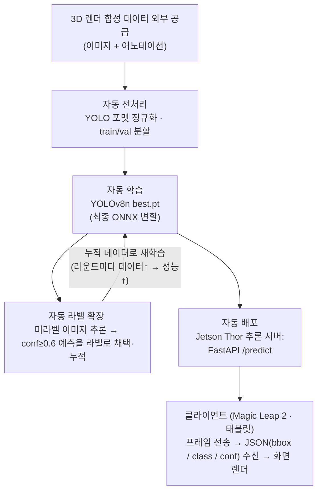

# XR 오토러닝 (XR Auto-Learning) - 헬기 부품 비마커 인식 파이프라인

## 1. 프로젝트 개요

헬기 정비 부품을 비마커(QR/바코드 없이) 인식하는 YOLO 객체탐지 모델을 **사람 개입 없이(zero-manual) 자동으로 학습·배포하는 MLOps 파이프라인**이다. 3D 렌더링으로 생성된 (이미지 + 어노테이션)을 입력으로 받아, 전처리 → 자동 라벨 확장 → YOLO 학습 → ONNX/API 배포까지 하나의 루프로 돌린다.

### 데이터 생성 방식
**수작업 라벨링 없이 이미지+어노테이션 동시 산출**

1. 입력: 현장 정비사가 실제 부품의 2D 사진 촬영
2. 3D화: 시스템이 2D 사진을 3D 모델로 자동 변환
3. 다시점 렌더링: 3D 모델을 다각도로 렌더링하여 여러 시점의 2D 이미지 생성
4. 자동 어노테이션: 렌더 시점의 3D 좌표를 이미지 평면에 투영해 정확한 바운딩 박스 자동 산출
5. 투입: (이미지 + 어노테이션) 쌍을 YOLO 학습 파이프라인에 즉시 공급

### 핵심 기능

- **자동 데이터 파이프라인**: 입력 데이터 → YOLO 포맷 정규화 → train/val 분할까지 무인 처리
- **자동 라벨 확장(self-training)**: 학습된 모델이 실제 이미지에 conf ≥ 0.6 라벨을 생성해 데이터셋을 자동 증분·재학습
- **학습·변환 자동화**: YOLOv8n 학습 → best.pt 추출 → ONNX export를 단일 스크립트로
- **추론 서빙**: FastAPI `/predict` + ONNX로 박스/클래스/신뢰도 JSON 제공

<br>

## 2. 시스템 아키텍처 및 파이프라인

3D 렌더링 합성 데이터를 활용한 YOLO 자동 라벨링·학습 파이프라인. 데이터 입수부터 학습·배포까지 사람 손을 타지 않고 단일 루프로 자동화하는 것이 설계 목표다.

**데이터 흐름**



- 사람 개입은 데이터 투입뿐, 라벨링·학습·배포는 전부 스크립트가 수행 (단계별 실행 명령은 6장, 루프 효과 실측은 5.3)
- **배포 구조 = 원격 추론(서버 사이드)**: 클라이언트(Magic Leap 2·태블릿)는 카메라 프레임을 보내고 JSON 결과만 받아 그린다. 전처리(레터박스)·추론·후처리(NMS·좌표 복원)·GPU 활용은 전부 Thor 서버의 ultralytics 런타임이 담당하므로 기기 쪽 구현 부담과 기종 의존성이 없다

**컴포넌트 연동**

| 계층 | 구성 |
|------|------|
| 모델 | YOLOv8n (Ultralytics), 단일 스테이지 탐지기. 모델·입력크기 선정 벤치마크는 `5_benchmark.py` |
| 추론 서버 | **NVIDIA Jetson Thor** (ARM64 + Blackwell GPU, JetPack 스택). FastAPI + Uvicorn (`/predict`, `/health`), 기동 시 모델 로드+워밍업, 추론은 스레드풀 실행(요청 비차단) |
| 클라이언트 | Magic Leap 2 · 태블릿: 프레임 전송 → JSON 수신 → 박스 렌더 (온디바이스 추론 없음) |
| 배포 포맷 | PyTorch `.pt`(서빙 기본) / ONNX / TensorRT 엔진(Thor 가속, 변환 예정) |
| 공용 모듈 | `pseudo_utils`(박스 선택 단일 구현: 운영·실험 공용) / `dataset_utils`(클래스 등록 가드) |
| 모델 릴리스 | 학습마다 `models/releases/v<타임스탬프>/`에 best.pt·onnx·지표·**학습로그 전문** 자동 보관(최근 10개). **배포 게이트**: 직전 채택본보다 mAP50 하락 시 서빙 모델 미교체. 롤백은 `6_model_registry.py` |
| 설정 | `scripts/config.py` 단일 소스(경로·임계값·하이퍼파라미터) |

**폴더 구조**

```
xr_autolearning/
├─ data.yaml                     # 클래스 정의(names)·데이터 경로
├─ requirements.txt
├─ scripts/                      # 파이프라인 스크립트 (번호 = 실행 순서)
│  ├─ config.py                  # 경로·클래스·임계값·하이퍼파라미터 공통 설정
│  ├─ 0_coco_to_yolo.py          # Roboflow COCO → YOLO 포맷 변환 (샘플 데이터용)
│  ├─ 0_import_render.py         # 3D 렌더 데이터 반입 (클래스 등록·라벨 검증·배치)
│  ├─ 0_import_roboflow.py       # Roboflow YOLOv8 export 정리
│  ├─ 1_auto_labeling.py         # 자동 라벨링 (conf 필터, --tta, --conf-per-class)
│  ├─ 2_train_pipeline.py        # train/val 분할 → 학습 → ONNX export
│  ├─ 3_api_server.py            # FastAPI 추론 서버
│  ├─ 4_experiment_autolearn.py  # 오토러닝 효과 실증 (정답 숨기고 자동 채점)
│  ├─ 5_benchmark.py             # 모델 x 입력크기 매트릭스 벤치마크 (배포 모델 선정 근거)
│  ├─ 6_model_registry.py        # 릴리스 조회/롤백 (이전 버전 복원)
│  ├─ 7_finetune_real.py         # 실사 소량 파인튜닝 (2단계: 동결 → 저lr 해제, 전/후 게이트)
│  ├─ dataset_utils.py           # 데이터셋 등록 공용 (names 정규화·data.yaml 등록 가드)
│  ├─ pseudo_utils.py            # 자동 라벨링 공용 (박스 선택 단일 구현: 추론·TTA·conf 필터)
│  └─ data_viewer.ipynb          # COCO 어노테이션 점검 노트북 (클래스 분포·라벨 시각화)
├─ models/                       # base_model.pt(초기 생성기) / new_model.pt·onnx(서빙 현재본)
│  └─ releases/                  # 버전별 보관: v<타임스탬프>/{best.pt, best.onnx, metrics.json, train.log}
├─ datasets/                     # images/ labels/ unlabeled_images/
├─ bench_results/                # 벤치마크 결과 (benchmark.json / benchmark.md)
└─ exp_results/                  # 실험 리포트 (report_*.json)
```

<br>

## 3. 기술 스택

**Data & AI**

- 언어: Python 3.10+
- 탐지 프레임워크: Ultralytics YOLOv8 (8.4.93), 모델 YOLOv8n
- 딥러닝: PyTorch 2.x (RTX 5090은 CUDA 12.8 빌드, 그 외 GPU는 CUDA 버전에 맞춰 설치)
- 변환·서빙 런타임: ONNX, onnxruntime, onnxslim
- 데이터 처리: NumPy, Pillow, PyYAML

**Infra & Backend**

- API: FastAPI, Uvicorn, python-multipart
- 배포(운영) 서버: NVIDIA Jetson Thor (ARM64 + Blackwell, JetPack 기반 torch/ultralytics 스택, TensorRT 가속 예정. 도입 전으로 스택 구성은 7장 과제)
- 학습·실험 환경: NVIDIA RTX 5090 1장 (단일 GPU, CUDA 12.8)
- 형상 관리: Git (GitHub: `ev1025/auto_annotation_learning`)
- 데이터셋/모델 가중치는 `.gitignore`로 제외(용량·재생성 가능), 소스·결과 리포트(json)만 추적

<br>

## 4. 데이터 전처리 및 모델링

### 4.1 데이터 소스

**샘플 데이터 (현재 사용 중, 파이프라인 검증용)**

| 항목 | 내용 |
|------|------|
| 데이터셋 | Mechanical Parts Dataset 2022 (Roboflow 공개 데이터) |
| 규모 | 2,250장 / 4클래스(bearing·bolt·gear·nut) / 박스 10,599개 |
| 포맷 | Roboflow COCO (`_annotations.coco.json` + 이미지) → `0_coco_to_yolo.py`로 변환 |
| 용도 | 학습·자동라벨·평가 루프의 유효성 검증 (5장 실험 결과가 전부 이 데이터 기준) |

**실제 데이터 (도입 예정, 운영용)**

| 항목 | 내용 |
|------|------|
| 데이터셋 | 헬기 정비 부품 3D 렌더 합성 데이터 (외부 공급) |
| 라벨 생성 | 렌더 시점에 3D 좌표를 이미지 평면에 투영 → 정답 bbox 자동 산출 (수작업 0) |
| 포맷 | YOLO txt(정규화 cxcywh) 또는 COCO JSON + 클래스 정의 파일 (7장 논의사항 2 참고) |
| 반입 절차 | `0_import_render.py`로 클래스(번호↔부품명) 등록 → 라벨 검증 → 데이터셋 배치. 기존 등록 클래스와 다르면 중단(등록 가드), 클래스별 분포 출력으로 번호 어긋남을 조기 발견 |
| 상태 | 미확보. 확보 시 위 반입 절차만 거치면 동일 파이프라인 적용 |

입력이 샘플이든 실제 렌더든 이후 파이프라인은 동일. 검증 대상은 "라벨셋 → 학습 → 자동라벨 확장 → 성능 향상" 루프다.

### 4.2 전처리 (COCO → YOLO)

| 처리 | 내용 |
|------|------|
| 좌표 변환 | COCO 픽셀 bbox → YOLO 정규화 중심좌표 (경계 밖은 0~1 클램프) |
| 더미 클래스 제거 | Roboflow가 넣는 상위 카테고리(id 0) 제외, 실제 클래스만 0..k-1 재매핑 |
| 정합성 검증 | 이미지-라벨 파일명 1:1 매칭, 필드 5개 미만 라인 스킵 |
| train/val 분할 | 최초 실행 시 고정 seed 분할(val 20%). 이후 신규 유입분(자동 라벨)은 **train에만 추가**하고 val은 고정 (라운드 간 비교 일관성 + 자동 라벨의 평가 오염 방지) |
| 경로 함정 회피 | 상대 `path` 오해석("Dataset not found") 방지용 절대경로 `data.generated.yaml` 자동 생성 |

변환 예시 (실제 데이터 1개 박스, 이미지 크기 416×416):

```
----------------------------------------------------------------------------
[변환 전] COCO 방식 = "박스의 왼쪽 위 모서리 + 크기"를 픽셀로 기록
----------------------------------------------------------------------------
  클래스: gear
  "bbox": [116.9, 73.3, 77.9, 82.0]     → 왼쪽 위 (116.9, 73.3)에서 시작하는
                                          가로 77.9 × 세로 82.0 픽셀짜리 박스

----------------------------------------------------------------------------
[변환 계산] "박스의 중심점 + 크기"로 바꾸고, 이미지 크기로 나눠 0~1 비율로
----------------------------------------------------------------------------
  중심 x = (116.9 + 77.9/2) ÷ 416 = 0.375
  중심 y = ( 73.3 + 82.0/2) ÷ 416 = 0.275
  너비   =  77.9 ÷ 416            = 0.187
  높이   =  82.0 ÷ 416            = 0.197

----------------------------------------------------------------------------
[변환 후] YOLO 방식 = .txt 한 줄
----------------------------------------------------------------------------
  2 0.375 0.275 0.187 0.197
  = "클래스 2(gear), 중심 (0.375, 0.275), 크기 0.187 × 0.197"
```

변환이 끝나면 이미지 1장마다 이런 .txt 가 하나씩 생긴다 (한 줄 = 박스 1개):

```
train/labels/239_jpg.rf.9urQ....txt   ← 같은 이름의 .jpg 와 짝
  1 0.426154 0.414663 0.082115 0.242788     ← bolt
  1 0.629219 0.403846 0.083630 0.250000     ← bolt
  3 0.743389 0.324519 0.081202 0.120192     ← nut
  ...(총 7줄 = 이 사진엔 bolt 3개, nut 4개)
```

### 4.3 자동 라벨링 안전장치 (모델 작동 근거)

| 장치 | 동작 | 이유 |
|------|------|------|
| conf ≥ 0.6 | 임계값 이상 예측만 라벨 채택 | 정밀도 우선, 오라벨 유입 억제 |
| TTA 일관성 필터 (`--tta`) | 원본·반전·축소 3뷰 모두 재현(IoU≥0.8)되는 예측만 채택 (이미지 8장 단위 배치 추론) | "자신 있게 틀리는" 예측 차단 (실측 FP −44%, 5.4 참고) |
| 클래스별 임계값 (`--conf-per-class`) | 클래스마다 임계값 개별 설정 | 쉬운 클래스만 라벨 양산되는 클래스 소외 완화 |
| 콜드 리스타트 | 매 라운드 `yolov8n.pt`에서 새로 학습 | 오라벨이 가중치에 고착(confirmation bias)되는 것 방지 |
| 가드레일 | 라운드1 mAP < 라운드0이면 폐기 권고 기록 | 오류 증폭 자동 감지·롤백 |
| 박스 선택 단일 구현 | 위 필터 전부를 `pseudo_utils.predict_boxes` 한 곳에 구현, 운영(1번)·실험(4번)이 공용 | 실험으로 검증한 규칙과 실제 배포 규칙이 몰래 어긋나는 것(드리프트) 차단 |

자동 라벨링 후 생성되는 리포트(report.json). 라벨 전수 검사 대신 이 수치로 채택 여부를 판단한다:

```json
"pseudo": {
  "labeled_images": 578,        // 라벨 생성된 이미지 수 (입력 647장 중)
  "boxes": 2955,                // 생성 박스 총 개수
  "precision": 0.9381,          // 정답과 일치 비율 (실험 환경 한정)
  "recall": 0.7406,             // 실제 객체 중 잡아낸 비율
  "per_class_boxes": {"nut": 1667, "bolt": 1288},  // 한쪽 0에 쏠리면 이상 신호
  "mean_conf": 0.9218,          // 지속 하락 시 중단 신호
  "tta_dropped_boxes": 352      // TTA 필터가 걸러낸 박스 수
},
"guardrail": {"accepted": true} // false = 이번 라운드 라벨 폐기
```

핵심: 채택 여부는 `guardrail`, 이상 징후는 `per_class_boxes`·`mean_conf` 로 본다.

### 4.4 하이퍼파라미터 및 검증 전략

| 항목 | 값 |
|------|-----|
| 모델 | YOLOv8n (사전학습 `yolov8n.pt`에서 전이학습) |
| 입력 크기 | 640 |
| epochs | 60 (실험), 기본 100 (운영 스크립트) |
| batch | 32 (단일 GPU), 대용량 조건은 24 |
| optimizer | auto (Ultralytics 자동 선택) |
| best 선택 | `model.trainer.best` (val 기준 best.pt) |

- 검증 분할: 고정 난수 seed 단일 홀드아웃. 실험은 초기 라벨셋 / 미라벨셋(라벨 숨김) / 평가셋(측정 전용) 3분할, 평가셋은 어떤 학습에도 미사용 (코드·리포트 표기: seed / pool / test)
- k-fold 교차검증 미적용 (7장 한계점 참고)

<br>

## 5. 성능 평가

평가는 두 가지 질문에 답하기 위해 수행했다.

1. **최종 모델의 탐지 성능은 어느 수준인가?** → 5.2
2. **오토러닝(자동 라벨 재학습)이 성능을 실제로 올렸는가?** → 5.3 (이 프로젝트의 핵심 검증)

### 5.1 지표 정의

| 지표 | 의미 | 어디에 쓰나 |
|------|------|-------------|
| mAP50 | 예측 박스가 정답과 50% 이상 겹치면 정답으로 인정하고 계산한 평균 정밀도 (0~1, 높을수록 좋음) | 모델 성능의 대표 지표 |
| mAP50-95 | 겹침 기준을 50~95%까지 높여가며 평균 | 박스 위치까지 엄격히 본 지표 |
| 자동라벨 정밀도(P) | 자동 생성 라벨 중 정답과 일치한 비율 | 자동 라벨을 믿어도 되는지 |
| 자동라벨 재현율(R) | 실제 객체 중 자동 라벨이 잡아낸 비율 | 자동 라벨이 얼마나 빠뜨리는지 |

- 모든 mAP는 **평가셋**(어떤 학습에도 안 쓴 데이터)에서 측정
- 자동라벨 P/R은 미라벨셋의 숨겨둔 정답과 IoU ≥ 0.5 매칭으로 산출
- 분할·셔플은 고정 난수 seed로 재현 가능

### 5.2 최종 모델 성능

오토러닝 완료 후(라운드1) 모델의 **평가셋**(정답 라벨, 학습 미사용) 성능:

| 조건 | mAP50 | mAP50-95 |
|------|-------|----------|
| 2클래스 (bolt·nut) | 0.859 | 0.674 |
| 3클래스 (+gear) | 0.835 | 0.677 |
| **4클래스 전체** | **0.863** | **0.680** |

참고: 운영 루프 E2E 구동(전체 라벨 부트스트랩 100 epochs → 자동 라벨 220장 누적 → 재학습 100 epochs) 결과, 고정 val(405장, 자동 라벨 미포함) 기준 mAP50 0.873 / mAP50-95 0.708 (정밀도 0.917 / 재현율 0.804). 이 구동에서 재학습 시 train이 1,620 → 1,840장으로 늘어 자동 라벨이 실제 누적됨을 확인.

클래스별 mAP50-95 (4클래스 실험 모델):

| bolt | nut | gear | bearing |
|------|-----|------|---------|
| 0.710 | 0.751 | 0.570 | 0.690 |

- gear가 상대적으로 낮음(형태 다양성·유사 클래스 혼동) → 데이터 보강 대상
- Confusion Matrix, PR curve 등 상세 플롯은 학습 시 `runs/<name>/`에 자동 생성

**실제 추론 예시** (평가셋 이미지 1장, 오토러닝 완료 2클래스 모델)

| 입력 (이미지 + 라벨) | 출력 (모델 추론 결과) |
|---|---|
|  |  |

입력 라벨 (bolt 4개 + nut 2개):

```
1 0.560721 0.637019 0.086058 0.125000   ← nut
1 0.703726 0.752404 0.093221 0.120192   ← nut
0 0.635228 0.378606 0.095649 0.252404   ← bolt
0 0.757825 0.432692 0.090793 0.254808   ← bolt
0 0.497055 0.507212 0.088486 0.254808   ← bolt
0 0.612392 0.840144 0.199014 0.112981   ← bolt
```

- 출력: 6개 객체 전부 탐지, 신뢰도 0.93~0.95 (bolt 4, nut 2, 미탐·오탐 0)

### 5.3 오토러닝 효과 검증 (전후 비교 실험)

**목적**: "라벨 없는 이미지에 모델이 스스로 붙인 라벨로 재학습하면, 라벨링 비용 0으로 성능이 오르는가"를 증명한다. 같은 평가셋에서 **재학습 전(라운드0)과 후(라운드1)를 비교**해 차이(Δ)가 곧 오토러닝의 효과다.

| 실험 | 라벨o / 라벨x / 평가셋 (장) | mAP50 (R0→R1) | ΔmAP50 | mAP50-95 (R0→R1) | 자동라벨 P/R |
|------|---------------------------|----------------|--------|-------------------|--------------|
| 2클래스, 초기 라벨 15% | 149 / 647 / 199 | 0.835 → 0.859 | **+2.3%p** | 0.645 → 0.674 | 0.902 / 0.805 |
| 2클래스, 초기 라벨 10% | 99 / 697 / 199 | 0.819 → 0.839 | **+2.0%p** | 0.623 → 0.663 | 0.885 / 0.765 |
| 3클래스 | 236 / 1,025 / 315 | 0.825 → 0.835 | **+1.0%p** | 0.649 → 0.677 | 0.901 / 0.715 |
| 4클래스 전체 | 337 / 1,463 / 450 | 0.827 → 0.863 | **+3.6%p** | 0.649 → 0.680 | 0.871 / 0.726 |

- 라벨o = 라벨 주고 시작하는 초기 학습분 / 라벨x = 라벨 숨기고 자동 라벨을 붙이는 대상 / 평가셋 = 측정 전용
- 라벨o가 라벨x보다 훨씬 적은 이유: "라벨은 비싸서 적고, 미라벨은 공짜로 많다"는 실전 조건을 재현한 것. 초기 라벨이 많으면 미라벨 데이터의 기여를 측정할 수 없다

**결과 해석**:

- 4개 조건 전부 라운드1 > 라운드0 → 클래스 수·초기 라벨 비율과 무관하게 오토러닝 효과가 일관 재현됨
- 초기 라벨 15%→10%(149→99장)로 줄여도 개선폭 유지(+2.0%p) → 초기 라벨 부담을 낮춰도 유효
- 자동 라벨 정밀도 0.87~0.90 → 사람 개입 없이 학습에 쓸 만한 품질

**반증(라벨 품질이 깨지면)**: 자동 라벨과 이미지 매칭이 깨진 채 학습된 사례에서 mAP50 **−19.7%p** 폭락(전 객체를 배경으로 오학습). 좋은 라벨은 +2~4%p 올리지만 나쁜 라벨은 −20%p로 무너뜨림 → 라벨-이미지 정합성이 오토러닝 성패의 핵심 변수.

### 5.4 TTA 일관성 필터 효과 (2클래스, 초기 라벨 15% 동일 분할)

**목적**: 안전장치인 TTA 일관성 필터(4.3)가 오라벨을 실제로 걸러내는지, 켰을 때 무엇을 얻고 잃는지 측정한다.

| | 기본 conf 필터 | + TTA 일관성 필터 | 변화 |
|---|---|---|---|
| pseudo 정밀도 | 0.902 | **0.938** | **+3.6%p** |
| 오라벨(FP) 수 | 327개 | **183개** | **−44%** |
| pseudo 재현율 | 0.805 | 0.741 | −6.4%p |
| 채택 박스 수 | 3,339 | 2,955 (352개 필터 제거) | −11% |
| ΔmAP50 (R0→R1) | +2.3%p | +0.1%p | |
| ΔmAP50-95 (R0→R1) | +2.9%p | +2.1%p | |

- TTA 필터는 약속대로 동작: **오라벨을 절반 가까이 제거**(FP −44%)하고 정밀도를 0.94로 올림. 대가는 재현율 −6.4%p.
- 단, 동일 도메인(공개 데이터) 조건에서는 기본 필터도 정밀도 0.90으로 이미 충분해 최종 mAP50 이득은 없었음.
- 결론: **동일 도메인에서는 기본 conf 필터로 충분(TTA 기본 OFF 유지). 렌더→실사처럼 도메인 갭이 있어 오라벨 위험이 커지는 구간에서 `--tta`를 켜는 것을 권장**(오라벨 유입 차단이 정밀도 손실보다 중요해지는 상황).
- 참고: 두 실행의 라운드0 기준점이 다름(0.835 vs 0.820, 학습 확률성·GPU 구성 차이). pseudo 정밀도/FP 비교가 필터 자체의 효과를 보는 지표.

<br>

## 6. 설치 및 실행 방법

### 6.1 환경 설정

```bash
pip install -r requirements.txt
# GPU 사용 시 torch 는 CUDA 버전에 맞춰 별도 설치
#   RTX 5090(Blackwell): pip install torch torchvision --index-url https://download.pytorch.org/whl/cu128
#   그 외:               pip install torch --index-url https://download.pytorch.org/whl/cu124
```

경로·임계값·하이퍼파라미터는 별도 `.env` 없이 `scripts/config.py` 한 곳에서 관리(`BASE_MODEL`, `AUTO_LABEL_CONF`, `API_IOU`, `SERVE_MODEL` 등).

### 6.2 데이터 준비

```bash
# (검증용) Roboflow COCO 데이터를 YOLO 구조로 변환
python scripts/0_coco_to_yolo.py --src ./mechanical-parts-coco --dst ./mechanical-parts-yolo

# (운영용) 3D 렌더 데이터 반입: 클래스 등록(나열 순서=번호) + 라벨 검증 + 배치
python scripts/0_import_render.py --src ./render_delivery --classes bolt nut gear --dry-run  # 검증만
python scripts/0_import_render.py --src ./render_delivery --classes bolt nut gear           # 실제 반입
```

### 6.3 실행 순서 (자동화 루프)

```bash
# 0) 부트스트랩(1회): 반입된 라벨셋으로 첫 모델 학습 후 라벨 생성기로 승격
python scripts/2_train_pipeline.py --epochs 100 --device 0
cp models/new_model.pt models/base_model.pt

# 1) 자동 라벨링: 미라벨 이미지(datasets/unlabeled_images) → conf≥0.6 YOLO 라벨
python scripts/1_auto_labeling.py --weights models/base_model.pt

# 2) 재학습 + ONNX 변환: 누적 라벨로 학습 → best.pt/onnx  (1↔2 반복 = 오토러닝 루프)
#    매 실행마다 models/releases/v<타임스탬프>/ 에 버전 보관(모델·지표·학습로그).
#    배포 게이트: 직전 채택본보다 mAP50 낮으면 보관만 하고 서빙 모델은 유지 (--force-promote 로 무시)
python scripts/2_train_pipeline.py --epochs 100 --device 0

# 3) 추론 API 서버
python scripts/3_api_server.py       # http://0.0.0.0:8000
curl -X POST -F "file=@sample.jpg" "http://localhost:8000/predict?conf=0.3"

# (운영) 릴리스 조회 / 문제 시 이전 버전으로 롤백
python scripts/6_model_registry.py list
python scripts/6_model_registry.py rollback            # 직전 채택본으로 복원
python scripts/6_model_registry.py rollback v20260716_093012   # 특정 버전으로 복원
```

### 6.4 자동화 효과 재현 실험

```bash
# 정답을 숨기고 자동 채점: 라운드0 vs 라운드1 mAP + 자동라벨 P/R
python scripts/4_experiment_autolearn.py --src ./mechanical-parts-yolo --classes bolt nut --epochs 60
# 결과: exp_autolearn/report.json (exp_results/ 에 조건별 리포트 보관)
```

### 6.5 모델·입력크기 벤치마크

```bash
# 모델 x 입력크기 매트릭스: 정확도(mAP)·단건 지연(ms)·FPS·파라미터 비교
# --src 만 바꾸면 다른 데이터셋으로 즉시 재실행 가능
python scripts/5_benchmark.py --src ./mechanical-parts-yolo \
    --models yolov8n.pt yolov8s.pt yolov8m.pt yolo11n.pt yolo26n.pt yolo26s.pt yolo26m.pt \
    --imgsz 640 1280 --epochs 100 --device 0
# 결과: bench_results/benchmark.json + benchmark.md (조합마다 누적 저장)
# 지연/FPS 는 실행 장비 기준. Jetson Thor 실측은 Thor 에서 같은 명령 재실행
```

### 6.6 실사 소량 파인튜닝 (실제 데이터 확보 후)

```bash
# 합성 사전학습 모델을 실사 50~100장으로 2단계 파인튜닝 (7장 "추후 시도할 것" [1] 구현)
# 1단계 backbone 동결 -> 2단계 저학습률 해제. 실사 val 전/후 비교 게이트 + 릴리스 보관
python scripts/7_finetune_real.py --src ./real_photos --device 0
# real_photos/images/*.jpg + real_photos/labels/*.txt (클래스 번호는 data.yaml 체계와 동일)
```

API 응답 예시:

```json
{
  "filename": "part.jpg",
  "image": {"width": 1280, "height": 720},
  "count": 1,
  "detections": [
    {"class_id": 0, "class_name": "bolt", "confidence": 0.91,
     "bbox": {"x": 120.5, "y": 80.0, "w": 64.0, "h": 64.0}}
  ]
}
```

- `bbox` = 좌상단 `x,y` + `w,h`(픽셀). XR/프론트가 그대로 렌더 가능.

<br>

## 7. 한계점 및 추후 개선 과제

**한계점**

- **도메인 갭**: 실제 대상 부품 3D 렌더 데이터 미확보로 공개 기계부품 데이터로 대체 검증. 렌더 이미지와 실사 간 sim-to-real 갭은 미검증.
- **검증 방식**: 고정 seed 단일 홀드아웃 분할. k-fold 교차검증 미적용으로 지표의 신뢰구간(분산) 미산출.
- **라운드 깊이**: 라운드1까지만 측정. 다회 라운드 누적 시 수렴·포화 지점 미검증.
- **자동 라벨 재현율**: 0.71~0.81 수준으로 conf 0.6에서 놓치는 객체 존재. 현재 파이프라인은 자동 라벨을 무검수로 학습에 투입.
- **데이터 규모**: 수백~천 장대. 실제 운영 규모(수만 장) 및 클래스 불균형(gear 저조) 미검증.
- **리소스 병목**: 멀티GPU(DDP) 학습 후 메모리 미회수로 대용량 조건 OOM 발생 → 단일 GPU로 우회(다중 GPU 스케일아웃 미확보).

**추후 개선 과제(Next steps)**

- **Jetson Thor 배포 스택 구성**: ARM64+JetPack용 torch/ultralytics 설치, TensorRT 엔진 변환(`model.export(format="engine")`), Thor에서 벤치마크(6.5) 재실행으로 실기 지연 실측
- **실시간 왕복 지연 검증**: 클라이언트(Magic Leap 2·태블릿) ↔ Thor 프레임 전송~JSON 수신 전 구간 측정 (목표 fps 대비)
- 모델·입력크기 벤치마크(6.5) 결과 기반 배포 모델 확정
- 3D 렌더 합성 데이터 연동(입력 자동 수집 → 전처리 자동 트리거)으로 루프 완전 무인화
- k-fold 교차검증 도입, 다회 라운드 누적 실험으로 수렴 곡선 확보
- conf 임계값·초기 라벨 비율 스윕으로 정밀도-재현율 트레이드오프 최적화
- 저성능 클래스(gear) 표적 데이터 증강 및 클래스 불균형 보정
- 아래 **논의사항 1·2** 확정 후 실제 데이터 전환

**추후 시도할 것 (합성→실사 전환 시, 문헌 검증 기법)**

실제 3D 렌더 데이터 전환 시점에 적용할 후보. 수치는 해당 논문의 실측(우리 데이터 미검증).

| 기법 | 내용 | 근거 |
|------|------|------|
| 하이브리드 학습 | 합성 대량 사전학습 → 실사 50~100장만 라벨링해 낮은 학습률로 소량 파인튜닝 | 고품질 합성 + 실사 50장 ≈ 저품질 합성 + 실사 400장 (실사 라벨 약 8배 절감) [1] |
| 파인튜닝 2단계 레시피 | 1단계 backbone 동결(`freeze=10`)·20ep·lr0 0.01 → 2단계 전층 해제·40ep·lr0 0.001, `cos_lr=True` | 기본 lr(0.01) 그대로 파인튜닝하면 합성에서 배운 가중치 파괴(catastrophic forgetting) [1] |
| 파인튜닝용 실사 선별 | 모델이 틀린 어려운 프레임(hard mining)보다 **균등 랜덤 샘플링**이 우수 | 200Hard < 200Random 실측 [1] |
| 파인튜닝 특화 증강 | `mosaic=1.0`·`mixup=0.3~0.5`(작은 객체·배경 혼합 강건성), `hsv_h/s/v` 지터(렌더의 완벽한 조명을 현실처럼 왜곡) | 렌더(부품이 크게)↔실사(작게 보임) 스케일 갭 대응 |
| loss 가중치 튜닝 | 박스가 헐거우면 `box` 7.5→10, 클래스 혼동이면 `cls` 상향 | |
| LLM 유도 증강 루프 | 왜곡 유형별 실패 통계를 LLM에 입력 → 증강 레시피(JSON) 자동 생성 → 오프라인 증강 후 재파인튜닝. 우리 report.json(클래스 분포·mean_conf)과 바로 연결 가능 | PCB 탐지에서 Gaussian blur mAP50 31.6→94.9% 회복, 추론 비용 증가 0 [2]. 단 motion blur는 증강만으로 한계(7.8→16.4%) |
| 합성 데이터 반복 개선 | 씬 단위로 쪼개 성능 기여 분석 → 비효율 씬 재설계. 장소당 700~1,000장 초과 생성은 다양성 추가 없인 무효 | 3회 반복 개선으로 합성 단독 mAP50 0.24→0.49 [1] |

- 하이브리드 학습은 "실사 소량 손라벨" 도입을 전제하므로 zero-manual 포지셔닝의 완화 여부 결정 필요 (논의사항 1·2와 함께 협의)

**논의사항 1. YOLO 라벨의 클래스를 어디서 정의할 것인가**

부품 클래스(번호↔부품명)를 누가, 어디서 정의해서 파이프라인에 넣을지 결정 필요. 현재는 반입 시 CLI(`0_import_render.py --classes ...`)로 임시 대응 중.

| 안 | 방식 | 장점 | 고려사항 |
|----|------|------|----------|
| A. 공급분에 동봉 | 3D팀이 `classes.txt`(번호↔부품명)를 데이터와 함께 제공 | 데이터-정의가 같이 움직여 번호 어긋남 최소 | 3D팀 작업 절차에 추가 부담 |
| B. 저작도구에서 선택/입력 | 저작도구 UI에서 부품 클래스를 선택하거나 신규 입력 → 파이프라인에 전달 | 사용자가 클래스 체계를 직접 제어, 신규 부품 추가 유연 | UI·API 개발 필요, 오입력(오탈자·중복) 검증 로직 필요 |
| C. 3D 모델 메타데이터에서 자동 추출 | 3D 자료의 부품명 메타데이터를 렌더 시 라벨에 자동 기입 | 완전 무인(zero-manual 포지셔닝과 일치) | 3D 자료에 부품명 메타 필수, 명명 규칙 표준화 선행 필요 |

- 결정 기준: 클래스 체계의 관리 주체(3D팀 vs 저작도구 사용자), 신규 부품 추가 시 워크플로우, 오입력 검증 방법, 기존 학습 모델과의 클래스 호환(추가/삭제 시 재학습 범위)

**논의사항 2. 3D 렌더링 데이터 공급 조건 (도메인 랜덤화)**

실제 3D 렌더 데이터를 공급받을 때, 렌더와 실사 간 도메인 갭(sim-to-real gap)을 줄이기 위해 렌더링 시점에 반영할 사항을 공급 측과 협의 필요. 픽셀 단위 열화(노이즈·블러·색 왜곡)는 학습 측 증강으로 처리하므로, 렌더 측은 **증강으로 만들 수 없는 구조적 다양성**에 집중한다.

| 항목 | 요청 내용 | 이유 |
|------|-----------|------|
| 배경 랜덤화 | 단색/스튜디오 배경 금지. 격납고·정비고·공장 등 실사 배경(HDRI)을 렌더마다 무작위 교체 | 깨끗한 배경만 학습하면 실사의 복잡한 배경에서 오탐 급증. 배경은 2D 증강으로 못 바꿈 |
| 광원 랜덤화 | 광원의 위치·방향·색온도·강도를 렌더마다 무작위 변경. 강한 그림자/역광 씬 포함 | 그림자·반사의 기하학적 변화는 밝기 조절(증강)로 재현 불가 |
| 가림(occlusion) | 부품이 손·공구·다른 부품에 부분적으로 가려진 씬 포함 (가림률 0~50% 변주) | 실제 정비 환경의 기본 조건. Cutout 증강은 진짜 가림을 대체 못함 |
| 카메라 변주 | 거리·각도·높이를 전방위로 랜덤화 (정면 위주 금지). 근접/원거리 극단 포함 | 정비사 시점(HMD)은 각도가 불규칙함 |
| 재질/오염 변주 | 기름때·긁힘·부식·도색 차이 등 표면 상태 변주 | 렌더의 깨끗한 재질만 학습하면 실부품의 오염 상태에서 미탐 |
| 라벨 규격 | 각 렌더 이미지에 대해 3D 좌표 투영 기반 2D bbox를 YOLO txt(정규화 cxcywh) 또는 COCO JSON으로 제공 | 본 파이프라인이 즉시 소비 가능한 포맷 |
| 클래스 정의 파일 | 라벨의 클래스 번호↔부품명 매핑을 `classes.txt`로 동봉 (논의사항 1의 A안, 채택 시) | 라벨엔 번호만 있어 이 약속 없이는 부품 식별 불가 |
| 해상도 | 단변 640px 이상 | YOLO 입력 규격(640) |
| 수량 | **부품(클래스)당 300~500장 권장** (부품 인스턴스 기준 200개 이상). 최소 실증선은 클래스당 50~85장(5.3 실험), 상한은 ~1,000장(동일 조건 초과 생성은 다양성 추가 없인 성능 기여 없음, 참고자료 [1]) | 클래스당 50~85장에서 오토러닝 루프 작동 실증. 단 실사 기준 수치라 렌더→실사 갭 여유분 필요. 이미지당 부품 수가 적으면(1개/장) 인스턴스 기준으로 환산해 장수 증대 |

- 핵심 원칙: **사실적으로 예쁘게(PBR 고품질)보다, 다양하고 지저분하게.** 모델이 배경·조명·표면 상태가 아니라 부품의 기하학적 형태로 인식하도록 강제하는 것이 목적.

<br>

## 참고 자료

**논문** (원문 PDF는 `논문/` 폴더 보관, git 미추적)

| # | 논문 | 우리와의 연결 |
|---|------|--------------|
| [1] | Dergachov & Aizatskyi, *Synthetic data for deep learning in object detection tasks* (WDA'26, CEUR-WS) | Unity 합성 데이터 3회 반복 개선 + 실사 소량 파인튜닝 전략·수치의 출처 (위 "추후 시도할 것") |
| [2] | Lee, Chen & Jiang, *LLM-guided Data Augmentation for YOLOv8-based PCB Defect Detection* (Sensors and Materials 38, 2026) | LLM이 실패 통계 분석 → 증강 레시피 자동 생성 루프의 출처 |
| [3] | Schmedemann et al., *Tuning domain randomization for 3D-rendered synthetic training data for defect detection in aircraft engine borescope inspection* (J. Electronic Imaging) | 항공 도메인 + 3D 렌더 도메인 랜덤화 튜닝 (논의사항 2의 근거) |
| [4] | Horváth et al., *Object Detection Using Sim2Real Domain Randomization for Robotic Applications* (IEEE T-RO 39(2), 2023) | sim-to-real 갭 대응 방법론 |
| [5] | Deogan et al., *Synthetic Dataset Generation for Autonomous Mobile Robots Using 3D Gaussian Splatting for Vision Training* (arXiv:2506.05092) | 2D 사진 → 3D 재구성 기반 합성 데이터 생성 기법 (1장 데이터 생성 방식의 구현 후보) |
| [6] | Wiese et al., *Detection of Surgical Instruments Based on Synthetic Training Data* (Computers 14(2), 2025) | 합성 데이터로 기구(부품 유사) 탐지 사례 |
| [7] | Karki et al., *Synthetic Data-Driven Mixed Reality for AR-Assisted Maintenance* (TechRxiv, 2025) | 합성 데이터 + AR 정비 지원 = 본 프로젝트와 동일 시나리오 |

**대회·벤치마크**

- Kaggle [Synthetic-2-Real Object Detection Challenge](https://www.kaggle.com/competitions/synthetic-2-real-object-detection-challenge) - 합성 학습 → 실사 평가 일반화 벤치마크. 우리 파이프라인 검증 무대로 쓸 수 있는지 **추후 검토**
