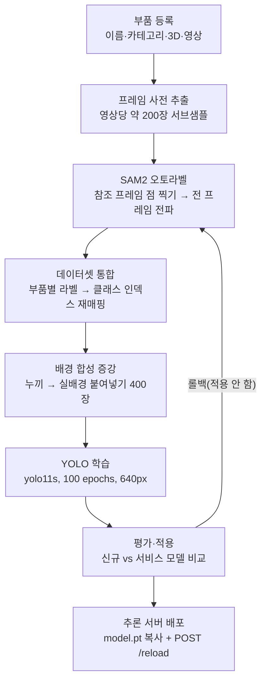

# XR 오토러닝 (XR Auto-Learning) - 헬기 부품 비마커 인식 파이프라인

## 1. 프로젝트 개요

부품 영상 몇 개만 등록하면 **사람이 박스를 그리지 않고** 부품 탐지 모델(YOLO)을 만들어 추론 서버까지 배포하는 파이프라인이다.
마커(QR·AR 태그)를 붙일 수 없는 헬기 정비 현장에서, 부품 자체의 외형으로 인식하는 것이 목표다.

사람이 하는 일은 **부품 영상 등록**과 **참조 프레임 몇 장에 점 찍기**뿐이다. 나머지(프레임 추출, 전 프레임 라벨 전파, 데이터셋 통합, 학습, 평가, 배포)는 자동으로 이어진다.

**핵심 기능**

- **부품 등록**: 이름·카테고리·설명·3D 모델·영상을 등록하면 프레임을 미리 잘라둔다. 학습 화면에서 기다리지 않는다
- **SAM2 오토라벨**: 참조 프레임에 점을 찍으면 SAM2가 마스크를 만들고 영상 전 프레임으로 전파해 YOLO 라벨을 생성한다
- **학습 -> 평가 -> 적용**: 선택한 부품으로 학습하고, 기존 모델과 비교한 뒤 적용하거나 롤백한다
- **추론 서버 자동 배포**: 적용 버튼 하나로 가중치가 추론 서버에 복사되고 재기동 없이 교체된다(핫 리로드)

<br>

---

## 2. 시스템 아키텍처 및 파이프라인

웹 대시보드 하나(:7862)가 등록·라벨·학습·평가를 모두 담당하고, 현장이 호출하는 추론 API(:9412)는 별도 프로세스다.
학습은 별도 서비스가 아니라 대시보드 프로세스 안의 백그라운드 스레드로 돈다.



- 등록 단계에서 프레임을 미리 자르는 이유는 라벨 화면에서 영상을 열 때마다 사용자가 기다리지 않게 하기 위해서다
- 학습은 매번 선택한 클래스로 처음부터 한다. 그래서 새 부품만 골라 학습하면 기존 부품을 잊는다(치명적 망각). 적용 전 비교 화면이 이 사고를 잡는 장치다

**컴포넌트**

| 컴포넌트 | 위치 | 포트 | 역할 |
|---|---|---|---|
| 대시보드 API + 프론트 | `backend/autolearning/dashboard_api.py` | 7862 | 등록·목록·라벨·학습·평가 화면과 API. `frontend/dist` 를 같이 서빙 |
| SAM2 · YOLO 학습 | `backend/autolearning/sam2_autolabel.py` | (스레드) | 라벨 생성, 데이터셋 통합, 학습, 모델 비교·적용 |
| 프레임·영상 인덱스 | `backend/autolearning/autolabel.py` | - | 영상 탐색, 프레임 추출·캐시 |
| 부품 등록 | `backend/autolearning/parts_registry.py` | - | 카테고리·부품 CRUD, 업로드, 프레임 추출 작업 |
| 메타데이터 DB | `backend/db/` + Postgres 16 | 5432 | 부품·영상·프레임·주석·학습이력 색인 |
| YOLO 추론 서버 | `backend/yolo_server/server.py` | 9412 | 현장용 `/detect`, 모델 핫 리로드 `/reload` |

**폴더 구조**

```
xr_autolearning/
├─ backend/
│  ├─ autolearning/
│  │  ├─ dashboard_api.py        # FastAPI 라우트 + 프론트 서빙 (:7862)
│  │  ├─ sam2_autolabel.py       # 라벨 생성·학습·평가·적용 (핵심 모듈)
│  │  ├─ autolabel.py            # 영상 인덱스 · 프레임 추출/캐시
│  │  └─ parts_registry.py       # 부품·카테고리 등록, 업로드
│  ├─ db/
│  │  ├─ models.py               # 스키마 6테이블 (SQLAlchemy 2.x)
│  │  ├─ session.py              # 접속 URL 조립 · 경로 상대화 헬퍼
│  │  ├─ migrate_from_files.py   # 파일 -> DB 동기화(부품 단위 upsert + prune)
│  │  ├─ reads.py                # 조회의 DB 구현(파일 구현과 동일 형태)
│  │  └─ verify_reads.py         # 파일판 vs DB판 결과 동등성 비교
│  └─ yolo_server/server.py      # 현장 추론 API (:9412)
├─ frontend/
│  ├─ src/App.jsx                # 3탭 SPA (부품 등록 / 목록 / 학습)
│  └─ src/app.css                # 디자인 토큰(타입·간격·컨트롤 높이)
├─ scripts/
│  ├─ config.py                  # 공용 경로·학습 기본값
│  ├─ eval_gt.py                 # GT 라벨로 실제 mAP 측정
│  └─ experiments/               # 서버 학습·모델 비교·추론 벤치(목록은 그 폴더 README)
├─ deploy/docker-compose.dev.yml # Postgres 16 (127.0.0.1 바인딩)
├─ data/                         # 원본(git 제외)
│  ├─ bell412/<부품>/videos/     #   등록 영상
│  ├─ bell412/<부품>/gt/         #   사람이 그린 정답 라벨(평가 전용)
│     └─ eval/                  #   내부 성능 확인용 미학습 영상(등록·학습에서 제외)
└─ results/                      # 산출물(git 제외)
   ├─ autolabels/<부품>/         #   프레임 · 라벨 · 마스크 · shots.json
   ├─ <시각>/model/best.pt       #   학습 run 별 가중치
   └─ _served.json               #   현재 서비스 모델 포인터
```

<br>

---

## 3. 기술 스택

**AI & ML**

| 항목 | 버전 | 용도 |
|---|---|---|
| SAM2 (segment-anything-2) | 2.1 hiera base+ | 참조 프레임 마스크 생성, 영상 전 프레임 전파 |
| Ultralytics YOLO | 8.4.104 | 부품 탐지 학습(yolo11s) · 추론 |
| PyTorch | 2.6.0+cu124 | 학습·추론 런타임 (RTX 4060 8GB) |
| OpenCV | 5.0.0 | 프레임 추출, 합성 증강, 결과 시각화 |
| NumPy | 2.4.4 | 배열 연산 |

**Data & Storage**

| 항목 | 버전 | 용도 |
|---|---|---|
| PostgreSQL | 16 (docker) | 부품·영상·프레임·주석·학습이력 색인 |
| SQLAlchemy | 2.0.52 | ORM. JSONB 사용, SQLite 폴백 가능 |
| psycopg | 3.3.4 | Postgres 드라이버 |

**App & Infra**

| 항목 | 버전 | 용도 |
|---|---|---|
| FastAPI | 0.139.2 | 대시보드 API, 추론 API |
| React + Vite | 18.3 / 6.x | 대시보드 프론트(빌드 산출물을 FastAPI가 서빙) |
| Docker Compose | - | Postgres만 컨테이너. 애플리케이션은 venv 프로세스 |

- 형상 관리: `data/`, `results/`, `*.pt`, `*.onnx`, `deploy/.env` 는 git 추적 제외. 코드와 설정만 추적한다
- DB 경로는 저장소 루트 기준 상대경로 + POSIX 구분자로 저장한다. 절대경로를 넣으면 Linux·컨테이너에서 전부 깨진다

<br>

---

## 4. 데이터 전처리 및 모델링

### 4.1 데이터 소스

**운영 데이터(등록 부품)**

| 항목 | 규모 | 포맷 | 상태 |
|---|---|---|---|
| 등록 부품 | 35종 | DB `parts` + 부품 폴더 | 운영 중 |
| 등록 영상 | 39개 | mp4 | 운영 중 |
| 추출 프레임 | 9,881장 | jpg | 운영 중 |
| SAM2 주석 | 1,206건 | DB `sam2_annotations` | 참조샷 21건 포함 |
| 학습 이력 | 13건 | `results/<시각>/` | 서비스 모델 1개 지정 |

**평가 데이터(성능 측정 전용, 학습에 넣지 않음)**

| 항목 | 규모 | 용도 |
|---|---|---|
| GT 정답 라벨 | a_test 30장, gearbox 40장 | 실제 mAP 측정 |
| 내부 평가 영상 | a_test 1개, gearbox 4개 | 미학습 영상 검출률 |

- 평가 영상은 부품 폴더 안 `eval/` 에 둔다. 영상 인덱스가 이 폴더를 건너뛰어 등록·학습에 섞이지 않는다
- GT는 2개 부품에만 있다. 나머지 33종은 실제 정확도를 측정할 수단이 없다(7장 한계 참조)

### 4.2 전처리

| 처리 | 내용 |
|---|---|
| 프레임 서브샘플 | 영상당 목표 200장. `stride = 전체 프레임 / 200` 으로 건너뛰며 저장 |
| 좌표 정규화 | 탭 포인트·박스 모두 0~1로 저장. 원본 해상도가 바뀌어도 유효 |
| 클래스 재매핑 | 부품별 라벨은 전부 class 0으로 저장되므로, 통합 시 부품명 -> 클래스 인덱스로 다시 쓴다 |
| 배경 합성 증강 | 학습 객체를 SAM2로 오려 실배경에 붙여 400장 추가 |

**실데이터 변환 예시** (a_test 부품, `train` 영상 0번 프레임)

```
[변환 전] 사용자가 찍은 점 (results/autolabels/a_test/shots.json)
  {"0": [[0.2391, 0.3184, 1], [0.4696, 0.4885, 1], [0.3609, 0.3825, 1]]}
  = 0번 프레임에 점 3개. 각 [x, y, label]이고 label 1은 "이 안쪽이 부품"이라는 뜻.
    좌표는 이미지 폭·높이로 나눈 0~1 값(0.2391 = 왼쪽에서 23.9% 지점)

[변환 계산] SAM2가 점 -> 마스크를 만들고, 마스크의 최소 경계를 YOLO 박스로 바꾼다
  마스크 경계 픽셀(폭 1080 x 높이 1920 프레임)  x: 237~556, y: 557~1005
  cx = (237 + 556) / 2 / 1080 = 0.367130     (중심 x를 폭으로 나눔)
  cy = (557 + 1005) / 2 / 1920 = 0.406771    (중심 y를 높이로 나눔)
  w  = (556 - 237) / 1080 = 0.295370
  h  = (1005 - 557) / 1920 = 0.233333

[변환 후] YOLO 라벨 (results/autolabels/a_test/labels/train_00000.txt)
  0 0.367130 0.406771 0.295370 0.233333
  = "클래스 0번 부품이 화면 중앙에서 약간 왼쪽·아래(36.7%, 40.7%) 위치에 있고,
     폭은 화면의 29.5%, 높이는 23.3%를 차지한다"
```

- 참조샷 10장을 찍으면 나머지 프레임(약 190장)은 SAM2 전파로 자동 생성된다. 사람이 만지는 라벨은 5% 남짓이다

### 4.3 모델 작동 근거

| 장치 | 동작 | 이유 |
|---|---|---|
| 프레임 목표 200장 | 영상 길이와 무관하게 약 200장으로 서브샘플 | 30fps 원본을 다 쓰면 연속 프레임이 거의 같은 그림이라 학습 이득 없이 시간만 늘어난다 |
| 참조샷 방식 | 사람이 몇 장만 찍고 나머지는 전파 | 전 프레임 수작업 라벨링(200장)을 10장으로 줄이는 것이 이 파이프라인의 존재 이유다 |
| 배경 합성 증강 | 객체를 오려 실배경 400장에 붙임 | 부품이 항상 같은 작업대에서 촬영돼 배경에 과적합된다. 5.3에서 효과를 실측했다 |
| 합성 시 클래스 균등 추출 | 클래스를 먼저 고르고 그 안에서 객체를 뽑음 | 한 통에서 뽑으면 라벨이 많은 부품이 합성 이미지까지 독점해 불균형이 증폭된다 |
| 평가 conf 0.4 | 학습 후 검출률 측정 임계값 | 재현율 쪽을 보려는 값. 현장 서빙(0.7)보다 낮다 |
| 서빙 conf 0.7 | 추론 API가 0.7 미만 검출을 응답에서 제외 | 현장 오탐이 사용자 신뢰를 깎기 때문에 정밀도 우선 |
| 매 학습 from-scratch | 선택 클래스만으로 처음부터 학습 | 구현이 단순하지만 기존 부품을 잊는다. 그래서 적용 전 비교 단계가 필수다 |

### 4.4 하이퍼파라미터·검증

| 항목 | 값 | 근거 |
|---|---|---|
| 백본 | yolo11s | 벤치마크에서 정확도·지연 균형이 가장 나았다 |
| epochs | 100 | 5.3·5.4 실험 전부 동일 조건으로 비교하기 위해 고정 |
| 입력 크기 | 640 | Hailo·Thor 등 엣지 런타임 호환을 고려한 고정값 |
| 검증 방식 | 학습에 쓰지 않은 GT 라벨로 mAP 측정 | 학습셋 내부 지표는 배경 과적합을 잡지 못한다 |

<br>

---

## 5. 성능 평가

평가가 답하는 질문

1. 지금 서비스 중인 모델의 실제 성능은 어느 수준인가? -> 5.2
2. 배경 합성 증강은 실제로 효과가 있는가? -> 5.3
3. 참조샷을 몇 장 찍어야 하는가? -> 5.4
4. 화면의 인식률 지표를 믿어도 되는가? -> 5.5

### 5.1 지표 정의

| 지표 | 의미 | 어디에 쓰나 |
|---|---|---|
| mAP@0.5 | 예측 박스가 정답 박스와 50% 이상 겹치면 정답으로 인정했을 때의 평균 정밀도 | 실제 성능 판단 기준. GT가 있어야 계산 가능 |
| mAP@0.5:0.95 | 겹침 기준을 50%부터 95%까지 올려가며 평균 | 위치 정확도까지 보는 엄격한 지표 |
| 인식률(검출률) | 프레임 중 "정답 클래스가 하나라도 검출된" 비율 | GT가 없는 부품용 참고값. 위치가 틀려도 올라간다 |

### 5.2 최종 성능

**현재 서비스 지정 모델** (`260811_182853`, a_test 1종, GT 30장 기준, imgsz 640)

| 지표 | 값 |
|---|---|
| mAP@0.5 | 0.061 |
| mAP@0.5:0.95 | 0.051 |
| 정밀도 | 0.165 |
| 재현율 | 0.167 |

이 모델은 완성 모델이 아니라 파이프라인 검증용 산출물이다. 수치가 낮은 원인은 위치 오차가 아니라 **다른 물체를 부품으로 검출**하는 것으로 확인됐다.

```
test_00035  GT [424,735,671,935]    검출 없음
test_00124  GT [929,932,1074,1185]  PRED [13,567,135,710]    conf 0.60  IoU 0.00
test_00146  GT [778,913,982,1232]   PRED [200,555,323,689]   conf 0.37  IoU 0.00
```

- GT = 사람이 그린 정답 박스(픽셀 좌표), PRED = 모델 최고신뢰 예측, IoU = 두 박스 겹침 비율
- IoU 0.00이 다수다. 소화기·쓰레기통 같은 배경 사물에 박스가 붙는다. 라벨 품질(배경 오채택)을 먼저 점검해야 한다

**같은 부품에서 측정된 최고 성능** (조건을 바꾼 실험 기준, 5.3 참조)

| 부품 | 조건 | mAP@0.5 | mAP@0.5:0.95 |
|---|---|---|---|
| a_test | 라벨 200장 + 배경 합성 | **0.8602** | 0.5552 |
| gearbox | 라벨 20장 + 배경 합성 | **0.6322** | 0.5110 |

즉 파이프라인 자체는 0.86까지 낸 적이 있고, 현재 서비스 모델의 0.061은 그 파이프라인의 한계가 아니라 그 run의 라벨 문제로 보인다.

### 5.3 효과 검증: 배경 합성 증강

**목적**: 부품이 같은 배경에서만 촬영되어 생기는 과적합을, 합성 이미지 400장으로 줄일 수 있는지 검증한다.

라벨 수(N)를 고정하고 합성 유무만 바꿔 측정했다. 측정은 학습에 쓰지 않은 GT로 한다.

| 부품 | 라벨 수 N | 합성 없음 | 합성 있음 | **Δ mAP@0.5** |
|---|---|---|---|---|
| a_test | 20 | 0.7685 | 0.7779 | **+0.0094** |
| a_test | 50 | 0.6622 | 0.7573 | **+0.0951** |
| a_test | 100 | 0.7670 | 0.8363 | **+0.0693** |
| a_test | 200 | 0.8217 | 0.8602 | **+0.0385** |
| a_test | 266(전체) | 0.8361 | 0.8326 | **-0.0035** |
| gearbox | 20 | 0.4504 | 0.6322 | **+0.1818** |
| gearbox | 50 | 0.3221 | 0.5431 | **+0.2210** |
| gearbox | 100 | 0.2107 | 0.4557 | **+0.2450** |
| gearbox | 200 | 0.3191 | 0.5588 | **+0.2397** |
| gearbox | 206(전체) | 0.3650 | 0.4854 | **+0.1204** |

**결과 해석**

- 10개 조건 중 9개에서 상승했다. 특히 gearbox는 전 구간에서 +0.12~+0.25로 크게 올랐다
- gearbox가 a_test보다 이득이 큰 이유는 원래 점수가 낮았기 때문이다. 배경 의존이 심한 데이터일수록 합성의 효과가 크다
- a_test 전체 라벨(266장)에서만 -0.0035로 사실상 변화 없다. 원본이 이미 충분하면 합성이 더할 것이 없다
- 비용: 학습 시간이 2~5배 늘어난다(a_test N=200 기준 9.8분 -> 21.8분). 누끼 작업에 SAM2를 400회 도는 값이다

### 5.4 참조샷 개수별 성능

**목적**: 사람이 점을 몇 장 찍어야 하는지 정한다. 참조샷이 늘면 라벨 품질은 오르지만 사람 손이 더 든다.

| 부품 | 참조샷 N | 커버리지 | 자동 라벨 수 | 합성 없음 | 합성 있음 |
|---|---|---|---|---|---|
| a_test | 1 | 0.5 | 133 | 0.7413 | 0.7508 |
| a_test | 2 | 1.0 | 266 | 0.7908 | 0.8195 |
| a_test | 4 | 1.0 | 266 | 0.7738 | 0.8316 |
| a_test | 6 | 1.0 | 266 | **0.8123** | **0.8320** |
| gearbox | 1 | 0.5 | 103 | 0.3377 | 0.5689 |
| gearbox | 2 | 1.0 | 206 | 0.3520 | **0.5919** |
| gearbox | 4 | 1.0 | 206 | **0.4026** | 0.5459 |
| gearbox | 6 | 1.0 | 206 | 0.3804 | 0.5852 |

- 커버리지 = 참조샷에서 전파된 프레임이 영상 전체에서 차지하는 비율. 참조샷 1장이면 전파가 한 방향으로만 되어 절반만 라벨된다
- 참조샷 2장(영상 처음·끝)이면 커버리지 100%가 된다. 그 이상은 라벨 수가 아니라 라벨 정확도를 올린다
- a_test는 6장까지 꾸준히 오르지만(0.7413 -> 0.8123), gearbox는 4장에서 정점이고 6장에서 오히려 떨어진다. 부품 형상에 따라 최적점이 다르다
- 실제 등록 데이터(a_test)는 참조샷 10장으로 라벨했다. 실측상 2~6장이면 대부분의 이득을 얻는다

### 5.5 인식률 지표의 한계

같은 모델, 같은 영상에서 지표만 바꿔 측정했다.

| 측정 방법 | 값 |
|---|---|
| 화면의 인식률(정답 없이 검출 여부만) | 0.733 |
| GT 기준 mAP@0.5 | 0.061 |

- 12배 차이가 난다. 인식률은 "뭔가를 검출했다"는 사실만 세기 때문에 엉뚱한 물체를 잡아도 올라간다
- 현재 적용·롤백 판단이 이 인식률 위에 서 있다. 오검출 모델을 "적용 권장"으로 밀 수 있다(7장 한계)
- GT 측정은 `scripts/eval_gt.py` 로 언제든 재현할 수 있다

<br>

---

## 6. 외부 연동 규격

외부 시스템과 붙는 지점은 두 개다. 둘 다 이름(`detection_class`) 하나로 맞춘다.

```
[오토러닝]  --(1) 학습된 model.pt -->  [XR 연동 YOLO 서버 :8001]  --> XR 클라이언트
[부품 DB ]  --(2) GET /api/xr/parts -->  외부 시스템(부품 목록·번호)
```

### 6.1 부품 데이터 제공 (외부 -> 우리)

읽기 전용 엔드포인트 하나만 공개한다. 등록·삭제·학습 API 는 열지 않는다.
**정본은 Thor 다.** 운영 PC 와 Thor 는 DB 가 따로이고, 외부는 Thor 만 본다.

```
GET http://10.37.27.42:7862/api/xr/parts        # Thor (사내망)
```

```json
{
  "count": 36,
  "parts": [
    { "name": "gearbox", "category": "Gearbox", "model3d": "/api/xr/parts/gearbox/model3d" },
    { "name": "borescope", "category": "Tools", "model3d": null }
  ]
}
```

| 필드 | 뜻 | 주의 |
|------|-----|------|
| `name` | 부품 이름 | **판별 키.** 추론 응답의 `detection_class` 와 문자열이 같다 |
| `category` | `Gearbox` / `Tools` | 미분류는 `null`. 값이 늘 수 있으니 하드코딩하지 않는다 |
| `model3d` | 3D 모델 내려받기 경로 | 없으면 `null` |

3D 모델은 DB 에 경로만 있고 파일은 파일시스템에 있다. 그래서 경로를 그대로 주지 않고
내려받기 URL 을 준다.

```
GET http://<서버IP>:7862/api/xr/parts/gearbox/model3d
-> 200  Content-Disposition: attachment; filename="gearbox.glb"  (파일 바이트)
-> 404  {"error": "3D 모델이 없습니다.", "part": "gearbox"}
```

지원 확장자: `.glb` `.gltf` `.obj` `.stl` `.ply` `.fbx`

- 자동증가 `id` 는 내보내지 않는다. 기기마다 값이 달라 기준이 될 수 없다
- 모델 응답의 `detection_code`(클래스 인덱스)는 재학습하면 바뀐다. 판별에 쓰면 안 된다
- 응답 필드는 고정이다. 내부 `/api/parts` 가 바뀌어도 이 엔드포인트는 유지한다
- 부품 번호(`code`)가 필요하면 `GET /api/part_codes` 로 별도 제공한다(이름 -> 번호 표)
- 컨테이너 3개가 `restart: unless-stopped` 라 Thor 재부팅 후에도 자동으로 다시 뜬다
- 부품을 운영 PC 에서 등록하면 Thor 에는 자동으로 넘어가지 않는다. 외부에 보일 부품은 Thor 화면에서 등록한다

### 6.2 학습 모델 배포 (우리 -> XR 서버)

`deploy/sync_xr_server.sh` 가 담당한다. 대시보드에서 '신규 모델 적용'을 하면 고정 경로
(`models/model.pt`)가 갱신되고, 이 스크립트가 해시를 비교해 XR 서버 폴더로 복사한 뒤
`POST /reload` 로 재시작 없이 반영한다.

```bash
bash deploy/sync_xr_server.sh            # 수동 1회
bash deploy/sync_xr_server.sh --install  # 파일 감시(systemd path unit)로 자동화
```

- XR 서버 폴더는 다른 사람의 작업물이라 컨테이너에 쓰기 권한을 주지 않고 호스트 스크립트로 분리했다
- 기본 비활성이다. 그쪽 모델 교체 시점을 합의한 뒤 켠다
- `.engine`(TensorRT)으로 서빙 중이면 파일 복사만으로는 반영되지 않는다(재변환 필요)

<br>

## 7. 설치 및 실행 방법

```bash
# 0) 환경
python -m venv venv && venv\Scripts\activate
pip install -r requirements.txt
# torch 는 GPU 에 맞춰 별도 설치 (RTX 40 계열: cu124)
pip install torch torchvision --index-url https://download.pytorch.org/whl/cu124

# 1) DB (Postgres) - deploy/.env 에 XR_DB_PASSWORD 지정 후
docker compose -f deploy/docker-compose.dev.yml up -d

# 2) 프론트 빌드 (프론트 수정 시에만)
cd frontend && npm install && npm run build && cd ..

# 3) 대시보드 (등록·라벨·학습·평가)  -> http://127.0.0.1:7862
set XR_DB_READS=1
set DASH_HOST=0.0.0.0
venv\Scripts\python.exe backend/autolearning/dashboard_api.py

# 4) 추론 서버 (현장용)  -> http://127.0.0.1:9412/docs
venv\Scripts\python.exe backend/yolo_server/server.py
```

```bash
# 파일 -> DB 동기화(최초 1회 또는 파일을 직접 건드린 뒤)
venv\Scripts\python.exe backend/db/migrate_from_files.py          # --dry-run 으로 미리보기

# GT 로 실제 mAP 측정
venv\Scripts\python.exe scripts/eval_gt.py                        # 현재 서비스 모델
venv\Scripts\python.exe scripts/eval_gt.py --weights <best.pt>    # 특정 모델
```

- `XR_DB_READS=1` 이 없으면 조회가 조용히 파일 폴백으로 동작한다. `GET /api/db/status` 가 `{"source":"db"}` 인지 확인한다

**추론 API 응답 예시** (`POST /detect`, 필드 `image` + `camera_id`)

```json
{
  "timestamp": "2026-08-14T09:12:33.481200",
  "camera_id": "TAB-01",
  "detection_count": 1,
  "detections": [
    {
      "detection_class": "a_test",      // 부품 이름(= 학습 클래스명)
      "detection_code": 0,              // 클래스 인덱스
      "confidence": 0.842,              // 0.7 미만은 응답에 포함하지 않는다
      "bbox": {"x": 237.0, "y": 557.0, "w": 319.0, "h": 448.0}
    }
  ]
}
```

- `bbox` 의 x, y는 좌상단 픽셀 좌표, w·h는 폭·높이(픽셀)다
- 감지가 없어도 200과 빈 배열을 반환한다. 오류는 400(이미지 문제) 또는 500(추론 실패)

<br>

---

## 8. 한계점 및 추후 개선 과제

**한계점**

- **평가 지표 신뢰도**: 화면의 인식률은 정답 없이 검출 여부만 센 값이다. 같은 모델에서 GT mAP와 12배 차이가 났다(5.5). 적용·롤백 판단이 이 값 위에 있다
- **GT 부족**: 정답 라벨이 a_test·gearbox 2종뿐이다. 나머지 33종은 실제 정확도를 잴 수 없다
- **현재 서비스 모델 품질**: GT mAP@0.5 0.061. 배경 사물을 부품으로 검출한다. 라벨 품질 점검이 안 끝났다
- **치명적 망각**: 매 학습이 from-scratch라 새 부품만 학습하면 기존 부품을 잊는다. 비교 화면으로 사고를 잡을 뿐, 구조적으로 막지는 못한다
- **Thor 배포 미착수**: Jetson Thor용 이미지·컴포즈가 없다. L4T 파이토치에서 SAM2 학습이 되는지 실기 확인이 필요하다
- **기동 절차 수동**: Postgres·대시보드·추론 서버를 각각 띄워야 하고, 환경변수를 빠뜨리면 반쪽으로 뜬다
- **직접 촬영 미구현**: 등록은 파일 업로드만 된다. 웹캠 촬영은 보안 컨텍스트(HTTPS 또는 localhost) 제약 때문에 보류했다
- **유물 컬럼**: `part_videos.role` 은 항상 `train` 이고 읽는 코드가 없다. 마이그레이션 시점을 기다리는 중이다

**추후 개선 과제(Next steps)**

1. a_test 학습 라벨 육안 검증. 배경을 잡고 있는지 확인한다. 라벨이 원인이면 학습 조건을 아무리 바꿔도 소용없다
2. 라벨이 원인으로 확인되면 마스크 영역을 좁혀 재라벨 -> 재학습 -> `eval_gt.py` 로 전후 비교
3. 평가 화면의 판단 근거 교체. GT가 있는 부품은 mAP를, 없는 부품만 인식률을 쓰고 화면에 그 차이를 명시
4. 부품당 GT 라벨 최소 장수 기준을 정하고 나머지 33종에 확보
5. 기동 스크립트 하나로 3개 프로세스 기동, `XR_DB_READS` 기본값을 DB로 전환
6. Thor 패키징. 학습까지 포함할지에 따라 이미지 구성이 달라진다

**논의사항 1: 망각을 어떻게 막을 것인가**

| 안 | 방식 | 장점 | 고려사항 |
|---|---|---|---|
| 전체 재학습 | 매번 등록된 전 부품으로 학습 | 망각 없음, 구현 단순 | 부품이 늘수록 학습 시간이 선형 증가 |
| 이어 학습 | 기존 가중치에서 새 부품만 추가 학습 | 빠름 | 클래스 헤드 확장·리허설 데이터 설계 필요 |
| 현행(선택 학습) + 비교 게이트 | 지금 방식 | 원하는 조합만 학습 가능 | 사용자가 비교 결과를 잘못 읽으면 그대로 사고 |

- 결정 기준: 부품 30종 기준 전체 재학습 시간이 얼마인지 먼저 실측한다. 30분 안쪽이면 전체 재학습이 가장 안전하다

<br>
