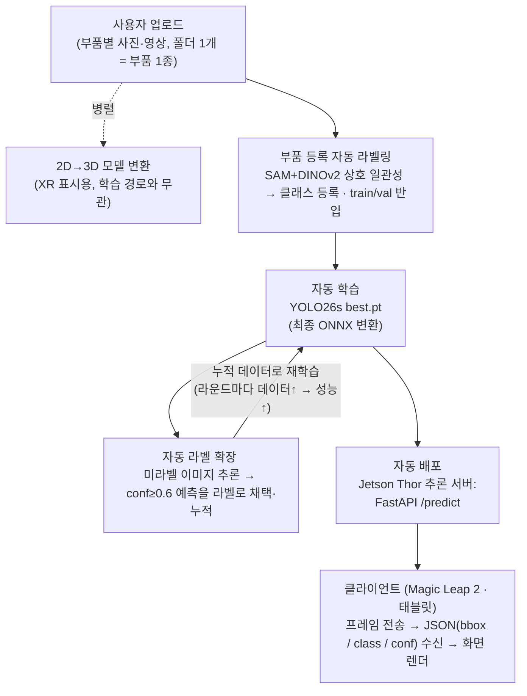

# XR 오토러닝 (XR Auto-Learning) - 헬기 부품 비마커 인식 파이프라인

## 1. 프로젝트 개요

헬기 정비 부품을 비마커(QR/바코드 없이) 인식하는 YOLO 객체탐지 모델을 **사람 개입 없이(zero-manual) 자동으로 학습·배포하는 MLOps 파이프라인**이다. 사용자가 업로드한 부품 사진에서 라벨을 자동 생성하고, 학습 → 자동 라벨 확장 → ONNX/API 배포까지 하나의 루프로 돌린다.

### 데이터 생성 방식
**수작업 라벨링 없이 사용자 업로드 사진으로 학습 데이터 산출**

1. 등록: 사용자가 부품별 사진(영상 프레임 포함)을 업로드 목록에 쌓음 (폴더 1개 = 부품 1종)
2. 자동 라벨링: 상호 일관성 매칭으로 각 사진에서 부품 위치를 자동 탐지해 라벨 생성 (4.3 참고)
3. 반입: 클래스 자동 등록 + YOLO 학습 데이터로 변환. 배치 처리라 재학습은 배치당 1회
4. 병렬: 같은 업로드 사진으로 2D→3D 모델 변환을 병렬 수행 (XR 화면 표시용, 학습 경로와 무관)

설계 변경 이력(무엇이 어떻게 바뀌었는지)은 8장에 계속 기록한다.

### 핵심 기능

- **부품 등록 자동 라벨링**: 업로드 사진에서 SAM+DINOv2 상호 일관성 매칭으로 라벨 자동 생성
- **자동 라벨 확장(self-training)**: 학습된 모델이 신규 이미지에 conf ≥ 0.6 라벨을 생성해 데이터셋을 자동 증분·재학습
- **학습·변환 자동화**: YOLO26s 학습 → best.pt 추출 → ONNX export를 단일 스크립트로
- **추론 서빙**: FastAPI `/predict` + ONNX로 박스/클래스/신뢰도 JSON 제공

<br>

## 2. 시스템 아키텍처 및 파이프라인

사용자 업로드 사진 기반 YOLO 자동 라벨링·학습 파이프라인. 부품 등록부터 학습·배포까지 사람 손을 타지 않고 단일 루프로 자동화하는 것이 설계 목표다.

**데이터 흐름**



- 사람 개입은 사진 업로드뿐, 라벨링·학습·배포는 전부 스크립트가 수행 (단계별 실행 명령은 6장, 루프 효과 실측은 5.3)
- **배포 구조 = 원격 추론(서버 사이드)**: 클라이언트(Magic Leap 2·태블릿)는 카메라 프레임을 보내고 JSON 결과만 받아 그린다. 전처리(레터박스)·추론·후처리(NMS·좌표 복원)·GPU 활용은 전부 Thor 서버의 ultralytics 런타임이 담당하므로 기기 쪽 구현 부담과 기종 의존성이 없다

**컴포넌트 연동**

| 계층 | 구성 |
|------|------|
| 모델 | **YOLO26s** (Ultralytics, NMS-free end-to-end). 7모델 x 2크기 벤치마크 + 시드 3반복으로 선정 (5.5) |
| 등록 라벨링 | SAM(ViT-H) 후보 분할 + DINOv2 상호 일관성 매칭 (`0_register_part.py`). 업로드 = 부품 1종 전제라 클래스 분류가 불필요 |
| 추론 서버 | **NVIDIA Jetson Thor** (ARM64 + Blackwell GPU, JetPack 스택). FastAPI + Uvicorn (`/predict`, `/health`), 기동 시 모델 로드+워밍업, 추론은 스레드풀 실행(요청 비차단) |
| 클라이언트 | Magic Leap 2 · 태블릿: 프레임 전송 → JSON 수신 → 박스 렌더 (온디바이스 추론 없음) |
| 배포 포맷 | PyTorch `.pt`(서빙 기본) / ONNX / TensorRT 엔진(Thor 가속, 변환 예정) |
| 공용 모듈 | `pseudo_utils`(박스 선택 단일 구현: 운영·실험 공용) / `dataset_utils`(클래스 등록 가드) |
| 모델 릴리스 | 학습마다 `models/releases/v<타임스탬프>/`에 best.pt·onnx·지표·**학습로그 전문** 자동 보관(최근 10개). **배포 게이트**: 직전 채택본보다 mAP50 하락 시 서빙 모델 미교체. 롤백은 `6_model_registry.py` |
| 설정 | `scripts/config.py` 단일 소스(경로·임계값·하이퍼파라미터) |

**폴더 구조**

```
xr_autolearning/
├─ data.yaml                     # 클래스 정의(names)·데이터 경로
├─ requirements.txt
├─ scripts/                      # 파이프라인 스크립트 (번호 = 실행 순서)
│  ├─ config.py                  # 경로·클래스·임계값·하이퍼파라미터 공통 설정
│  ├─ 0_register_part.py         # 부품 등록: 업로드 사진 → 자동 라벨 → 반입 (운영 진입점)
│  ├─ 0_coco_to_yolo.py          # Roboflow COCO → YOLO 포맷 변환 (샘플 데이터용)
│  ├─ 0_import_render.py         # 라벨 딸린 외부 데이터 반입 (클래스 등록·라벨 검증·배치)
│  ├─ 0_import_roboflow.py       # Roboflow YOLOv8 export 정리
│  ├─ 1_auto_labeling.py         # 자동 라벨링 (conf 필터, --tta, --conf-per-class)
│  ├─ 2_train_pipeline.py        # train/val 분할 → 학습 → ONNX export
│  ├─ 3_api_server.py            # FastAPI 추론 서버
│  ├─ 4_experiment_autolearn.py  # 오토러닝 효과 실증 (정답 숨기고 자동 채점)
│  ├─ 5_benchmark.py             # 모델 x 입력크기 매트릭스 벤치마크 (배포 모델 선정 근거)
│  ├─ 6_model_registry.py        # 릴리스 조회/롤백 (이전 버전 복원)
│  ├─ 7_finetune_real.py         # 실사 소량 파인튜닝 (2단계: 동결 → 저lr 해제, 전/후 게이트)
│  ├─ dataset_utils.py           # 데이터셋 등록 공용 (names 정규화·data.yaml 등록 가드)
│  ├─ pseudo_utils.py            # 자동 라벨링 공용 (박스 선택 단일 구현: 추론·TTA·conf 필터)
│  └─ data_viewer.ipynb          # COCO 어노테이션 점검 노트북 (클래스 분포·라벨 시각화)
├─ zeroshot_labeler/             # 제로샷 라벨링 실험·프롬프트 실험대 (등록 방식 선정 근거, eval_out/)
├─ models/                       # base_model.pt(초기 생성기) / new_model.pt·onnx(서빙 현재본)
│  └─ releases/                  # 버전별 보관: v<타임스탬프>/{best.pt, best.onnx, metrics.json, train.log}
├─ datasets/                     # images/ labels/ unlabeled_images/
├─ bench_results/                # 벤치마크 결과 (benchmark.json / benchmark.md)
└─ exp_results/                  # 실험 리포트 (report_*.json)
```

<br>

## 3. 기술 스택

**Data & AI**

- 언어: Python 3.10+
- 탐지 프레임워크: Ultralytics 8.4.93, 모델 YOLO26s (벤치마크 선정, 5.5. NMS-free 라 후처리 없이 배포)
- 딥러닝: PyTorch 2.x (RTX 5090은 CUDA 12.8 빌드, 그 외 GPU는 CUDA 버전에 맞춰 설치)
- 등록 라벨링: segment-anything(SAM ViT-H) + DINOv2(torch.hub, 임베딩 매칭)
- 변환·서빙 런타임: ONNX, onnxruntime, onnxslim
- 데이터 처리: NumPy, Pillow, PyYAML

**Infra & Backend**

- API: FastAPI, Uvicorn, python-multipart
- 배포(운영) 서버: NVIDIA Jetson Thor (ARM64 + Blackwell, JetPack 기반 torch/ultralytics 스택, TensorRT 가속 예정. 도입 전으로 스택 구성은 7장 과제)
- 학습·실험 환경: NVIDIA RTX 5090 1장 (단일 GPU, CUDA 12.8)
- 형상 관리: Git (GitHub: `ev1025/auto_annotation_learning`)
- 데이터셋/모델 가중치는 `.gitignore`로 제외(용량·재생성 가능), 소스·결과 리포트(json)만 추적

<br>

## 4. 데이터 전처리 및 모델링

### 4.1 데이터 소스

**샘플 데이터 (현재 사용 중, 파이프라인 검증용)**

| 항목 | 내용 |
|------|------|
| 데이터셋 | Mechanical Parts Dataset 2022 (Roboflow 공개 데이터) |
| 규모 | 2,250장 / 4클래스(bearing·bolt·gear·nut) / 박스 10,599개 |
| 포맷 | Roboflow COCO (`_annotations.coco.json` + 이미지) → `0_coco_to_yolo.py`로 변환 |
| 용도 | 학습·자동라벨·평가 루프의 유효성 검증 (5장 실험 결과가 전부 이 데이터 기준) |

**실제 데이터 (운영용): 사용자 등록 사진**

| 항목 | 내용 |
|------|------|
| 출처 | 사용자가 부품 등록 시 업로드하는 사진·영상 프레임 (폴더 1개 = 부품 1종, 여러 부품을 목록에 쌓아 배치 처리) |
| 라벨 생성 | `0_register_part.py` 상호 일관성 매칭으로 자동 생성 (수작업 0, 방식은 4.3) |
| 클래스 정의 | 업로드 폴더명 = 부품명(클래스). 반입 시 data.yaml 에 자동 등록(기존과 충돌하면 중단하는 가드) |
| 시재품 준비 | 기본 장비를 우리가 같은 절차로 사전 등록해 모델을 구워 넣은 상태로 출고 |
| 수량 기준 | 부품당 사진 30장+ 권장 (실증 최소선: 클래스당 50~85장에서 오토러닝 루프 작동, 5.3). 영상 등록이면 프레임 추출로 충당 |

입력이 샘플이든 사용자 등록분이든 이후 파이프라인은 동일. 검증 대상은 "라벨셋 → 학습 → 자동라벨 확장 → 성능 향상" 루프다.

### 4.2 전처리 (COCO → YOLO)

| 처리 | 내용 |
|------|------|
| 좌표 변환 | COCO 픽셀 bbox → YOLO 정규화 중심좌표 (경계 밖은 0~1 클램프) |
| 더미 클래스 제거 | Roboflow가 넣는 상위 카테고리(id 0) 제외, 실제 클래스만 0..k-1 재매핑 |
| 정합성 검증 | 이미지-라벨 파일명 1:1 매칭, 필드 5개 미만 라인 스킵 |
| train/val 분할 | 최초 실행 시 고정 seed 분할(val 20%). 이후 신규 유입분(자동 라벨)은 **train에만 추가**하고 val은 고정 (라운드 간 비교 일관성 + 자동 라벨의 평가 오염 방지) |
| 경로 함정 회피 | 상대 `path` 오해석("Dataset not found") 방지용 절대경로 `data.generated.yaml` 자동 생성 |

변환 예시 (실제 데이터 1개 박스, 이미지 크기 416×416):

```
----------------------------------------------------------------------------
[변환 전] COCO 방식 = "박스의 왼쪽 위 모서리 + 크기"를 픽셀로 기록
----------------------------------------------------------------------------
  클래스: gear
  "bbox": [116.9, 73.3, 77.9, 82.0]     → 왼쪽 위 (116.9, 73.3)에서 시작하는
                                          가로 77.9 × 세로 82.0 픽셀짜리 박스

----------------------------------------------------------------------------
[변환 계산] "박스의 중심점 + 크기"로 바꾸고, 이미지 크기로 나눠 0~1 비율로
----------------------------------------------------------------------------
  중심 x = (116.9 + 77.9/2) ÷ 416 = 0.375
  중심 y = ( 73.3 + 82.0/2) ÷ 416 = 0.275
  너비   =  77.9 ÷ 416            = 0.187
  높이   =  82.0 ÷ 416            = 0.197

----------------------------------------------------------------------------
[변환 후] YOLO 방식 = .txt 한 줄
----------------------------------------------------------------------------
  2 0.375 0.275 0.187 0.197
  = "클래스 2(gear), 중심 (0.375, 0.275), 크기 0.187 × 0.197"
```

변환이 끝나면 이미지 1장마다 이런 .txt 가 하나씩 생긴다 (한 줄 = 박스 1개):

```
train/labels/239_jpg.rf.9urQ....txt   ← 같은 이름의 .jpg 와 짝
  1 0.426154 0.414663 0.082115 0.242788     ← bolt
  1 0.629219 0.403846 0.083630 0.250000     ← bolt
  3 0.743389 0.324519 0.081202 0.120192     ← nut
  ...(총 7줄 = 이 사진엔 bolt 3개, nut 4개)
```

### 4.3 자동 라벨링 안전장치 (모델 작동 근거)

**등록 단계 (콜드스타트, `0_register_part.py`)** - 모델이 없을 때 라벨을 만드는 방법과 안전장치:

| 장치 | 동작 | 이유 |
|------|------|------|
| 상호 일관성 매칭 | SAM 이 분할한 물체 후보 중 "같은 폴더의 **다른 모든 사진에도 등장하는 물체**"를 DINOv2 임베딩 유사도로 식별 | 업로드 사진엔 그 부품이 매 장 등장하고 배경 물체는 바뀜. 텍스트 프롬프트 제로샷(정밀도 0.24 실측, zeroshot_labeler/eval_out)과 달리 클래스 혼동이 원천 배제됨 |
| 일관성 τ ≥ 0.55 | 미달 후보는 라벨 포기(해당 사진 제외) | 고순도 우선. DINOv2 τ0.85 고정밀 추출은 P 0.927 실측 |
| 다중 채택 + 포함 억제 | τ 이상 후보 전부 라벨(NMS 중복 제거), 큰 박스에 70%+ 포함되는 작은 박스 제거 | 한 사진에 같은 부품 여러 개 대응(빠뜨리면 배경으로 오학습) + SAM 부분-전체 이중 분할 교정 |
| 최소 채택 수(5장) | 미만이면 그 부품 등록 보류, 재촬영 안내 | 저품질 등록이 학습을 오염시키는 것 차단 |

**운영 루프 (self-training, `1_auto_labeling.py`)** - 학습된 모델이 라벨을 확장할 때의 안전장치:

| 장치 | 동작 | 이유 |
|------|------|------|
| conf ≥ 0.6 | 임계값 이상 예측만 라벨 채택 | 정밀도 우선, 오라벨 유입 억제 |
| TTA 일관성 필터 (`--tta`) | 원본·반전·축소 3뷰 모두 재현(IoU≥0.8)되는 예측만 채택 (이미지 8장 단위 배치 추론) | "자신 있게 틀리는" 예측 차단 (실측 FP −44%, 5.4 참고) |
| 클래스별 임계값 (`--conf-per-class`) | 클래스마다 임계값 개별 설정 | 쉬운 클래스만 라벨 양산되는 클래스 소외 완화 |
| 콜드 리스타트 | 매 라운드 사전학습 가중치(`config.PRETRAINED`)에서 새로 학습 | 오라벨이 가중치에 고착(confirmation bias)되는 것 방지 |
| 가드레일 | 라운드1 mAP < 라운드0이면 폐기 권고 기록 | 오류 증폭 자동 감지·롤백 |
| 박스 선택 단일 구현 | 위 필터 전부를 `pseudo_utils.predict_boxes` 한 곳에 구현, 운영(1번)·실험(4번)이 공용 | 실험으로 검증한 규칙과 실제 배포 규칙이 몰래 어긋나는 것(드리프트) 차단 |

자동 라벨링 후 생성되는 리포트(report.json). 라벨 전수 검사 대신 이 수치로 채택 여부를 판단한다:

```json
"pseudo": {
  "labeled_images": 578,        // 라벨 생성된 이미지 수 (입력 647장 중)
  "boxes": 2955,                // 생성 박스 총 개수
  "precision": 0.9381,          // 정답과 일치 비율 (실험 환경 한정)
  "recall": 0.7406,             // 실제 객체 중 잡아낸 비율
  "per_class_boxes": {"nut": 1667, "bolt": 1288},  // 한쪽 0에 쏠리면 이상 신호
  "mean_conf": 0.9218,          // 지속 하락 시 중단 신호
  "tta_dropped_boxes": 352      // TTA 필터가 걸러낸 박스 수
},
"guardrail": {"accepted": true} // false = 이번 라운드 라벨 폐기
```

핵심: 채택 여부는 `guardrail`, 이상 징후는 `per_class_boxes`·`mean_conf` 로 본다.

### 4.4 하이퍼파라미터 및 검증 전략

| 항목 | 값 |
|------|-----|
| 모델 | YOLO26s (사전학습 `yolo26s.pt`에서 전이학습. 5장 실험 결과는 선정 이전의 YOLOv8n 기준 측정) |
| 입력 크기 | 640 |
| epochs | 60 (실험), 기본 100 (운영 스크립트) |
| batch | 32 (단일 GPU), 대용량 조건은 24 |
| optimizer | auto (Ultralytics 자동 선택) |
| best 선택 | `model.trainer.best` (val 기준 best.pt) |

- 검증 분할: 고정 난수 seed 단일 홀드아웃. 실험은 초기 라벨셋 / 미라벨셋(라벨 숨김) / 평가셋(측정 전용) 3분할, 평가셋은 어떤 학습에도 미사용 (코드·리포트 표기: seed / pool / test)
- k-fold 교차검증 미적용 (7장 한계점 참고)

<br>

## 5. 성능 평가

평가는 두 가지 질문에 답하기 위해 수행했다.

1. **최종 모델의 탐지 성능은 어느 수준인가?** → 5.2
2. **오토러닝(자동 라벨 재학습)이 성능을 실제로 올렸는가?** → 5.3 (이 프로젝트의 핵심 검증)

### 5.1 지표 정의

| 지표 | 의미 | 어디에 쓰나 |
|------|------|-------------|
| mAP50 | 예측 박스가 정답과 50% 이상 겹치면 정답으로 인정하고 계산한 평균 정밀도 (0~1, 높을수록 좋음) | 모델 성능의 대표 지표 |
| mAP50-95 | 겹침 기준을 50~95%까지 높여가며 평균 | 박스 위치까지 엄격히 본 지표 |
| 자동라벨 정밀도(P) | 자동 생성 라벨 중 정답과 일치한 비율 | 자동 라벨을 믿어도 되는지 |
| 자동라벨 재현율(R) | 실제 객체 중 자동 라벨이 잡아낸 비율 | 자동 라벨이 얼마나 빠뜨리는지 |

- 모든 mAP는 **평가셋**(어떤 학습에도 안 쓴 데이터)에서 측정
- 자동라벨 P/R은 미라벨셋의 숨겨둔 정답과 IoU ≥ 0.5 매칭으로 산출
- 분할·셔플은 고정 난수 seed로 재현 가능

### 5.2 최종 모델 성능

오토러닝 완료 후(라운드1) 모델의 **평가셋**(정답 라벨, 학습 미사용) 성능:

| 조건 | mAP50 | mAP50-95 |
|------|-------|----------|
| 2클래스 (bolt·nut) | 0.859 | 0.674 |
| 3클래스 (+gear) | 0.835 | 0.677 |
| **4클래스 전체** | **0.863** | **0.680** |

참고: 운영 루프 E2E 구동(전체 라벨 부트스트랩 100 epochs → 자동 라벨 220장 누적 → 재학습 100 epochs) 결과, 고정 val(405장, 자동 라벨 미포함) 기준 mAP50 0.873 / mAP50-95 0.708 (정밀도 0.917 / 재현율 0.804). 이 구동에서 재학습 시 train이 1,620 → 1,840장으로 늘어 자동 라벨이 실제 누적됨을 확인.

클래스별 mAP50-95 (4클래스 실험 모델):

| bolt | nut | gear | bearing |
|------|-----|------|---------|
| 0.710 | 0.751 | 0.570 | 0.690 |

- gear가 상대적으로 낮음(형태 다양성·유사 클래스 혼동) → 데이터 보강 대상
- Confusion Matrix, PR curve 등 상세 플롯은 학습 시 `runs/<name>/`에 자동 생성

**실제 추론 예시** (평가셋 이미지 1장, 오토러닝 완료 2클래스 모델)

| 입력 (이미지 + 라벨) | 출력 (모델 추론 결과) |
|---|---|
|  |  |

입력 라벨 (bolt 4개 + nut 2개):

```
1 0.560721 0.637019 0.086058 0.125000   ← nut
1 0.703726 0.752404 0.093221 0.120192   ← nut
0 0.635228 0.378606 0.095649 0.252404   ← bolt
0 0.757825 0.432692 0.090793 0.254808   ← bolt
0 0.497055 0.507212 0.088486 0.254808   ← bolt
0 0.612392 0.840144 0.199014 0.112981   ← bolt
```

- 출력: 6개 객체 전부 탐지, 신뢰도 0.93~0.95 (bolt 4, nut 2, 미탐·오탐 0)

### 5.3 오토러닝 효과 검증 (전후 비교 실험)

**목적**: "라벨 없는 이미지에 모델이 스스로 붙인 라벨로 재학습하면, 라벨링 비용 0으로 성능이 오르는가"를 증명한다. 같은 평가셋에서 **재학습 전(라운드0)과 후(라운드1)를 비교**해 차이(Δ)가 곧 오토러닝의 효과다.

| 실험 | 라벨o / 라벨x / 평가셋 (장) | mAP50 (R0→R1) | ΔmAP50 | mAP50-95 (R0→R1) | 자동라벨 P/R |
|------|---------------------------|----------------|--------|-------------------|--------------|
| 2클래스, 초기 라벨 15% | 149 / 647 / 199 | 0.835 → 0.859 | **+2.3%p** | 0.645 → 0.674 | 0.902 / 0.805 |
| 2클래스, 초기 라벨 10% | 99 / 697 / 199 | 0.819 → 0.839 | **+2.0%p** | 0.623 → 0.663 | 0.885 / 0.765 |
| 3클래스 | 236 / 1,025 / 315 | 0.825 → 0.835 | **+1.0%p** | 0.649 → 0.677 | 0.901 / 0.715 |
| 4클래스 전체 | 337 / 1,463 / 450 | 0.827 → 0.863 | **+3.6%p** | 0.649 → 0.680 | 0.871 / 0.726 |

- 라벨o = 라벨 주고 시작하는 초기 학습분 / 라벨x = 라벨 숨기고 자동 라벨을 붙이는 대상 / 평가셋 = 측정 전용
- 라벨o가 라벨x보다 훨씬 적은 이유: "라벨은 비싸서 적고, 미라벨은 공짜로 많다"는 실전 조건을 재현한 것. 초기 라벨이 많으면 미라벨 데이터의 기여를 측정할 수 없다

**결과 해석**:

- 4개 조건 전부 라운드1 > 라운드0 → 클래스 수·초기 라벨 비율과 무관하게 오토러닝 효과가 일관 재현됨
- 초기 라벨 15%→10%(149→99장)로 줄여도 개선폭 유지(+2.0%p) → 초기 라벨 부담을 낮춰도 유효
- 자동 라벨 정밀도 0.87~0.90 → 사람 개입 없이 학습에 쓸 만한 품질

**반증(라벨 품질이 깨지면)**: 자동 라벨과 이미지 매칭이 깨진 채 학습된 사례에서 mAP50 **−19.7%p** 폭락(전 객체를 배경으로 오학습). 좋은 라벨은 +2~4%p 올리지만 나쁜 라벨은 −20%p로 무너뜨림 → 라벨-이미지 정합성이 오토러닝 성패의 핵심 변수.

### 5.4 TTA 일관성 필터 효과 (2클래스, 초기 라벨 15% 동일 분할)

**목적**: 안전장치인 TTA 일관성 필터(4.3)가 오라벨을 실제로 걸러내는지, 켰을 때 무엇을 얻고 잃는지 측정한다.

| | 기본 conf 필터 | + TTA 일관성 필터 | 변화 |
|---|---|---|---|
| pseudo 정밀도 | 0.902 | **0.938** | **+3.6%p** |
| 오라벨(FP) 수 | 327개 | **183개** | **−44%** |
| pseudo 재현율 | 0.805 | 0.741 | −6.4%p |
| 채택 박스 수 | 3,339 | 2,955 (352개 필터 제거) | −11% |
| ΔmAP50 (R0→R1) | +2.3%p | +0.1%p | |
| ΔmAP50-95 (R0→R1) | +2.9%p | +2.1%p | |

- TTA 필터는 약속대로 동작: **오라벨을 절반 가까이 제거**(FP −44%)하고 정밀도를 0.94로 올림. 대가는 재현율 −6.4%p.
- 단, 동일 도메인(공개 데이터) 조건에서는 기본 필터도 정밀도 0.90으로 이미 충분해 최종 mAP50 이득은 없었음.
- 결론: **동일 도메인에서는 기본 conf 필터로 충분(TTA 기본 OFF 유지). 촬영 환경이 크게 달라 도메인 갭이 생기는 구간(신규 현장 등)에서 `--tta`를 켜는 것을 권장**(오라벨 유입 차단이 정밀도 손실보다 중요해지는 상황).
- 참고: 두 실행의 라운드0 기준점이 다름(0.835 vs 0.820, 학습 확률성·GPU 구성 차이). pseudo 정밀도/FP 비교가 필터 자체의 효과를 보는 지표.

### 5.5 배포 모델 선정 벤치마크 (YOLO26s 확정 근거)

7모델(v8n/s/m·11n·26n/s/m) × 입력 2크기(640/1280) = 14조합을 동일 조건(epochs 100, 동일 test 분할, RTX 5090)으로 비교. 전체 표는 `bench_results/benchmark.md`, 실행 방법은 6.5.

**640 상위 4개 (test split 기준)**

| 모델 | mAP50 | mAP50-95 | 단건 지연 | FPS | 가중치 |
|------|-------|----------|----------|-----|--------|
| yolov8s | 0.905 | 0.753 | 9.2ms | 109 | 22.5MB |
| yolo11n | 0.895 | 0.745 | 8.6ms | 117 | 5.5MB |
| yolo26m | 0.895 | 0.754 | 7.3ms | 137 | 44.0MB |
| **yolo26s** | 0.893 | 0.747 | **7.0ms** | **144** | 20.3MB |

**후속 검증 3종** (`bench_results/exp_epochs.json`)

| 검증 | 결과 |
|------|------|
| 시드 3반복 (26s vs v8s) | mAP50 평균 26s 0.894 ±0.001 / v8s 0.897 ±0.007 → **1위 격차는 시드 노이즈**. mAP50-95 평균은 26s 우위(0.751 vs 0.746), 분산은 26s가 1/6 |
| 300ep 연장 (v8s·11n) | 100ep 대비 개선 없음(조기종료 발동) → epochs 100 유지 |
| 26n 레시피(245ep·lr0 0.0054·MuSGD) | 0.868 < 기본 100ep 0.880 → 소규모 데이터에선 레시피 이득 없음 |

**선정: yolo26s @ 640**

- 정확도 동급(mAP50-95 평균 1위) + **시드 분산 최소** → 자동 재학습이 반복되는 오토러닝에서 품질 일관성 확보
- **지연 최단(7.0ms)**: 파라미터가 v8n의 3배인데도 더 빠름 = NMS-free(end-to-end) 구조 효과. 후처리가 없어 Thor TensorRT 변환·다중 클라이언트 서빙에도 구조적 이점
- 입력 1280은 전 모델에서 정확도 이득 없이 지연 1.5~2배 → 640 확정
- 주의: 5.2~5.4의 실험 수치는 선정 이전 YOLOv8n 기준 측정값(루프 유효성 검증 목적이라 결론 불변). 실데이터 전환 시 26s 기준으로 갱신

<br>

## 6. 설치 및 실행 방법

### 6.1 환경 설정

```bash
pip install -r requirements.txt
# GPU 사용 시 torch 는 CUDA 버전에 맞춰 별도 설치
#   RTX 5090(Blackwell): pip install torch torchvision --index-url https://download.pytorch.org/whl/cu128
#   그 외:               pip install torch --index-url https://download.pytorch.org/whl/cu124
```

경로·임계값·하이퍼파라미터는 별도 `.env` 없이 `scripts/config.py` 한 곳에서 관리(`BASE_MODEL`, `AUTO_LABEL_CONF`, `API_IOU`, `SERVE_MODEL` 등).

### 6.2 데이터 준비

```bash
# (검증용) Roboflow COCO 데이터를 YOLO 구조로 변환
python scripts/0_coco_to_yolo.py --src ./mechanical-parts-coco --dst ./mechanical-parts-yolo

# (운영용) 부품 등록: uploads/<부품명>/ 에 사진을 쌓고 배치 실행 (폴더명 = 클래스)
python scripts/0_register_part.py --batch ./uploads --dry-run   # 라벨 품질 검증만(미리보기 저장)
python scripts/0_register_part.py --batch ./uploads             # 자동 라벨 + 클래스 등록 + 반입

# (선택) 라벨이 이미 있는 외부 데이터 반입
python scripts/0_import_render.py --src ./labeled_delivery --classes bolt nut gear
```

### 6.3 실행 순서 (자동화 루프)

```bash
# 0) 부트스트랩(1회): 등록·반입된 라벨셋으로 첫 모델 학습 후 라벨 생성기로 승격
python scripts/2_train_pipeline.py --epochs 100 --device 0
cp models/new_model.pt models/base_model.pt

# 1) 자동 라벨링: 미라벨 이미지(datasets/unlabeled_images) → conf≥0.6 YOLO 라벨
python scripts/1_auto_labeling.py --weights models/base_model.pt

# 2) 재학습 + ONNX 변환: 누적 라벨로 학습 → best.pt/onnx  (1↔2 반복 = 오토러닝 루프)
#    매 실행마다 models/releases/v<타임스탬프>/ 에 버전 보관(모델·지표·학습로그).
#    배포 게이트: 직전 채택본보다 mAP50 낮으면 보관만 하고 서빙 모델은 유지 (--force-promote 로 무시)
python scripts/2_train_pipeline.py --epochs 100 --device 0

# 3) 추론 API 서버
python scripts/3_api_server.py       # http://0.0.0.0:8000
curl -X POST -F "file=@sample.jpg" "http://localhost:8000/predict?conf=0.3"

# (운영) 릴리스 조회 / 문제 시 이전 버전으로 롤백
python scripts/6_model_registry.py list
python scripts/6_model_registry.py rollback            # 직전 채택본으로 복원
python scripts/6_model_registry.py rollback v20260716_093012   # 특정 버전으로 복원
```

### 6.4 자동화 효과 재현 실험

```bash
# 정답을 숨기고 자동 채점: 라운드0 vs 라운드1 mAP + 자동라벨 P/R
python scripts/4_experiment_autolearn.py --src ./mechanical-parts-yolo --classes bolt nut --epochs 60
# 결과: exp_autolearn/report.json (exp_results/ 에 조건별 리포트 보관)
```

### 6.5 모델·입력크기 벤치마크

```bash
# 모델 x 입력크기 매트릭스: 정확도(mAP)·단건 지연(ms)·FPS·파라미터 비교
# --src 만 바꾸면 다른 데이터셋으로 즉시 재실행 가능
python scripts/5_benchmark.py --src ./mechanical-parts-yolo \
    --models yolov8n.pt yolov8s.pt yolov8m.pt yolo11n.pt yolo26n.pt yolo26s.pt yolo26m.pt \
    --imgsz 640 1280 --epochs 100 --device 0
# 결과: bench_results/benchmark.json + benchmark.md (조합마다 누적 저장)
# 지연/FPS 는 실행 장비 기준. Jetson Thor 실측은 Thor 에서 같은 명령 재실행
```

### 6.6 소량 데이터 증분 파인튜닝 (도구)

```bash
# 기존 모델을 신규 라벨 데이터 50~100장으로 2단계 파인튜닝 (동결 -> 저학습률 해제)
# catastrophic forgetting 방지 레시피 [1]. val 전/후 비교 게이트 + 릴리스 보관
python scripts/7_finetune_real.py --src ./new_photos --device 0
# new_photos/images/*.jpg + labels/*.txt (클래스 번호는 data.yaml 체계와 동일)
```

API 응답 예시:

```json
{
  "filename": "part.jpg",
  "image": {"width": 1280, "height": 720},
  "count": 1,
  "detections": [
    {"class_id": 0, "class_name": "bolt", "confidence": 0.91,
     "bbox": {"x": 120.5, "y": 80.0, "w": 64.0, "h": 64.0}}
  ]
}
```

- `bbox` = 좌상단 `x,y` + `w,h`(픽셀). XR/프론트가 그대로 렌더 가능.

<br>

## 7. 한계점 및 추후 개선 과제

**한계점**

- **등록 라벨 정밀도**: 등록 자동 라벨(상호 일관성)은 시뮬 데이터로 검증(채택률 100%, 미리보기 정상). 실제 촬영 영상 기준 정밀도 실측은 진행 중.
- **영상 등록의 배경 고정**: 상호 일관성은 "배경이 사진마다 바뀐다"는 가정인데, 한 영상에서 뽑은 프레임은 배경이 같아 배경 물체가 오채택될 수 있음(장소를 바꿔 2개 이상 영상 권장).
- **검증 방식**: 고정 seed 단일 홀드아웃 분할. k-fold 교차검증 미적용으로 지표의 신뢰구간(분산) 미산출.
- **라운드 깊이**: 라운드1까지만 측정. 다회 라운드 누적 시 수렴·포화 지점 미검증.
- **자동 라벨 재현율**: 0.71~0.81 수준으로 conf 0.6에서 놓치는 객체 존재. 현재 파이프라인은 자동 라벨을 무검수로 학습에 투입.
- **데이터 규모**: 수백~천 장대 검증. 사용자 등록 사진은 부품당 수십 장 수준이라 수량이 새 병목(영상 프레임 추출·증강으로 보완 필요).
- **리소스 병목**: 멀티GPU(DDP) 학습 후 메모리 미회수로 대용량 조건 OOM 발생 → 단일 GPU로 우회(다중 GPU 스케일아웃 미확보).

**추후 개선 과제(Next steps)**

- **Jetson Thor 배포 스택 구성**: ARM64+JetPack용 torch/ultralytics 설치, TensorRT 엔진 변환(`model.export(format="engine")`), Thor에서 벤치마크(6.5) 재실행으로 실기 지연 실측
- **실시간 왕복 지연 검증**: 클라이언트(Magic Leap 2·태블릿) ↔ Thor 프레임 전송~JSON 수신 전 구간 측정 (목표 fps 대비)
- **실사 영상 등록 검증**: 실제 촬영 영상으로 등록→학습→탐지 E2E 실측 (진행 중)
- **영상 등록 고도화**: 프레임 추출 자동화 + SAM2 트래킹 전파(한 프레임 라벨 → 수백 프레임)로 부품당 수량 확보
- **시재품 기본 장비 사전 등록**: 등록 파이프라인으로 기본 부품 N종 구축 후 모델 내장 출고
- k-fold 교차검증 도입, 다회 라운드 누적 실험으로 수렴 곡선 확보
- conf 임계값·초기 라벨 비율 스윕으로 정밀도-재현율 트레이드오프 최적화
- 저성능 클래스(gear) 표적 데이터 증강 및 클래스 불균형 보정
- 아래 **논의사항 1** (부품 200종+ 구조) 협의

**추후 시도할 것 (문헌 검증 기법)**

수치는 해당 논문의 실측(우리 데이터 미검증).

| 기법 | 내용 | 근거 |
|------|------|------|
| 파인튜닝 2단계 레시피 | 1단계 backbone 동결(`freeze=10`)·20ep·lr0 0.01 → 2단계 전층 해제·40ep·lr0 0.001, `cos_lr=True` (6.6에 구현) | 기본 lr 그대로 파인튜닝하면 기존 가중치 파괴(catastrophic forgetting) [1] |
| 증분 데이터 선별 | 모델이 틀린 어려운 프레임(hard mining)보다 **균등 랜덤 샘플링**이 우수 | 200Hard < 200Random 실측 [1] |
| 촬영 조건 증강 | `hsv_h/s/v` 지터·블러·노이즈로 카메라(HMD) 촬영 조건 변주 | 조명·블러 열화에 대한 강건성 [2] |
| loss 가중치 튜닝 | 박스가 헐거우면 `box` 7.5→10, 클래스 혼동이면 `cls` 상향 | |
| LLM 유도 증강 루프 | 왜곡 유형별 실패 통계를 LLM에 입력 → 증강 레시피(JSON) 자동 생성 → 오프라인 증강 후 재파인튜닝. 우리 report.json(클래스 분포·mean_conf)과 바로 연결 가능 | PCB 탐지에서 Gaussian blur mAP50 31.6→94.9% 회복, 추론 비용 증가 0 [2]. 단 motion blur는 증강만으로 한계(7.8→16.4%) |

**논의사항 1. 부품(클래스) 수가 많아질 때의 모델 구조 (200종+ 대비)**

YOLO는 아키텍처상 수백 클래스도 학습 가능(COCO 80, Objects365 365)하지만, 정비부품 도메인의 실용 한계가 먼저 온다: ① 유사 부품(볼트 규격 차이 등) 간 혼동 급증 ② 소형 모델(s급)의 클래스당 표현력 한계 ③ 부품 1종 추가 시 전체 재학습 부담. 단일 모델 안정권은 20~50클래스, 200종+는 구조 분리가 필요.

| 안 | 방식 | 장점 | 고려사항 |
|----|------|------|----------|
| A. 작업 단위 모델 분할 | 정비 절차(작업지시) 단위로 소형 모델 분리 (작업당 클래스 15~30개). 클라이언트가 절차 ID 전송 → 서버가 해당 모델로 라우팅 | 정비는 절차 단위 진행이라 분할 경계가 자연스러움. 서버 메모리(128GB)에 수십 모델 상주 가능(26s 20MB×20=400MB), API에 model_id 만 추가 | 절차↔부품 매핑 관리 필요(저작도구와 연동. 클래스 정의는 등록 폴더명=부품명으로 해소됨). 릴리스/롤백 체계의 모델별 확장 |
| B. 2단계: 대분류 탐지 + 세부 분류 | YOLO 는 상위 카테고리(볼트류·피팅류 등 20~30개)만 탐지, 잘라낸 영역을 임베딩 분류기가 세부 부품 식별 | **신규 부품 추가 시 YOLO 재학습 불필요**(분류기 갤러리에 참조 크롭 임베딩만 등록, few-shot). 유사 부품 구분에 특화 | 2단 파이프라인이라 지연 소폭 증가, 구현 복잡도 상승 |
| C. 단일 대형 모델 | 클래스 200개를 한 모델에 | 구조 단순 | 유사 부품 혼동·전체 재학습 비용·소형 모델 용량 한계로 200종+ 비권장 |

- 권장 방향: **A안 기본 + 유사 부품이 몰린 작업에만 B안 보강.** 200종 = 작업 10~15개 × 15~30클래스 소형 모델. 결정 기준: 절차↔부품 매핑의 관리 주체, 동시 진행 작업 수, 신규 부품 추가 빈도

<br>

## 참고 자료

**논문** (원문 PDF는 `논문/` 폴더 보관, git 미추적)

| # | 논문 | 우리와의 연결 |
|---|------|--------------|
| [1] | Dergachov & Aizatskyi, *Synthetic data for deep learning in object detection tasks* (WDA'26, CEUR-WS) | Unity 합성 데이터 3회 반복 개선 + 실사 소량 파인튜닝 전략·수치의 출처 (위 "추후 시도할 것") |
| [2] | Lee, Chen & Jiang, *LLM-guided Data Augmentation for YOLOv8-based PCB Defect Detection* (Sensors and Materials 38, 2026) | LLM이 실패 통계 분석 → 증강 레시피 자동 생성 루프의 출처 |
| [3] | Schmedemann et al., *Tuning domain randomization for 3D-rendered synthetic training data for defect detection in aircraft engine borescope inspection* (J. Electronic Imaging) | 항공 도메인 + 3D 렌더 도메인 랜덤화 튜닝 |
| [4] | Horváth et al., *Object Detection Using Sim2Real Domain Randomization for Robotic Applications* (IEEE T-RO 39(2), 2023) | sim-to-real 갭 대응 방법론 |
| [5] | Deogan et al., *Synthetic Dataset Generation for Autonomous Mobile Robots Using 3D Gaussian Splatting for Vision Training* (arXiv:2506.05092) | 2D 사진 → 3D 재구성 기반 합성 데이터 생성 기법 (1장 데이터 생성 방식의 구현 후보) |
| [6] | Wiese et al., *Detection of Surgical Instruments Based on Synthetic Training Data* (Computers 14(2), 2025) | 합성 데이터로 기구(부품 유사) 탐지 사례 |
| [7] | Karki et al., *Synthetic Data-Driven Mixed Reality for AR-Assisted Maintenance* (TechRxiv, 2025) | 합성 데이터 + AR 정비 지원 = 본 프로젝트와 동일 시나리오 |

주: [1][3][4][6]의 합성(렌더) 학습 부분은 렌더 학습 경로 폐기(8장 변경 이력 2026-07-22)로 참고 가치가 낮아짐. 파인튜닝 레시피·증강 등 실사 적용 기법은 유효.

**대회·벤치마크**

- Kaggle [Synthetic-2-Real Object Detection Challenge](https://www.kaggle.com/competitions/synthetic-2-real-object-detection-challenge) - 합성 학습 → 실사 평가 일반화 벤치마크. 우리 파이프라인 검증 무대로 쓸 수 있는지 **추후 검토**

<br>

## 8. 설계 변경 이력 및 시도 기록

본문은 항상 "현재 구조"만 기술하고, 무엇을 시도했고 어떻게 바뀌었는지는 이 장에 계속 기록한다.
실패한 시도와 함정도 남긴다(같은 삽질 방지 + 선택의 근거 보존).

### 2026-07-22 학습 데이터 아키텍처 피벗 (가장 큰 변경)

**기존**: 3D 렌더 합성 데이터가 학습 원천. 외부가 "2D 사진 → 3D 모델 → 다시점 렌더 +
3D 좌표 투영 어노테이션"으로 (이미지+정답박스)를 공급 → 반입 → 학습. 렌더→실사 도메인 갭이
핵심 리스크라 렌더 공급 조건(도메인 랜덤화 표)과 실사 파인튜닝 스크립트까지 준비했었음.

**변경**: 사용자가 업로드한 부품 2D 사진(영상 프레임 포함)이 학습 원천. `0_register_part.py`가
상호 일관성 매칭(SAM+DINOv2)으로 라벨 자동 생성. 2D→3D 변환은 병렬 수행하되 XR 표시용으로만
쓰고 **학습 경로에서 제외**.

**사유**: 2D→3D 변환이 학습 어노테이션에 쓸 만큼 정교하지 않을 것으로 판단.

**파생**: 도메인 갭 문제 소멸(데이터가 처음부터 실사) / 새 병목 = 수량 / 구 논의사항 1(클래스
정의 A·B·C안)은 "업로드 폴더명 = 부품명"으로 해소 / 구 논의사항 2(렌더 공급 조건) 폐기 /
참고자료 [1][3][4][6]의 합성 학습 부분 참고 가치 하향 / 운영: 업로드 목록에 부품을 쌓아 배치
처리, 재학습은 배치당 1회 (시재품 = 기본 장비 사전 등록 출고, 완성품 = 신규 장비 등록 시 실행).

### 2026-07-22 등록 라벨링 방식 선정까지의 시도 (콜드스타트 실험 여정)

"라벨·모델이 전무한 상태에서 자동 라벨 생성" 문제를 정답 있는 test 204장으로 검증
(라벨 없는 척 생성 → 숨긴 정답과 IoU 0.5 채점, zeroshot_labeler/eval_out 에 결과 보존):

| 순서 | 시도 | 정밀도 | 판정·배운 것 |
|------|------|--------|--------------|
| 1 | Grounding DINO 텍스트 프롬프트 | 0.215 | 유사 금속 부품 클래스 혼동(접시→gear 오인)이 병목 |
| 2 | + NMS·거대박스 제거 후처리 | 0.238 | 중복·배경박스는 부차적 원인이었음 |
| 3 | + 임계값 0.5 상향 | 0.292 | 재현율 반토막, 근본 해결 아님 |
| 4 | Grounded-SAM (SAM 타이트박스) | 0.239 | **박스 여백은 애초에 문제가 아니었음** (TP 평균 IoU: DINO 원본 0.908 > SAM 타이트 0.876, SAM 이 사람 라벨보다 과수축) |
| 5 | SAM 전체분할 + CLIP 갤러리(참조 10크롭) | 0.600 | 텍스트→시각 매칭 전환으로 2.5배 도약. nut 은 P 0.88 |
| 6 | + top1-top2 마진 규칙 (외부 검토 제언) | CLIP 에만 유효 | 임베더별 처방이 다름 |
| 7 | **SAM + DINOv2 갤러리** (외부 검토 제언) | **0.927 (τ0.85)** | 미세 시각특징 매칭이 정답. P≥0.85 운영점 최초 달성 |
| 8 | **상호 일관성 매칭** (업로드=부품 1종 활용) | 시뮬 채택률 100% | 갤러리조차 불필요: "모든 사진에 공통 등장하는 물체 = 그 부품". 클래스 분류 자체를 제거 → 최종 채택 |

- 등록 파이프라인 자체도 3라운드 개선: 사진당 1박스 채택(주 부품 미포착) → τ 이상 전부 채택 +
  NMS(부분-전체 이중 라벨 발생) → **포함 억제**(큰 박스 안 70%+ 소박스 제거)로 확정
- 부산물: Grounding DINO 프롬프트 실험대 웹 UI(`zeroshot_labeler/dino_playground.py`, Gradio)
- 부수 함정: autodistill 숨은 의존성 3종(scikit-learn, roboflow, **transformers<4.50** - 5.x는
  groundingdino BERT 파열), gradio 설치가 huggingface-hub 를 올려 transformers 와 충돌(재고정 필요)
- 검토 자료: Kaggle Synthetic-2-Real 대회(종료·데이터 MIT, sim2real 리허설 후보였으나 피벗으로 보류)

### 2026-07-22 배포 모델 확정: YOLOv8n → YOLO26s @ 640

**기존**: YOLOv8n(경량 기본값). **변경**: YOLO26s, 입력 640 확정.
**과정**: 7모델(v8n/s/m·11n·26n/s/m) × 2크기(640/1280) = 14조합 동일조건(100ep) 벤치마크를
4-GPU 병렬로 실행 + 후속 검증 3종:

- 시드 3반복: v8s 의 1위(0.905)는 시드 운 — 3시드 평균 v8s 0.897±0.007 vs 26s 0.894±0.001
  (동률, 분산 1/6), mAP50-95 평균은 26s 우위(0.751)
- 300ep 연장(v8s·11n): 개선 없음(조기종료) → epochs 100 유지. "학습곡선 막판 상승"은 과적합 방향이었음
- 26n 전용 레시피(245ep·lr0 0.0054·MuSGD): 0.868 < 기본 0.880 → 소규모 데이터에 공식 레시피 역효과
- 입력 1280: 전 모델에서 정확도 이득 없이 지연 1.5~2배 → 640 확정
- 함정: ssh 원격 명령으로 `pkill -f <패턴>` 실행 시 명령 문자열 자체가 매치돼 자기 세션이 죽음
  (exit 255) → pkill 은 스크립트 파일 안에서 실행

### 2026-07-22 학습 기록 체계 보강

- 학습률(산입률) 콜백: "입력 N장 중 M장 산입 = X%" + 제외 파일명 로그. 깨진 이미지 2장 주입
  실험으로 검증(ultralytics 는 스캔 단계에서 불량을 제외하고 계속 학습 = 중단 없음 확인)
- metrics.json 에 trained_at 명시 + models/releases/history.jsonl 누적 이력(한 줄 = 학습 1회)

### 2026-07-21 지속 배포 안전장치 도입

**기존**: 학습 결과가 서빙 모델을 무조건 덮어씀, 이전 버전·학습 로그 미보존.
**변경**: 릴리스 버전 보관(best/onnx/지표/학습로그 전문) + 배포 게이트(직전 채택본 대비 mAP50
하락 시 미교체) + 원터치 롤백(`6_model_registry.py`) + 보관 개수 자동 정리.
**함께**: 문헌 검토([1][2])로 하이브리드 파인튜닝 2단계 레시피를 `7_finetune_real.py` 로 구현
(당시 목적은 렌더→실사 적응, 피벗 후 소량 증분 적응 도구로 용도 변경).

### 2026-07-21 배포 구조 확정: Jetson Thor 원격 추론

**기존**: 배포 형태 미정(FastAPI 서버만 존재). **변경**: 클라이언트(Magic Leap 2·태블릿)는
프레임 전송/JSON 수신만, Thor 서버가 전처리·추론·후처리 전담.
**사유**: 온디바이스 구현 부담·기종 의존성 제거. 32명 동시 서빙 용량 계산상 VRAM(128GB)이 아니라
처리량·네트워크·배칭 서버가 관건임을 정리(나노~s급 @640 + TensorRT 전제 인당 10~15fps 현실적).

### 2026-07-16 오토러닝 유효성 실증 (초기 구축)

- 파이프라인 구축(자동라벨→학습→ONNX→서빙) + self-training 실증: 4개 조건(2cls 10%·15%,
  3cls, 4cls) 전부 라운드1 > 라운드0 (+1.0~+3.6%p), 자동 라벨 정밀도 0.87~0.90 (5.3)
- TTA 일관성 필터 절제 실험: FP −44%·P 0.94, 동일 도메인에선 mAP 이득 없음 → 기본 OFF (5.4)
- 반증 실험: 라벨 파일명이 어긋난 오라벨 학습 시 mAP50 −19.7%p — 자동 라벨 품질의 중요성 정량화
- 증분 학습 수정: 멱등 가드가 신규 데이터를 무시하던 버그 → val 고정 + 신규분 train 추가로 수정
  (train 1,620→1,840 E2E 재검증)
- 함정 기록: ① ultralytics predict(source=list) 가 r.path 를 'image0' 으로 반환 → zip 매핑으로
  해결 ② DDP 학습 후 GPU 메모리 미회수로 후속 OOM → 단일 GPU + 명시 회수 ③ `cmd && mv; touch
  marker` 는 실패해도 marker 생성 → 완료 판정은 실산출물(report.json)로
